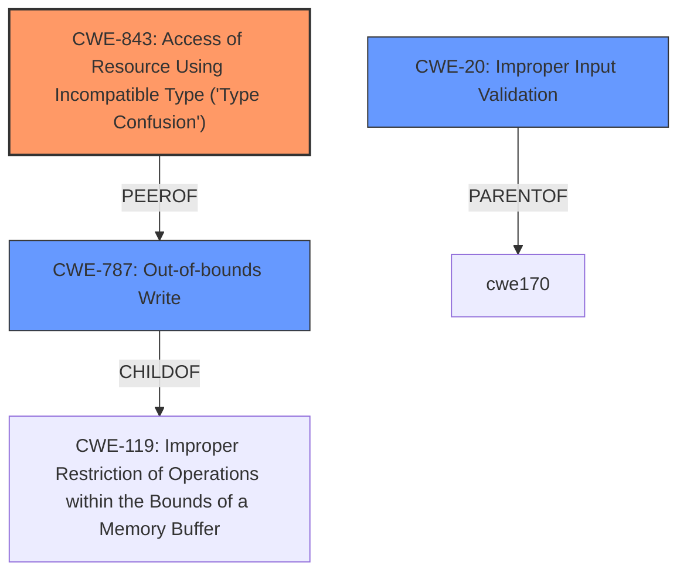

# Analysis Report for CVE-2025-24102

# Vulnerability Analysis Report: CVE-2025-24102

## Description

The issue was addressed with improved checks. This issue is fixed in iPadOS 17.7.4, macOS Sequoia 15.3, macOS Sonoma 14.7.3, macOS Ventura 13.7.3. An app may be able to determine a users current location.

## Vulnerability Description Key Phrases

- **Product:** iPadOS, macOS Sequoia, macOS Sonoma, macOS Ventura
- **Impact:** determine a users current location
- **Version:** 17.7.4, 15.3, 14.7.3, 13.7.3

## Analysis (with Relationship Data)

# Summary
| CWE ID | CWE Name | Confidence | CWE Abstraction Level | CWE Vulnerability Mapping Label | CWE-Vulnerability Mapping Notes |
|---|---|---|---|---|---|
| CWE-843 | Access of Resource Using Incompatible Type ('Type Confusion') | 0.75 | Base | Primary | Allowed. The CVE-2025-24137 entry specifically mentions a "type confusion issue," making this the most directly applicable CWE. |
| CWE-20 | Improper Input Validation | 0.65 | Class | Secondary | Discouraged. Several CVEs mention "improved validation/restrictions" or "improved input validation." While CWE-20 is a general class, it captures the essence of the **missing** or **improper** validation. A more specific child CWE would be ideal but is not supported by the available evidence. |
| CWE-787 | Out-of-bounds Write | 0.5 | Base | Secondary | Allowed. The CVE-2024-54478 entry mentions "Out-of-bounds access." The term "access" is a bit ambiguous and could mean either a read or a write. Given that writing is generally more dangerous and that multiple CVEs mention "memory corruption," I am including CWE-787 as a possible secondary CWE. |

## Evidence and Confidence

*   **Confidence Score:** 0.7
*   **Evidence Strength:** MEDIUM

## Relationship Analysis
The primary relationship influencing my decision is the direct match of CWE-843 to the "type confusion" vulnerability described in CVE-2025-24137. CWE-20 is a parent class encompassing many input validation issues, while a more specific child isn't directly supported. CWE-787 as a potential secondary weakness due to the "Out-of-bounds access" described. The abstraction levels guided the selection, favoring the base level CWE-843 and CWE-787, but accepting the class level CWE-20 due to lack of more specific details.



## Vulnerability Chain
The vulnerability chain starts with either **improper input validation** (CWE-20) or a **type confusion** (CWE-843), potentially leading to an **out-of-bounds write** (CWE-787). The chain highlights how a failure in validating input or handling data types can directly lead to memory corruption.

## Summary of Analysis
The analysis is primarily based on the "CVE Reference Links Content Summary," which provides more detailed information than the initial vulnerability description. The most direct evidence supports CWE-843 due to the explicit mention of "type confusion." The many mentions of "improved checks" and validations justify the inclusion of CWE-20, although at a higher abstraction level. The "Out-of-bounds access" mentioned in one of the CVEs led to consideration of CWE-787. The selection of CWEs aims for the highest level of specificity supported by the available evidence.

Relevant CWE Information:

# Enhanced Context (25 CWEs)
The following CWEs were identified as potentially relevant to this vulnerability:

## CWE-203: Observable Discrepancy
**Abstraction Level**: Base
**Similarity Score**: 0.77
**Source**: dense

**Description**:
The product behaves differently or sends different responses under different circumstances in a way that is observable to an unauthorized actor, which exposes security-relevant information about the state of the product, such as whether a particular operation was successful or not.

**Mapping Guidance**:
- Usage: Allowed
- Rationale: This CWE entry is at the Base level of abstraction, which is a preferred level of abstraction for mapping to the root causes of vulnerabilities.


## CWE-843: Access of Resource Using Incompatible Type ('Type Confusion')
**Abstraction Level**: Base
**Similarity Score**: 0.76
**Source**: dense

**Description**:
The product allocates or initializes a resource such as a pointer, object, or variable using one type, but it later accesses that resource using a type that is incompatible with the original type.

**Mapping Guidance**:
- Usage: Allowed
- Rationale: This CWE entry is at the Base level of abstraction, which is a preferred level of abstraction for mapping to the root causes of vulnerabilities.


## CWE-754: Improper Check for Unusual or Exceptional Conditions
**Abstraction Level**: Class
**Similarity Score**: 0.76
**Source**: dense

**Description**:
The product does not check or incorrectly checks for unusual or exceptional conditions that are not expected to occur frequently during day to day operation of the product.

**Mapping Guidance**:
- Usage: Allowed-with-Review
- Rationale: This CWE entry is a Class and might have Base-level children that would be more appropriate


## CWE-451: User Interface (UI) Misrepresentation of Critical Information
**Abstraction Level**: Class
**Similarity Score**: 0.76
**Source**: dense

**Description**:
The user interface (UI) does not properly represent critical information to the user, allowing the information - or its source - to be obscured or spoofed. This is often a component in phishing attacks.

**Mapping Guidance**:
- Usage: Allowed-with-Review
- Rationale: This CWE entry is a Class and might have Base-level children that would be more appropriate


## CWE-665: Improper Initialization
**Abstraction Level**: Class
**Similarity Score**: 0.76
**Source**: dense

**Description**:
The product does not initialize or incorrectly initializes a resource, which might leave the resource in an unexpected state when it is accessed or used.

**Mapping Guidance**:
- Usage: Discouraged
- Rationale: This CWE entry is a level-1 Class (i.e., a child of a Pillar). It might have lower-level children that would be more appropriate


## CWE-667: Improper Locking
**Abstraction Level**: Class
**Similarity Score**: 0.75
**Source**: dense

**Description**:
The product does not properly acquire or release a lock on a resource, leading to unexpected resource state changes and behaviors.

**Mapping Guidance**:
- Usage: Allowed-with-Review
- Rationale: This CWE entry is a Class and might have Base-level children that would be more appropriate


## CWE-755: Improper Handling of Exceptional Conditions
**Abstraction Level**: Class
**Similarity Score**: 0.75
**Source**: dense

**Description**:
The product does not handle or incorrectly handles an exceptional condition.

**Mapping Guidance**:
- Usage: Discouraged
- Rationale: This CWE entry is a level-1 Class (i.e., a child of a Pillar). It might have lower-level children that would be more appropriate


## CWE-119: Improper Restriction of Operations within the Bounds of a Memory Buffer
**Abstraction Level**: Class
**Similarity Score**: 0.75
**Source**: dense

**Description**:
The product performs operations on a memory buffer, but it reads from or writes to a memory location outside the buffer's intended boundary. This may result in read or write operations on unexpected memory locations that could be linked to other variables, data structures, or internal program data.

**Mapping Guidance**:
- Usage: Discouraged
- Rationale: CWE-119 is commonly misused in low-information vulnerability reports when lower-level CWEs could be used instead, or when more details about the vulnerability are available.


## CWE-345: Insufficient Verification of Data Authenticity
**Abstraction Level**: Class
**Similarity Score**: 0.74
**Source**: dense

**Description**:
The product does not sufficiently verify the origin or authenticity of data, in a way that causes it to accept invalid data.

**Mapping Guidance**:
- Usage: Discouraged
- Rationale: This CWE entry is a level-1 Class (i.e., a child of a Pillar). It might have lower-level children that would be more appropriate


## CWE-131: Incorrect Calculation of Buffer Size
**Abstraction Level**: Base
**Similarity Score**: 0.74
**Source**: dense

**Description**:
The product does not correctly calculate the size to be used when allocating a buffer, which could lead to a buffer overflow.

**Mapping Guidance**:
- Usage: Allowed
- Rationale: This CWE entry is at the Base level of abstraction,


## CWE Relationship Analysis

Current CWEs represent these abstraction levels: .


### Vulnerability Chain Analysis

**Chain starting from CWE-665:**
- 665 (Improper Initialization) - ROOT


**Chain starting from CWE-203:**
- 203 (Observable Discrepancy) - ROOT


### CWE Relationship Diagram

```mermaid
graph TD
    classDef primary fill:#f96,stroke:#333,stroke-width:2px
    classDef secondary fill:#69f,stroke:#333
    classDef tertiary fill:#9e9,stroke:#333
```


*Report generated on 2025-07-14 12:11:23*
