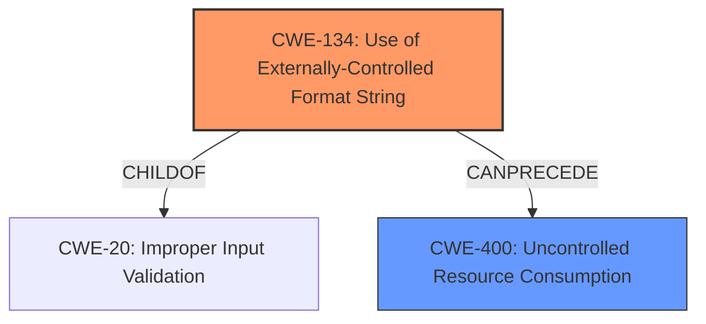

# Raw Analyzer Response for CVE-2025-24199

# Summary
| CWE ID | CWE Name | Confidence | CWE Abstraction Level | CWE Vulnerability Mapping Label | CWE-Vulnerability Mapping Notes |
|---|---|---|---|---|---|
| **CWE-134** | **Use of Externally-Controlled Format String** | 1.0 | Base | Primary | Allowed |
| CWE-400 | Uncontrolled Resource Consumption | 0.6 | Class | Secondary Candidate | Discouraged |

## Evidence and Confidence

*   **Confidence Score:** 0.9
*   **Evidence Strength:** HIGH

## Relationship Analysis
The primary relationship that influenced my decision was the direct match of the vulnerability description to CWE-134: Use of Externally-Controlled Format String. The vulnerability description specifically mentions an "**uncontrolled format string issue**". CWE-134 is a base-level CWE, which is the preferred level of abstraction.

CWE-400 (Uncontrolled Resource Consumption) was considered as a secondary effect, since the **impact** of the **format string vulnerability** is a denial-of-service.

## Vulnerability Chain
The vulnerability chain starts with the **uncontrolled format string**, leading to a denial-of-service.
- Root Cause: CWE-134 (Use of Externally-Controlled Format String)
- Impact: CWE-400 (Uncontrolled Resource Consumption)

## Summary of Analysis
The analysis is based on the vulnerability description, which explicitly mentions an "**uncontrolled format string issue**". The CVE Reference Links Content Summary reinforces this by stating, "The root cause is an uncontrolled format string issue." This provides strong evidence for selecting CWE-134 as the primary CWE.

CWE-400 was selected as a secondary CWE due to the impact being a denial-of-service, which aligns with the description of Uncontrolled Resource Consumption.

The selected CWEs are at the optimal level of specificity, with CWE-134 being a base-level CWE and accurately representing the **root cause** of the vulnerability.

Relevant CWE Information:

# Enhanced Context (25 CWEs)
The following CWEs were identified as potentially relevant to this vulnerability:

## CWE-134: Use of Externally-Controlled Format String
**Abstraction Level**: Base
**Similarity Score**: 0.75
**Source**: dense

**Description**:
The product uses a function that accepts a format string as an argument, but the format string originates from an external source.

**Mapping Guidance**:
- Usage: Allowed
- Rationale: This CWE entry is at the Base level of abstraction, which is a preferred level of abstraction for mapping to the root causes of vulnerabilities.

**Technical Explanation for CWE-134:**

*   How the vulnerability's details match the CWE's characteristics: The vulnerability description explicitly states an "**uncontrolled format string issue**," which directly aligns with CWE-134's description.
*   The security implications and potential impact: An attacker can control the format string, leading to information disclosure, arbitrary code execution, or denial-of-service. In this case, the impact is a denial-of-service.
*   Any parent-child relationships or chain patterns that influenced your mapping: CWE-134 is a child of CWE-20 (Improper Input Validation) and can precede CWE-123 (Write-what-where Condition).
*   Whether the weakness is primary or secondary in the vulnerability: CWE-134 is the primary weakness, representing the root cause of the vulnerability.
*   How the official MITRE mapping guidance influenced your decision: The MITRE mapping guidance allows for the usage of CWE-134, as it is at the Base level of abstraction.

**Technical Explanation for CWE-400:**

*   How the vulnerability's details match the CWE's characteristics: The vulnerability can cause a denial-of-service, indicating that an attacker can consume excessive resources.
*   The security implications and potential impact: A denial-of-service can disrupt services and make systems unavailable to legitimate users.
*   Any parent-child relationships or chain patterns that influenced your mapping: CWE-400 is a child of CWE-910 (Excessive Resource Consumption During Data Processing).
*   Whether the weakness is primary or secondary in the vulnerability: CWE-400 is a secondary weakness, representing the impact of the primary weakness (CWE-134).
*   How the official MITRE mapping guidance influenced your decision: The MITRE mapping guidance discourages the usage of CWE-400.

**CWEs Considered but Not Used:**

*   CWE-20 (Improper Input Validation): While improved input validation was mentioned as a fix, the more specific CWE-134 (Use of Externally-Controlled Format String) was more appropriate as the root cause.
*   CWE-787 (Out-of-bounds Write), CWE-843 (Access of Resource Using Incompatible Type ('Type Confusion')): These were not directly indicated by the vulnerability description, which focused on the format string issue.
*   CWE-123 (Write-what-where Condition): While a format string vulnerability *could* lead to a write-what-where condition, the available information only specifies a denial-of-service as the impact, making CWE-400 a more direct and appropriate fit.