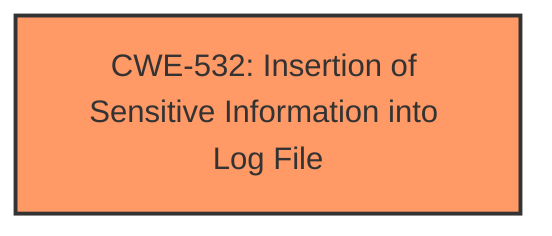

# Analysis Report for CVE-2025-24202

# Vulnerability Analysis Report: CVE-2025-24202

## Description

A **logging issue** was addressed with improved data redaction. This issue is fixed in iOS 18.4 and iPadOS 18.4, macOS Sequoia 15.4. An app may be able to access sensitive user data.

## Vulnerability Description Key Phrases

- **Weakness:** logging issue
- **Product:** iOS, iPadOS, macOS Sequoia
- **Impact:** access sensitive user data
- **Version:** 18.4, 18.4, 15.4

## Analysis (with Relationship Data)

# Summary

| CWE ID | CWE Name | Confidence | CWE Abstraction Level | CWE Vulnerability Mapping Label | CWE-Vulnerability Mapping Notes |
|---|---|---|---|---|---|
| CWE-532 | Insertion of Sensitive Information into Log File | 0.9 | Base | Allowed | Primary CWE |

## Evidence and Confidence

*   **Confidence Score:** 0.9
*   **Evidence Strength:** HIGH

## Relationship Analysis

The primary CWE identified is CWE-532 (Insertion of Sensitive Information into Log File), which is a Base level CWE. No specific child or parent relationships influenced the decision, as the description directly matches the CWE.



## Vulnerability Chain

The vulnerability chain is straightforward: a **logging issue** (CWE-532) leads to the potential access of sensitive user data. The root cause is the **improper logging** of sensitive data.

## Summary of Analysis

The initial analysis identified CWE-532 as the most relevant based on the vulnerability description, which explicitly mentions a "**logging issue**" and the potential access of sensitive user data. The retriever results also listed CWE-532 with a good score. The evidence from the CVE description clearly supports the mapping to CWE-532: "A **logging issue** was addressed with improved data redaction." The fix involves improved data redaction, which directly aligns with preventing the insertion of sensitive information into log files. This is a base-level CWE and accurately represents the weakness.

Relevant CWE Information:

# Enhanced Context (25 CWEs)

## CWE-203: Observable Discrepancy
Not selected. While the impact is that sensitive information may be accessed, this CWE is about observable differences, which isn't the primary issue.

## CWE-212: Improper Removal of Sensitive Information Before Storage or Transfer
Not selected. This CWE is about storage or transfer. The issue is with logging, which is more specific.

## CWE-532: Insertion of Sensitive Information into Log File
**SELECTED**. The vulnerability description states "A **logging issue** was addressed with improved data redaction," directly aligning with this CWE. The impact is that "An app may be able to access sensitive user data," which is a potential consequence of logging sensitive information.

## CWE-451: User Interface (UI) Misrepresentation of Critical Information
Not selected. This CWE is related to UI misrepresentation, not logging.

## CWE-667: Improper Locking
Not selected. This CWE is related to locking issues, not logging.

## CWE-843: Access of Resource Using Incompatible Type ('Type Confusion')
Not selected. This CWE is related to type confusion, not logging.

## CWE-209: Generation of Error Message Containing Sensitive Information
Not selected. This CWE is about error messages containing sensitive information, not general logging.

## CWE-754: Improper Check for Unusual or Exceptional Conditions
Not selected. This CWE is about checks for unusual conditions, not logging.

## CWE-252: Unchecked Return Value
Not selected. This CWE is about unchecked return values, not logging.

## CWE-345: Insufficient Verification of Data Authenticity
Not selected. This CWE is about data authenticity, not logging.

## CWE-665: Improper Initialization
Not selected. This CWE relates to initialization issues, which are not explicitly mentioned in the vulnerability description.

## CWE-415: Double Free
Not selected. This CWE relates to memory management issues, which are not explicitly mentioned in the vulnerability description.

## CWE-787: Out-of-bounds Write
Not selected. This CWE relates to buffer overflows, which are not explicitly mentioned in the vulnerability description.

## CWE-825: Expired Pointer Dereference
Not selected. This CWE is not relevant to the vulnerability description.

## CWE-123: Write-what-where Condition
Not selected. This CWE is not relevant to the vulnerability description.

## CWE-770: Allocation of Resources Without Limits or Throttling
Not selected. This CWE is not relevant to the vulnerability description.

## CWE-416: Use After Free
Not selected. This CWE relates to memory management issues, which are not explicitly mentioned in the vulnerability description.

## CWE-190: Integer Overflow or Wraparound
Not selected. This CWE is not relevant to the vulnerability description.

## CWE-226: Sensitive Information in Resource Not Removed Before Reuse
Not selected. This CWE is not relevant to the vulnerability description.

## CWE-779: Logging of Excessive Data
Considered but not selected over CWE-532. While excessive data could include sensitive data, the description specifically mentions sensitive data, making CWE-532 a more precise fit.

## CWE-129: Improper Validation of Array Index
Not selected. This CWE is not relevant to the vulnerability description.

## CWE-20: Improper Input Validation
Not selected. This CWE is too general. The specific issue is related to logging.


## CWE Relationship Analysis

Current CWEs represent these abstraction levels: .


### Vulnerability Chain Analysis

**Chain starting from CWE-779:**
- 779 (Logging of Excessive Data) - ROOT


**Chain starting from CWE-416:**
- 416 (Use After Free) - ROOT


### CWE Relationship Diagram

```mermaid
graph TD
    classDef primary fill:#f96,stroke:#333,stroke-width:2px
    classDef secondary fill:#69f,stroke:#333
    classDef tertiary fill:#9e9,stroke:#333
```


*Report generated on 2025-07-14 12:20:31*
