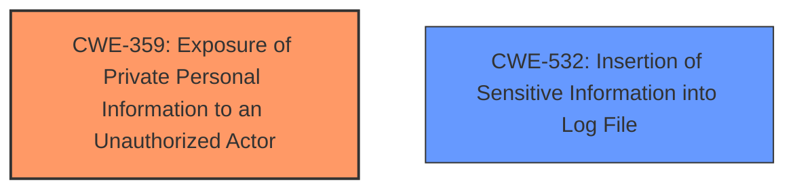

# Analysis Report for CVE-2025-24218

# Vulnerability Analysis Report: CVE-2025-24218

## Description

A privacy issue was addressed with improved private data redaction for log entries. This issue is fixed in macOS Sequoia 15.4. An app may be able to access information about a users contacts.

## Vulnerability Description Key Phrases

- **Impact:** access information about users contacts
- **Attacker:** app
- **Product:** macOS Sequoia
- **Version:** 15.4

## Analysis (with Relationship Data)

# Summary
| CWE ID | CWE Name | Confidence | CWE Abstraction Level | CWE Vulnerability Mapping Label | CWE-Vulnerability Mapping Notes |
|---|---|---|---|---|---|
| CWE-359 | Exposure of Private Personal Information to an Unauthorized Actor | 0.8 | Base | Allowed | Primary CWE. The vulnerability allows an app to access information about a user's contacts, which constitutes exposure of private personal information. |
| CWE-532 | Insertion of Sensitive Information into Log File | 0.5 | Base | Allowed | Secondary candidate. The fix involves improved private data redaction for log entries, suggesting that sensitive information was previously being logged. |

## Evidence and Confidence

*   **Confidence Score:** 0.7
*   **Evidence Strength:** MEDIUM

## Relationship Analysis
The primary relationship that influenced the decision was the direct match between the vulnerability description and CWE-359. The description states that an app may be able to access user contacts, which directly aligns with the definition of CWE-359: Exposure of Private Personal Information to an Unauthorized Actor.
CWE-532 was considered as a secondary factor because the fix involved improved redaction in logs, which indicates sensitive information was being logged.



## Vulnerability Chain
The vulnerability chain starts with a **lack of proper access control** or **improper data handling**, leading to the **exposure of sensitive user contact information** to an unauthorized application.
1.  **Root Cause:** Improper Access Control / Data Handling
2.  **Weakness:** Exposure of Private Personal Information
3.  **Impact:** Privacy Violation, Data Breach

## Summary of Analysis
The primary assessment is based on the provided evidence that an app may be able to access information about a user's contacts. This directly matches the description of CWE-359. The fix, improved private data redaction for log entries, suggests that CWE-532 may also be relevant, indicating that sensitive information was being logged.
The selection of CWE-359 is at the optimal level of specificity because it directly describes the core issue of exposing private personal information.
The evidence from the "CVE Reference Links Content Summary" states: "An app may be able to access information about a user's contacts." This directly supports the selection of CWE-359.

Relevant CWE Information:

# Enhanced Context (25 CWEs)
The following CWEs were identified as potentially relevant to this vulnerability:

## CWE-203: Observable Discrepancy - Not selected.

## CWE-212: Improper Removal of Sensitive Information Before Storage or Transfer - Not selected.

## CWE-532: Insertion of Sensitive Information into Log File - Selected as secondary.

## CWE-538: Insertion of Sensitive Information into Externally-Accessible File or Directory - Not selected.

## CWE-497: Exposure of Sensitive System Information to an Unauthorized Control Sphere - Not selected.

## CWE-201: Insertion of Sensitive Information Into Sent Data - Not selected.

## CWE-451: User Interface (UI) Misrepresentation of Critical Information - Not selected.

## CWE-359: Exposure of Private Personal Information to an Unauthorized Actor - Selected as primary.

## CWE-209: Generation of Error Message Containing Sensitive Information - Not selected.

## CWE-347: Improper Verification of Cryptographic Signature - Not selected.

## CWE-285: Improper Authorization - Not selected.

## CWE-532: Insertion of Sensitive Information into Log File - Selected as secondary.

## CWE-200: Exposure of Sensitive Information to an Unauthorized Actor - Not selected as it is too broad.

## CWE-863: Incorrect Authorization - Not selected.

## CWE-639: Authorization Bypass Through User-Controlled Key - Not selected.

## CWE-787: Out-of-bounds Write - Not selected.

## CWE-825: Expired Pointer Dereference - Not selected.

## CWE-1272: Sensitive Information Uncleared Before Debug/Power State Transition - Not selected.

## CWE-201: Insertion of Sensitive Information Into Sent Data - Not selected.

## CWE-226: Sensitive Information in Resource Not Removed Before Reuse - Not selected.

## CWE-824: Access of Uninitialized Pointer - Not selected.

## CWE-823: Use of Out-of-range Pointer Offset - Not selected.

## CWE-822: Untrusted Pointer Dereference - Not selected.

## CWE-562: Return of Stack Variable Address - Not selected.

## CWE-125: Out-of-bounds Read - Not selected.


## CWE Relationship Analysis

Current CWEs represent these abstraction levels: .


### Vulnerability Chain Analysis

**Chain starting from CWE-226:**
- 226 (Sensitive Information in Resource Not Removed Before Reuse) - ROOT


**Chain starting from CWE-639:**
- 639 (Authorization Bypass Through User-Controlled Key) - ROOT


### CWE Relationship Diagram

```mermaid
graph TD
    classDef primary fill:#f96,stroke:#333,stroke-width:2px
    classDef secondary fill:#69f,stroke:#333
    classDef tertiary fill:#9e9,stroke:#333
```


*Report generated on 2025-07-14 12:23:20*
