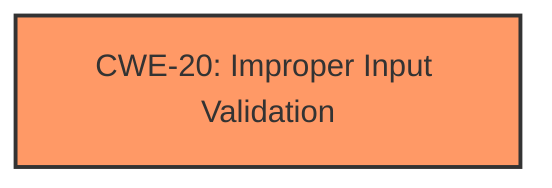

# Analysis Report for CVE-2025-24229

# Vulnerability Analysis Report: CVE-2025-24229

## Description

A **logic issue** was addressed with improved checks. This issue is fixed in macOS Ventura 13.7.5, macOS Sequoia 15.4, macOS Sonoma 14.7.5. A sandboxed app may be able to access sensitive user data.

## Vulnerability Description Key Phrases

- **Rootcause:** logic issue
- **Impact:** access sensitive user data
- **Attacker:** sandboxed app
- **Product:** ['macOS Sequoia', 'macOS Ventura', 'macOS Sonoma']
- **Version:** ['13.7.5', '14.7.5', '15.4']

## Analysis (with Relationship Data)

# Summary
| CWE ID | CWE Name | Confidence | CWE Abstraction Level | CWE Vulnerability Mapping Label | CWE-Vulnerability Mapping Notes |
|---|---|---|---|---|---|
| CWE-20 | Improper Input Validation | 0.7 | Class | Primary | Allowed-with-Review |

## Evidence and Confidence

*   **Confidence Score:** 0.7
*   **Evidence Strength:** MEDIUM

## Relationship Analysis
The primary focus is on identifying the **root cause** of the vulnerability, which is described as a **"logic issue."** CWE-20 (Improper Input Validation) is a Class-level CWE, indicating a broad category. While specific input validation issues can be further detailed with Base or Variant CWEs, the current description lacks the granularity to pinpoint the exact type of input validation failure.



## Vulnerability Chain
The vulnerability chain starts with a **"logic issue"** leading to a sandboxed app being able to access sensitive user data.
*   **Root Cause:** **Logic Issue** -> CWE-20 (Improper Input Validation)
*   **Impact:** Access to sensitive user data.

## Summary of Analysis
The analysis is based on the provided evidence which identifies a **"logic issue"** that leads to unauthorized access to sensitive user data by a sandboxed app. The vulnerability description mentions the issue was fixed with "improved checks". The closest CWE match, given the limited information, is CWE-20 (Improper Input Validation). This is because the description suggests a failure to properly validate or sanitize inputs, which could lead to the observed behavior.

The retriever results listed several CWEs, including CWE-787 (Out-of-bounds Write), CWE-843 (Access of Resource Using Incompatible Type ('Type Confusion')), and CWE-347 (Improper Verification of Cryptographic Signature). However, these CWEs are more specific and don't directly align with the high-level description of a "logic issue" that was resolved with "improved checks".

Therefore, CWE-20 is selected as the primary CWE due to its broad applicability to input validation failures. The confidence level is 0.7 due to the limited detail in the vulnerability description.

Relevant CWE Information:

# Enhanced Context (25 CWEs)
The following CWEs were identified as potentially relevant to this vulnerability:

## CWE-20: Improper Input Validation
**Abstraction Level**: Class
**Similarity Score**: 491.53
**Source**: sparse

**Description**:
The product does not validate or incorrectly validates input.

**Mapping Guidance**:
- Usage: Discouraged
- Rationale: CWE-285 is high-level and lower-level CWEs can frequently be used instead. It is a level-1 Class (i.e., a child of a Pillar).


## CWE Relationship Analysis

Current CWEs represent these abstraction levels: .


### Vulnerability Chain Analysis

**Chain starting from CWE-787:**
- 787 (Out-of-bounds Write) - ROOT


**Chain starting from CWE-843:**
- 843 (Access of Resource Using Incompatible Type ('Type Confusion')) - ROOT


### CWE Relationship Diagram

```mermaid
graph TD
    classDef primary fill:#f96,stroke:#333,stroke-width:2px
    classDef secondary fill:#69f,stroke:#333
    classDef tertiary fill:#9e9,stroke:#333
```


*Report generated on 2025-07-14 12:24:54*
