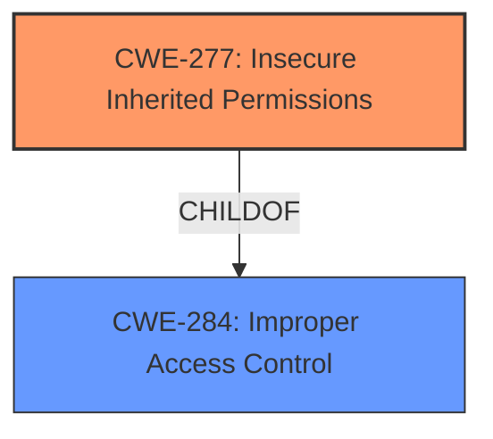

# Analysis Report for CVE-2025-24236

# Vulnerability Analysis Report: CVE-2025-24236

## Description

An access issue was addressed with additional sandbox restrictions. This issue is fixed in macOS Sequoia 15.4, macOS Sonoma 14.7.5. An app may be able to access sensitive user data.

## Vulnerability Description Key Phrases

- **Product:** macOS Sequoia, macOS Sonoma
- **Impact:** access sensitive user data
- **Version:** 15.4, 14.7.5

## Analysis (with Relationship Data)

# Summary
| CWE ID | CWE Name | Confidence | CWE Abstraction Level | CWE Vulnerability Mapping Label | CWE-Vulnerability Mapping Notes |
|---|---|---|---|---|---|
| CWE-277 | Insecure Inherited Permissions | 0.8 | Variant | Allowed | Primary CWE |
| CWE-284 | Improper Access Control | 0.5 | Pillar | Discouraged | Secondary Candidate |

## Evidence and Confidence

*   **Confidence Score:** 0.7
*   **Evidence Strength:** MEDIUM

## Relationship Analysis
The primary relationship that influenced the decision was the ChildOf relationship. CWE-277 (Insecure Inherited Permissions) is a variant of CWE-284 (Improper Access Control), and since the vulnerability description mentions "additional sandbox restrictions," this suggests an issue with how permissions are inherited within the sandbox environment. While CWE-284 is a broader category, CWE-277 provides a more specific classification related to the inheritance of permissions.



## Vulnerability Chain
The vulnerability chain involves the following sequence:
1.  **Root Cause:** Insecurely defined permissions that are inherited by objects. (CWE-277)
2.  **Weakness:** An app gains the ability to access sensitive user data due to the insecure permissions.
3.  **Impact:** Sensitive user data is accessed by an unauthorized application.

## Summary of Analysis
The initial analysis focused on identifying the root cause of the vulnerability, which the description indicates as an "access issue" addressed with "additional sandbox restrictions." This points to a problem with how permissions are managed or enforced within the sandbox environment.

CWE-277 (Insecure Inherited Permissions) was selected as the primary CWE because it specifically addresses vulnerabilities where insecure permissions are inherited by objects, which aligns with the concept of sandbox restrictions. The evidence supporting this decision comes from the CVE description stating that the fix involved "additional sandbox restrictions," suggesting an initial **lack of proper permission controls** within the sandbox.

While CWE-284 (Improper Access Control) is a related and broader category, CWE-277 provides a more precise classification that captures the inheritance aspect of the permission issue. Therefore, CWE-277 is the optimal level of specificity.

Other CWEs like CWE-863 (Incorrect Authorization) and CWE-285 (Improper Authorization) were considered but deemed less relevant because the description doesn't explicitly mention incorrect authorization checks. Instead, it focuses on the broader issue of access and permissions within the sandbox.

Relevant CWE Information:

# Enhanced Context (25 CWEs)
The following CWEs were identified as potentially relevant to this vulnerability:

## CWE-277: Insecure Inherited Permissions
**Abstraction Level**: Variant
**Similarity Score**: 0.73
**Source**: dense

**Description**:
A product defines a set of insecure permissions that are inherited by objects that are created by the program.

**Mapping Guidance**:
- Usage: Allowed
- Rationale: This CWE entry is at the Variant level of abstraction, which is a preferred level of abstraction for mapping to the root causes of vulnerabilities.

## CWE-284: Improper Access Control
**Abstraction Level**: Pillar
**Similarity Score**: 381.24
**Source**: sparse

**Description**:
The product does not properly control access to resources.

**Mapping Guidance**:
- Usage: Discouraged
- Rationale: This is a Pillar entry. More specific entries are usually available.

## CWE-20: Improper Input Validation
**Abstraction Level**: class
**Similarity Score**: 2.23
**Source**: graph

**Description**:
CWE-20: Improper Input Validation

**Mapping Guidance**:
- Usage: Discouraged
- Rationale: CWE-20 is commonly misused in low-information vulnerability reports when lower-level CWEs could be used instead, or when more details about the vulnerability are available [REF-1287]. It is not useful for trend analysis. It is also a level-1 Class (i.e., a child of a Pillar).


## CWE Relationship Analysis

Current CWEs represent these abstraction levels: .


### Vulnerability Chain Analysis

**Chain starting from CWE-863:**
- 863 (Incorrect Authorization) - ROOT


**Chain starting from CWE-277:**
- 277 (Insecure Inherited Permissions) - ROOT


### CWE Relationship Diagram

```mermaid
graph TD
    classDef primary fill:#f96,stroke:#333,stroke-width:2px
    classDef secondary fill:#69f,stroke:#333
    classDef tertiary fill:#9e9,stroke:#333
```


*Report generated on 2025-07-14 12:25:49*
