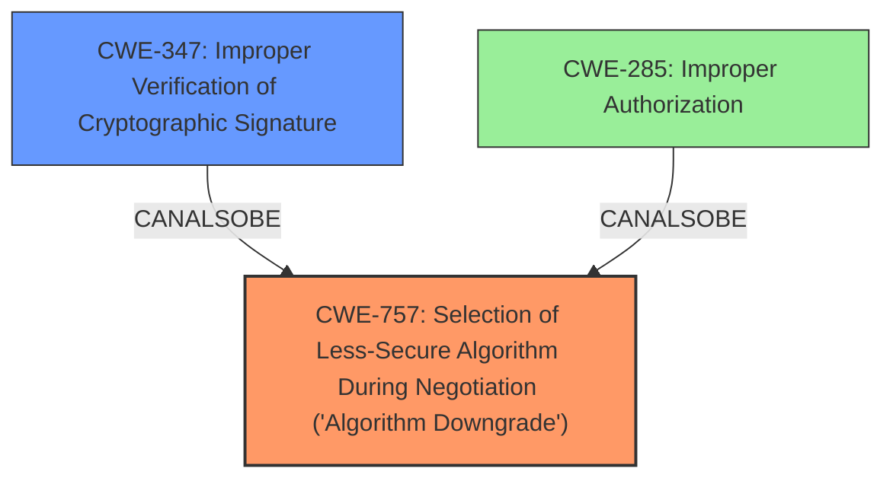

# Raw Analyzer Response for CVE-2025-24239

# Summary
| CWE ID | CWE Name | Confidence | CWE Abstraction Level | CWE Vulnerability Mapping Label | CWE-Vulnerability Mapping Notes |
|---|---|---|---|---|---|
| CWE-757 | Selection of Less-Secure Algorithm During Negotiation ('Algorithm Downgrade') | 0.7 | Base | Allowed | Primary CWE. The **downgrade issue** was addressed with additional code-signing restrictions |
| CWE-347 | Improper Verification of Cryptographic Signature | 0.5 | Base | Allowed | Secondary candidate because code-signing is part of the cryptographic signature verification process |
| CWE-285 | Improper Authorization | 0.3 | Class | Discouraged | Secondary candidate because the impact includes an app being able to access protected user data. |

## Evidence and Confidence

*   **Confidence Score:** 0.7
*   **Evidence Strength:** MEDIUM

## Relationship Analysis
The primary CWE is CWE-757, because the vulnerability description specifically mentions a downgrade issue was addressed with additional code-signing restrictions. CWE-757 is related to the negotiation of algorithms and the selection of a less secure algorithm, so is a good starting point for analysis of code signing restrictions. CWE-347 is a secondary CWE because code-signing restrictions are part of the cryptographic signature verification process. CWE-285 is a tertiary CWE because the impact is that an app may be able to access protected user data.

## Vulnerability Chain
The vulnerability chain starts with the **downgrade issue**, which leads to a less secure algorithm being selected (CWE-757). This can lead to **improper verification of cryptographic signature** (CWE-347) and ultimately to **improper authorization** (CWE-285), where an app can access protected user data.

## Summary of Analysis
The primary assessment is based on the vulnerability description that a **downgrade issue** was addressed with additional code-signing restrictions. The primary CWE is CWE-757, because the vulnerability description specifically mentions a downgrade issue was addressed with additional code-signing restrictions. The graph relationships influenced the selection of CWE-347 and CWE-285 as secondary candidates because they are related to the primary CWE. The selected CWEs are at the optimal level of specificity because they are at the Base and Class levels of abstraction.

CWE-787, CWE-123, CWE-416, CWE-456, CWE-134, CWE-825, CWE-824, CWE-823, CWE-822 and CWE-364 were not selected because they are related to memory corruption and pointers, which are not mentioned in the vulnerability description. CWE-451 was not selected because it is related to UI misrepresentation, which is not mentioned in the vulnerability description. CWE-665 was not selected because it is related to improper initialization, which is not mentioned in the vulnerability description. CWE-863 was not selected because it is related to incorrect authorization, which is similar to CWE-285.