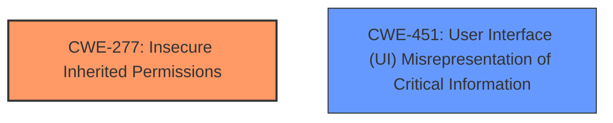

# Enhanced Analysis for CVE-2025-24241

# Summary
| CWE ID | CWE Name | Confidence | CWE Abstraction Level | CWE Vulnerability Mapping Label | CWE-Vulnerability Mapping Notes |
|---|---|---|---|---|---|
| CWE-277 | Insecure Inherited Permissions | 0.7 | Variant | Allowed | Primary CWE |
| CWE-451 | User Interface (UI) Misrepresentation of Critical Information | 0.5 | Class | Allowed-with-Review | Secondary Candidate |

## Evidence and Confidence

*   **Confidence Score:** 0.7
*   **Evidence Strength:** LOW

## Relationship Analysis
The primary CWE selected is CWE-277 (Insecure Inherited Permissions), a Variant-level weakness. The secondary candidate is CWE-451 (User Interface (UI) Misrepresentation of Critical Information), which is a Class-level weakness. There is no clear parent-child relationship between these two in the CWE structure. However, CWE-451 could potentially be a consequence of CWE-277 if insecure permissions allowed the UI to misrepresent critical information.



## Vulnerability Chain
The chain of events is as follows:

1.  **Root Cause:** **Configuration issue** resulting in **Insecure Inherited Permissions** (CWE-277).
2.  An app exploits these insecure permissions.
3.  **Impact:** The app tricks a user into copying sensitive data to the pasteboard (potentially leading to UI misrepresentation, CWE-451).

## Summary of Analysis
The primary classification is CWE-277 (Insecure Inherited Permissions). The vulnerability description mentions a **configuration issue** which was addressed with additional restrictions. The core issue seems to be that an app is able to perform an action it should not be able to (copying sensitive data to the pasteboard).

The description is vague and lacks technical details. The "CVE Reference Links Content Summary" is "UNRELATD", further limiting available information. The confidence is moderate due to the lack of specific evidence.

CWE-277 seems the most relevant because it directly addresses the **root cause** of a permission issue leading to unintended actions.

CWE-451 (User Interface (UI) Misrepresentation of Critical Information) is considered as a secondary candidate. An app may be able to trick a user, so the user interface might not be accurately representing the action being performed, and since the app is copying sensitive data to the pasteboard, this data may not have the correct ownership.

Other CWEs Considered:

*   CWE-787 (Out-of-bounds Write), CWE-843 (Access of Resource Using Incompatible Type ('Type Confusion')), CWE-665 (Improper Initialization), CWE-20 (Improper Input Validation), CWE-415 (Double Free), and CWE-347 (Improper Verification of Cryptographic Signature) were not selected as there is no evidence in the description to suggest memory corruption, type confusion, initialization issues, input validation flaws, or cryptographic issues.
*   CWE-825 (Expired Pointer Dereference) was also not selected because the description doesn't suggest pointer-related issues.

---
# Summary
| CWE ID | CWE Name | Confidence | CWE Abstraction Level | CWE Vulnerability Mapping Label | CWE-Vulnerability Mapping Notes |
|---|---|---|---|---|---|
| CWE-277 | Insecure Inherited Permissions | 0.7 | Variant | Allowed | Primary CWE |
| CWE-451 | User Interface (UI) Misrepresentation of Critical Information | 0.5 | Class | Allowed-with-Review | Secondary Candidate |

## Evidence and Confidence

*   **Confidence Score:** 0.7
*   **Evidence Strength:** LOW

## Relationship Analysis
The primary CWE selected is CWE-277 (Insecure Inherited Permissions), a Variant-level weakness. The secondary candidate is CWE-451 (User Interface (UI) Misrepresentation of Critical Information), which is a Class-level weakness. There is no clear parent-child relationship between these two in the CWE structure. However, CWE-451 could potentially be a consequence of CWE-277 if insecure permissions allowed the UI to misrepresent critical information.


## Vulnerability Chain
The chain of events is as follows:

1.  **Root Cause:** **Configuration issue** resulting in **Insecure Inherited Permissions** (CWE-277).
2.  An app exploits these insecure permissions.
3.  **Impact:** The app tricks a user into copying sensitive data to the pasteboard (potentially leading to UI misrepresentation, CWE-451).

## Summary of Analysis
The primary classification is CWE-277 (Insecure Inherited Permissions). The vulnerability description mentions a **configuration issue** which was addressed with additional restrictions. The core issue seems to be that an app is able to perform an action it should not be able to (copying sensitive data to the pasteboard).

The description is vague and lacks technical details. The "CVE Reference Links Content Summary" is "UNRELATD", further limiting available information. The confidence is moderate due to the lack of specific evidence.

CWE-277 seems the most relevant because it directly addresses the **root cause** of a permission issue leading to unintended actions.

CWE-451 (User Interface (UI) Misrepresentation of Critical Information) is considered as a secondary candidate. An app may be able to trick a user, so the user interface might not be accurately representing the action being performed, and since the app is copying sensitive data to the pasteboard, this data may not have the correct ownership.

Other CWEs Considered:

*   CWE-787 (Out-of-bounds Write), CWE-843 (Access of Resource Using Incompatible Type ('Type Confusion')), CWE-665 (Improper Initialization), CWE-20 (Improper Input Validation), CWE-415 (Double Free), and CWE-347 (Improper Verification of Cryptographic Signature) were not selected as there is no evidence in the description to suggest memory corruption, type confusion, initialization issues, input validation flaws, or cryptographic issues.
*   CWE-825 (Expired Pointer Dereference) was also not selected because the description doesn't suggest pointer-related issues.


## CWE Relationship Analysis

Current CWEs represent these abstraction levels: .


### Vulnerability Chain Analysis

**Chain starting from CWE-787:**
- 787 (Out-of-bounds Write) - ROOT


**Chain starting from CWE-277:**
- 277 (Insecure Inherited Permissions) - ROOT


### CWE Relationship Diagram

```mermaid
graph TD
    classDef primary fill:#f96,stroke:#333,stroke-width:2px
    classDef secondary fill:#69f,stroke:#333
    classDef tertiary fill:#9e9,stroke:#333
```