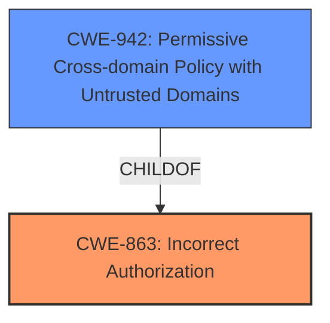

# Analysis Report for CVE-2025-24248

# Vulnerability Analysis Report: CVE-2025-24248

## Description

A **permissions issue** was addressed with additional restrictions. This issue is fixed in macOS Sequoia 15.4. An app may be able to enumerate devices that have signed into the users Apple Account.

## Vulnerability Description Key Phrases

- **Rootcause:** permissions issue
- **Product:** macOS Sequoia
- **Impact:** access users Apple Account, enumerate devices
- **Version:** 15.4

## Analysis (with Relationship Data)

# Summary
| CWE ID | CWE Name | Confidence | CWE Abstraction Level | CWE Vulnerability Mapping Label | CWE-Vulnerability Mapping Notes |
|---|---|---|---|---|---|
| CWE-863 | Incorrect Authorization | 0.8 | Class | Allowed-with-Review | The product performs an authorization check when an actor attempts to access a resource or perform an action, but it does not correctly perform the check. |

## Evidence and Confidence

*   **Confidence Score:** 0.8
*   **Evidence Strength:** MEDIUM

## Relationship Analysis
The primary CWE selected is CWE-863, Incorrect Authorization, which is a Class-level CWE. It relates to improper authorization checks. While it could potentially have more specific children, the provided information doesn't give specifics of the authorization flaw to select a better Base level CWE.



## Vulnerability Chain
The vulnerability chain starts with a **permissions issue** that leads to an application's ability to enumerate devices that have signed into the user's Apple account. The root cause is an **incorrect authorization** check (CWE-863). The impact is that an app can enumerate devices that have signed into the user's Apple Account.

## Summary of Analysis
The vulnerability is caused by a **permissions issue** that allows an app to enumerate devices signed into a user's Apple account. The retriever results suggest CWE-863, Incorrect Authorization, as a possible match. The description states "A **permissions issue** was addressed with additional restrictions." This aligns with the concept of incorrect authorization, where the system's authorization checks are not properly implemented, leading to unintended access.

The CWE mapping guidance Privileges vs Permissions section, identifies CWE-863 as a possible selection when "Authorization logic is present but flawed". Since the summary states "A **permissions issue** was addressed with additional restrictions," suggests the authorization logic was present, but flawed.

The other CWEs were considered but did not fit as well:

*   CWE-277: Insecure Inherited Permissions - This is more about how permissions are inherited, not about the authorization logic itself.
*   CWE-787: Out-of-bounds Write - This is a memory safety issue, not related to permissions or authorization.
*   CWE-285: Improper Authorization - This is a discouraged CWE as it is high-level, and CWE-863 is a better fit.
*   CWE-862: Missing Authorization - The summary stated the permissions issue was addressed, so authorization was present but flawed.
*   CWE-451: User Interface (UI) Misrepresentation of Critical Information - This is related to UI issues, not authorization.
*   CWE-732: Incorrect Permission Assignment for Critical Resource - This is about assigning permissions to resources, not about the authorization logic.
*   CWE-187: Partial String Comparison - This is a specific type of input validation issue, not related to authorization.
*   CWE-347: Improper Verification of Cryptographic Signature - This is related to cryptographic signatures, not authorization.
*   CWE-825: Expired Pointer Dereference - This is a memory management issue, not related to permissions or authorization.

The choice of CWE-863 is at the class level, but more specific details on the authorization flaw are needed to select a base variant.


## CWE Relationship Analysis

Current CWEs represent these abstraction levels: .


### Vulnerability Chain Analysis

**Chain starting from CWE-863:**
- 863 (Incorrect Authorization) - ROOT


**Chain starting from CWE-187:**
- 187 (Partial String Comparison) - ROOT


### CWE Relationship Diagram

```mermaid
graph TD
    classDef primary fill:#f96,stroke:#333,stroke-width:2px
    classDef secondary fill:#69f,stroke:#333
    classDef tertiary fill:#9e9,stroke:#333
```


*Report generated on 2025-07-14 12:27:41*
