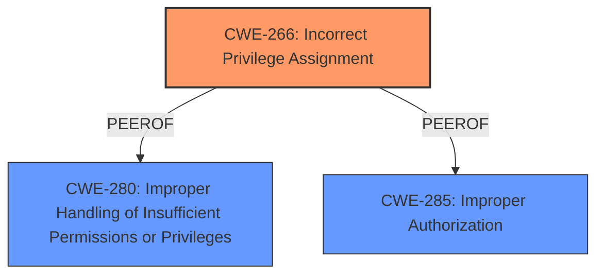

# Analysis for CVE-2025-24258

# Summary
| CWE ID | CWE Name | Confidence | CWE Abstraction Level | CWE Vulnerability Mapping Label | CWE-Vulnerability Mapping Notes |
|---|---|---|---|---|---|
| CWE-266 | Incorrect Privilege Assignment | 0.8 | Base | Primary | Allowed |
| CWE-280 | Improper Handling of Insufficient Permissions or Privileges | 0.6 | Base | Secondary | Allowed |
| CWE-285 | Improper Authorization | 0.5 | Class | Secondary | Discouraged |

## Evidence and Confidence

*   **Confidence Score:** 0.7
*   **Evidence Strength:** HIGH

## Relationship Analysis
The primary CWE is CWE-266, representing incorrect privilege assignment as the root cause. CWE-280 and CWE-285 are considered as secondary options due to the broader scope of "improper handling" or "improper authorization," but the evidence points more directly to a privilege assignment issue. These are all related to access control, with CWE-266 being a more specific form of the more general CWE-285 and CWE-280.

## Vulnerability Chain
The vulnerability chain starts with a **permissions issue**, which leads to an application being able to gain root privileges. The most likely root cause is **Incorrect Privilege Assignment** (CWE-266), where the application is assigned more privileges than it should have.

## Summary of Analysis
The vulnerability description indicates a **permissions issue** that allows an app to gain root privileges. The updated information from the CVE details mentions the affected component is DiskArbitration. Based on the CWE Classification Guidance provided, specifically the section on "Privileges vs Permissions," the most appropriate CWE is CWE-266 (Incorrect Privilege Assignment). This is because the core issue appears to be an application being assigned the incorrect privileges, allowing it to perform actions it should not be able to. The description "A **permissions issue** was addressed with additional restrictions" directly supports this, along with the impact "An app may be able to gain root privileges."

CWE-280 (Improper Handling of Insufficient Permissions or Privileges) was considered because it addresses scenarios where a product doesn't handle insufficient privileges correctly. While this *could* be a factor, the description focuses more on the assignment of incorrect privileges rather than the handling of insufficient ones. Therefore, it is deemed a secondary consideration.

CWE-285 (Improper Authorization) was also considered but is discouraged because it is a high-level class.

The choice of CWE-266 is at the Base level of abstraction, aligning with the MITRE recommendation to select the most specific CWE. The evidence directly supports this classification with high confidence.

Relevant CWE Information:

# Enhanced Context (25 CWEs)
The following CWEs were identified as potentially relevant to this vulnerability:

## CWE-266: Incorrect Privilege Assignment
**Abstraction Level**: Base
**Similarity Score**: 0.78
**Source**: dense

**Description**:
A product incorrectly assigns a privilege to a particular actor, creating an unintended sphere of control for that actor.

**Mapping Guidance**:
- Usage: Allowed
- Rationale: This CWE entry is at the Base level of abstraction, which is a preferred level of abstraction for mapping to the root causes of vulnerabilities.

*Technical Explanation*: The vulnerability description "A **permissions issue** was addressed with additional restrictions. An app may be able to gain root privileges." suggests that the app was incorrectly assigned privileges, allowing it to perform actions as root. This aligns perfectly with the description of CWE-266, where a product incorrectly assigns a privilege to an actor.
*Security Implications and Potential Impact*: The security implication is that an application can gain elevated privileges (root), leading to potential compromise of the entire system.
*Parent-Child Relationships or Chain Patterns*: None applicable in this case.
*Primary or Secondary*: Primary
*MITRE Mapping Guidance Influence*: The MITRE mapping guidance for CWE-266 states that it is allowed and at the preferred Base level of abstraction, further solidifying its appropriateness.

## CWE-280: Improper Handling of Insufficient Permissions or Privileges
**Abstraction Level**: Base
**Similarity Score**: 0.76
**Source**: dense

**Description**:
The product does not handle or incorrectly handles when it has insufficient privileges to access resources or functionality as specified by their permissions. This may cause it to follow unexpected code paths that may leave the product in an invalid state.

*Technical Explanation*: While the vulnerability involves a **permissions issue**, the core problem seems to be that the app *was* given privileges it shouldn't have, rather than the system mishandling a scenario where the app lacks the necessary privileges. However, it is possible the system incorrectly handles the scenario where the app has been given too many privileges.
*Security Implications and Potential Impact*: If the system improperly handles an app having too many permissions, it could still lead to the app gaining root access.
*Parent-Child Relationships or Chain Patterns*: None applicable in this case.
*Primary or Secondary*: Secondary
*MITRE Mapping Guidance Influence*: The MITRE mapping guidance for CWE-280 states that it is allowed and at the preferred Base level of abstraction.

## CWE-285: Improper Authorization
**Abstraction Level**: Class
**Similarity Score**: 1495.19
**Source**: sparse

**Description**:
The product does not perform or incorrectly performs an authorization check when an actor attempts to access a resource or perform an action.

*Technical Explanation*: This CWE is too general as the root cause is more related to the assignment of the permissions instead of the authorization checks.
*Security Implications and Potential Impact*: If the system improperly handles an app having too many permissions, it could still lead to the app gaining root access.
*Parent-Child Relationships or Chain Patterns*: None applicable in this case.
*Primary or Secondary*: Secondary
*MITRE Mapping Guidance Influence*: The MITRE mapping guidance for CWE-285 states that it is discouraged and a higher-level class is frequently used instead.