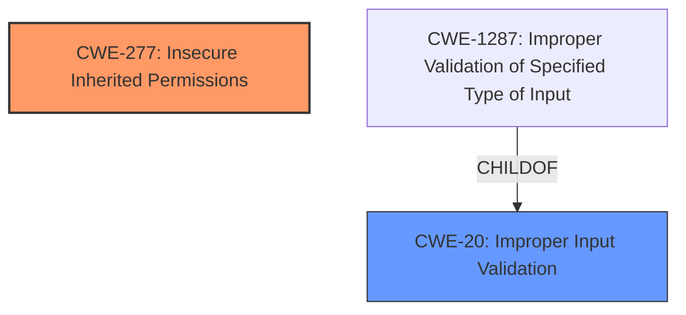

# Analysis for CVE-2025-24282

# Summary
| CWE ID | CWE Name | Confidence | CWE Abstraction Level | CWE Vulnerability Mapping Label | CWE-Vulnerability Mapping Notes |
|---|---|---|---|---|---|
| CWE-277 | Insecure Inherited Permissions | 0.7 | Variant | Allowed | Primary CWE. The vulnerability allows an app to modify protected parts of the file system, indicating an issue with how permissions are inherited or managed. |
| CWE-20 | Improper Input Validation | 0.6 | Class | Discouraged | Secondary candidate. The CVE reference mentions improved input sanitization as a fix. |

## Evidence and Confidence

*   **Confidence Score:** 0.7
*   **Evidence Strength:** MEDIUM

## Relationship Analysis
The primary CWE, CWE-277 (Insecure Inherited Permissions), is a variant-level CWE, providing a specific classification. CWE-20 (Improper Input Validation) is a class-level CWE and a parent of CWE-1287 (Improper Validation of Specified Type of Input), but is considered a secondary candidate as it is more general. The vulnerability description points towards an issue related to permissions, making CWE-277 a more direct fit.

## Vulnerability Chain
The vulnerability chain involves a **library injection** (**weakness**) leading to the ability to modify protected parts of the file system (**impact**). The root cause is likely related to how permissions are handled during library loading or execution, represented by CWE-277 (Insecure Inherited Permissions). Improved input sanitization (mentioned in the CVE reference) can be related to CWE-20, but this is a secondary weakness.

## Summary of Analysis
The primary assessment is based on the vulnerability allowing an app to modify protected parts of the file system, which strongly suggests a permission-related issue. The **library injection** **weakness** allows the **impact** of modifying protected parts of the file system. The CVE reference mentions improved input sanitization as a fix, making CWE-20 a secondary candidate. CWE-277 is at the optimal level of specificity because it directly addresses the insecure inheritance of permissions.

Relevant CWE Information:

# Enhanced Context (25 CWEs)
The following CWEs were identified as potentially relevant to this vulnerability:

## CWE-277: Insecure Inherited Permissions
**Abstraction Level**: Variant
**Similarity Score**: 0.73
**Source**: dense

**Description**:
A product defines a set of insecure permissions that are inherited by objects that are created by the program.

**Mapping Guidance**:
- Usage: Allowed
- Rationale: This CWE entry is at the Variant level of abstraction, which is a preferred level of abstraction for mapping to the root causes of vulnerabilities.

## CWE-20: Improper Input Validation
**Abstraction Level**: Class
**Similarity Score**: 398.31
**Source**: sparse

**Description**:
The product receives input or data, but it does
        not validate or incorrectly validates that the input has the
        properties that are required to process the data safely and
        correctly.

**Mapping Guidance**:
- Usage: Discouraged
- Rationale: CWE-20 is commonly misused in low-information vulnerability reports when lower-level CWEs could be used instead, or when more details about the vulnerability are available [REF-1287]. It is not useful for trend analysis. It is also a level-1 Class (i.e., a child of a Pillar).

### Other CWEs Considered and Rejected:

*   **CWE-787: Out-of-bounds Write:** This CWE is related to memory corruption issues and is not directly relevant to the vulnerability description, which focuses on permission issues.
*   **CWE-770: Allocation of Resources Without Limits or Throttling:** This CWE is related to resource management and is not directly relevant to the vulnerability description, which focuses on permission issues.
*   **CWE-347: Improper Verification of Cryptographic Signature:** This CWE is related to cryptographic signature verification and is not directly relevant to the vulnerability description, which focuses on permission issues.
*   **CWE-451: User Interface (UI) Misrepresentation of Critical Information:** This CWE is related to UI misrepresentation and is not directly relevant to the vulnerability description, which focuses on permission issues.
*   **CWE-667: Improper Locking:** This CWE is related to locking mechanisms and is not directly relevant to the vulnerability description, which focuses on permission issues.
*   **CWE-665: Improper Initialization:** This CWE is related to resource initialization and is not directly relevant to the vulnerability description, which focuses on permission issues.
*   **CWE-138: Improper Neutralization of Special Elements:** This CWE is related to input neutralization and is not directly relevant to the vulnerability description, which focuses on permission issues.
*   **CWE-129: Improper Validation of Array Index:** This CWE is related to array index validation and is not directly relevant to the vulnerability description, which focuses on permission issues.
*   **CWE-22: Improper Limitation of a Pathname to a Restricted Directory ('Path Traversal'):** This CWE is related to path traversal and is not directly relevant to the vulnerability description, which focuses on permission issues.
*   **CWE-41: Improper Resolution of Path Equivalence:** This CWE is related to path equivalence and is not directly relevant to the vulnerability description, which focuses on permission issues.
*   **CWE-822: Untrusted Pointer Dereference:** This CWE is related to pointer dereferencing and is not directly relevant to the vulnerability description, which focuses on permission issues.
*   **CWE-823: Use of Out-of-range Pointer Offset:** This CWE is related to pointer offsets and is not directly relevant to the vulnerability description, which focuses on permission issues.
*   **CWE-824: Access of Uninitialized Pointer:** This CWE is related to uninitialized pointers and is not directly relevant to the vulnerability description, which focuses on permission issues.
*   **CWE-825: Expired Pointer Dereference:** This CWE is related to expired pointers and is not directly relevant to the vulnerability description, which focuses on permission issues.
*   **CWE-1287: Improper Validation of Specified Type of Input:** While related to input validation, the primary issue appears to be with inherited permissions rather than the type of input.