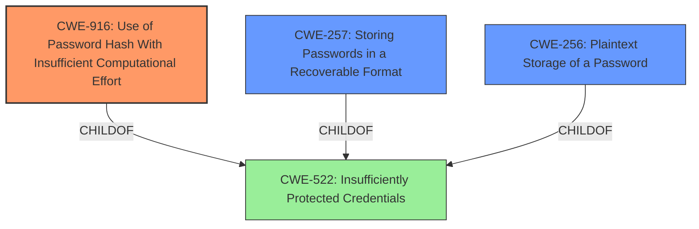

# Analysis for CVE-2025-24340

# Summary
| CWE ID | CWE Name | Confidence | CWE Abstraction Level | CWE Vulnerability Mapping Label | CWE-Vulnerability Mapping Notes |
|---|---|---|---|---|---|
| CWE-916 | Use of Password Hash With Insufficient Computational Effort | 0.9 | Base | Primary CWE | Allowed |
| CWE-257 | Storing Passwords in a Recoverable Format | 0.7 | Base | Secondary Candidate | Allowed |
| CWE-256 | Plaintext Storage of a Password | 0.6 | Base | Secondary Candidate | Allowed |

## Evidence and Confidence

*   **Confidence Score:** 0.8
*   **Evidence Strength:** MEDIUM

## Relationship Analysis
The primary relationship influencing the decision is the hierarchical structure with **CWE-522 (Insufficiently Protected Credentials)** as a Class and **CWE-916 (Use of Password Hash With Insufficient Computational Effort)**, **CWE-257 (Storing Passwords in a Recoverable Format)**, and **CWE-256 (Plaintext Storage of a Password)** as potential Base level children. We chose **CWE-916 (Use of Password Hash With Insufficient Computational Effort)** as the primary because the vulnerability description mentions that the **plaintext passwords** of other users may be recovered. **CWE-916 (Use of Password Hash With Insufficient Computational Effort)** is more specific to the password hashing implementation, while **CWE-257 (Storing Passwords in a Recoverable Format)** and **CWE-256 (Plaintext Storage of a Password)** are more general forms of the same issue.

## Vulnerability Chain
The chain of events starts with the **Use of Password Hash With Insufficient Computational Effort (CWE-916)**. This leads to a situation where passwords can be recovered, effectively resulting in **Storing Passwords in a Recoverable Format (CWE-257)** or even **Plaintext Storage of a Password (CWE-256)**. The ultimate impact is that an attacker can compromise user accounts.

## Summary of Analysis
The primary assessment is based on the provided evidence, especially the "CVE Reference Links Content Summary" which states, "**Weaknesses/vulnerabilities present:** Use of Password Hash With Insufficient Computational Effort (CWE-916)." This is strong evidence for selecting CWE-916. The retriever results also list **CWE-916 (Use of Password Hash With Insufficient Computational Effort)**, **CWE-257 (Storing Passwords in a Recoverable Format)** and **CWE-256 (Plaintext Storage of a Password)** as potential matches. The relationship graph shows that **CWE-916 (Use of Password Hash With Insufficient Computational Effort)** is a more specific child of **CWE-522 (Insufficiently Protected Credentials)** than the other candidates. **CWE-916 (Use of Password Hash With Insufficient Computational Effort)** is the optimal level of specificity because it focuses on the hashing algorithm's weakness, while **CWE-257 (Storing Passwords in a Recoverable Format)** and **CWE-256 (Plaintext Storage of a Password)** describe the consequence of that weakness.

Relevant CWE Information:

**CWE-916: Use of Password Hash With Insufficient Computational Effort**

*   The vulnerability description states the weakness is "**Use of Password Hash With Insufficient Computational Effort (CWE-916)**".
*   This aligns with the description of CWE-916, where the product uses a hashing scheme that doesn't provide sufficient computational effort to prevent password cracking.
*   The impact is that an attacker can recover plaintext passwords.
*   This is the primary CWE due to the explicit mention in the CVE summary.
*   Confidence: 0.9

**CWE-257: Storing Passwords in a Recoverable Format**

*   The vulnerability allows a remote attacker to recover plaintext passwords of other users.
*   This aligns with the description of CWE-257, where passwords can be recovered, making them subject to reuse.
*   This is a secondary CWE, as it's a consequence of the insufficient hashing algorithm.
*   Confidence: 0.7

**CWE-256: Plaintext Storage of a Password**

*   The vulnerability results in plaintext passwords being recoverable.
*   This aligns with the description of CWE-256, where storing passwords in plaintext may result in a system compromise.
*   This is a secondary CWE, and a more extreme case of CWE-257.
*   Confidence: 0.6

**CWE-532: Insertion of Sensitive Information into Log File**

*   This CWE was considered, as it relates to sensitive information disclosure. However, the vulnerability isn't specifically about logging, but about the **inadequate protection of passwords** making them **recoverable**, so it was not selected.

**CWE-522: Insufficiently Protected Credentials**

*   This CWE was considered, as it is a parent of **CWE-257**, **CWE-256** and **CWE-916**, but it is too high-level and general. The child CWEs are more specific and accurate.