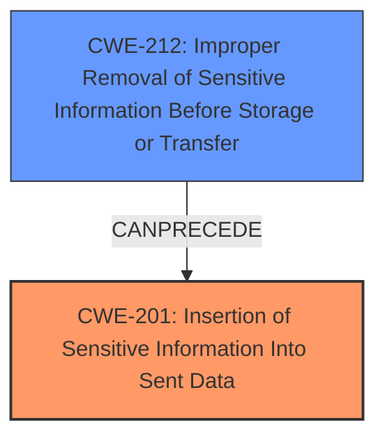

# Analysis Report for CVE-2025-24363

# Vulnerability Analysis Report: CVE-2025-24363

## Description

The HL7 FHIR IG publisher is a tool to take a set of inputs and create a standard FHIR IG. Prior to version 1.8.9, in CI contexts, the IG Publisher CLI uses git commands to determine the URL of the originating repo. If the repo was cloned, or otherwise set to use a repo that uses a **username and credential based URL**, the entire URL will be included in the built Implementation Guide, exposing username and credential. This does not impact users that clone public repos without credentials, such as those using the auto-ig-build continuous integration infrastructure. This problem has been patched in release 1.8.9. Some workarounds are available. Users should ensure the IG repo they are publishing does not have username or credentials included in the `origin` URL. Running the command `git remote origin url` should return a URL that contains no username, password, or token or users should run the IG Publisher CLI with the `-repo` parameter and specify a URL that contains no username, password, or token.

## Vulnerability Description Key Phrases

- **Rootcause:** username and credential based URL
- **Impact:** exposing username and credential
- **Vector:** git commands
- **Product:** HL7 FHIR IG publisher
- **Version:** prior to version 1.8.9

## Analysis (with Relationship Data)

# Summary
| CWE ID | CWE Name | Confidence | CWE Abstraction Level | CWE Vulnerability Mapping Label | CWE-Vulnerability Mapping Notes |
|---|---|---|---|---|---|
| CWE-201 | Insertion of Sensitive Information Into Sent Data | 0.9 | Base | Allowed | Primary CWE. The application transmits data (the git repo URL) that includes sensitive information (username and password) that should not be accessible. |
| CWE-212 | Improper Removal of Sensitive Information Before Storage or Transfer | 0.7 | Base | Allowed | Secondary CWE. The application stores the sensitive URL in the generated Implementation Guide and database without properly removing the credentials. |

## Evidence and Confidence

*   **Confidence Score:** 0.8
*   **Evidence Strength:** HIGH

## Relationship Analysis
The primary CWE is CWE-201 **Insertion of Sensitive Information Into Sent Data**. The secondary CWE is CWE-212 **Improper Removal of Sensitive Information Before Storage or Transfer**. CWE-212 can precede CWE-201, as the sensitive information must be present before it can be sent. Both CWEs are at the Base level of abstraction, which is preferred.



## Vulnerability Chain
The vulnerability chain starts with the use of a **username and credential based URL** in the git repository configuration. The HL7 FHIR IG Publisher then uses git commands to determine the repository URL. Due to the **username and credential based URL**, the entire URL, including credentials, is included in the generated Implementation Guide (**Insertion of Sensitive Information Into Sent Data**). This sensitive information is then stored in the database metadata (**Improper Removal of Sensitive Information Before Storage or Transfer**). The final impact is the exposure of usernames and passwords/tokens, allowing unauthorized access to the repository.

## Summary of Analysis
The vulnerability lies in the HL7 FHIR IG Publisher including credentials in the generated output due to the use of git commands that retrieve the repository URL. The primary weakness is CWE-201, as the sensitive information is directly inserted into the sent data (the Implementation Guide). CWE-212 is a secondary weakness, as the sensitive information is stored without proper removal of the credentials. The evidence supports this classification, as the vulnerability description explicitly mentions the exposure of usernames and credentials due to the inclusion of the entire URL in the built Implementation Guide. The retriever results also support this, with CWE-201 being a top match. I am not overriding any mapping guidance, and the selected CWEs are at the optimal level of specificity.

Relevant CWE Information:
*   **CWE-201: Insertion of Sensitive Information Into Sent Data**: This CWE accurately describes the vulnerability, as the application transmits data (the git repo URL) that includes sensitive information (username and password) that should not be accessible.
*   **CWE-212: Improper Removal of Sensitive Information Before Storage or Transfer**: This CWE is also applicable because the application stores the sensitive URL in the generated Implementation Guide and database without properly removing the credentials.

CWEs considered but not used:

*   **CWE-88: Improper Neutralization of Argument Delimiters in a Command ('Argument Injection')**: While the vulnerability involves git commands, it's not directly related to argument injection. The issue is the exposure of credentials, not the manipulation of command arguments.
*   **CWE-918: Server-Side Request Forgery (SSRF)**: This CWE is not relevant as there is no server-side request being forged.
*   **CWE-79: Improper Neutralization of Input During Web Page Generation ('Cross-site Scripting')**: This CWE is not relevant because the vulnerability doesn't involve web page generation or cross-site scripting.
*   **CWE-522: Insufficiently Protected Credentials**: This is related to credential management, but CWE-201 is more specific to the action of inserting the credentials into the data.
*   **CWE-214: Invocation of Process Using Visible Sensitive Information**: While sensitive information is used in a process (git), the core issue is the insertion of this information into sent data, making CWE-201 a more appropriate fit.


## CWE Relationship Analysis

Current CWEs represent these abstraction levels: .


### Vulnerability Chain Analysis

**Chain starting from CWE-88:**
- 88 (Improper Neutralization of Argument Delimiters in a Command ('Argument Injection')) - ROOT


**Chain starting from CWE-79:**
- 79 (Improper Neutralization of Input During Web Page Generation ('Cross-site Scripting')) - ROOT


### CWE Relationship Diagram

```mermaid
graph TD
    classDef primary fill:#f96,stroke:#333,stroke-width:2px
    classDef secondary fill:#69f,stroke:#333
    classDef tertiary fill:#9e9,stroke:#333
```


*Report generated on 2025-07-14 12:37:00*
