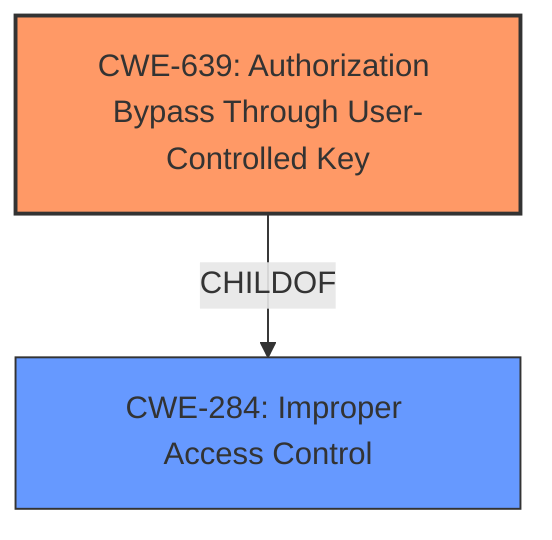

# Analysis Report for CVE-2025-24365

# Vulnerability Analysis Report: CVE-2025-24365

## Description

vaultwarden is an unofficial Bitwarden compatible server written in Rust, formerly known as bitwarden_rs. Attacker can obtain owner rights of other organization. Hacker should know the ID of victim organization (in real case the user can be a part of the organization as an unprivileged user) and be the owner/admin of other organization (by default you can create your own organization) in order to attack. This vulnerability is fixed in 1.33.0.

## Vulnerability Description Key Phrases

- **Impact:** obtain owner rights of other organization
- **Attacker:** attacker
- **Product:** vaultwarden

## Analysis (with Relationship Data)

# Summary
| CWE ID   | CWE Name                                                                 | Confidence | CWE Abstraction Level | CWE Vulnerability Mapping Label | CWE-Vulnerability Mapping Notes |
| :------- | :----------------------------------------------------------------------- | :--------- | :-------------------- | :------------------------------ | :------------------------------ |
| CWE-639  | Authorization Bypass Through User-Controlled Key                         | 1.0        | Base                  | Primary                         | Allowed                         |
| CWE-284  | Improper Access Control                                                    | 0.7        | Class                  | Secondary                       | Discouraged                     |

## Evidence and Confidence

*   **Confidence Score:** 0.9
*   **Evidence Strength:** HIGH

## Relationship Analysis
The primary CWE is CWE-639, which is a Base level CWE and a child of CWE-284. CWE-284 is a Class level CWE and is a parent of CWE-639. The analysis favors CWE-639 because it is more specific and maps directly to the **root cause** of the vulnerability, which is the **authorization bypass** due to the manipulation of the organization ID. CWE-284 is a broader category and less descriptive of the specific vulnerability.



## Vulnerability Chain
The vulnerability chain starts with the **improper handling of the organization ID**, which allows an attacker to **bypass authorization** checks and gain unauthorized access to resources belonging to another organization.

Root Cause: **CWE-639 Authorization Bypass Through User-Controlled Key** - The server uses an externally controlled organization ID to authorize access, allowing an attacker to manipulate this ID and bypass authorization checks.
Impact: Privilege Escalation - The attacker gains owner rights in a foreign organization, leading to potential data breach and unauthorized access.

## Summary of Analysis
The analysis identifies CWE-639 as the primary CWE because it directly addresses the root cause of the vulnerability: the **authorization bypass** due to user-controlled key. The vulnerability description and CVE Reference Links Content Summary clearly indicate that the attacker can manipulate the organization ID to gain unauthorized access to other organization's resources.

Evidence:
"The vulnerability stems from variable confusion in the `OrgHeaders` trait within `src/auth.rs`. Specifically, the server retrieves the organization UUID from either the path parameter or a GET query parameter. If both are present, the GET query parameter overwrites the path parameter. This allows an attacker to manipulate the organization ID used in subsequent operations."

CWE-284 was also considered, as it is listed in the advisory, but it's a more general Improper Access Control issue, and CWE-639 provides a more precise description of the **root cause**.

The retriever results also suggest CWE-639 as a strong candidate, further reinforcing the decision.

Other CWEs Considered but Not Used:

*   CWE-863: Incorrect Authorization - While related, it is more general than CWE-639.
*   CWE-610: Externally Controlled Reference to a Resource in Another Sphere - While the organization ID is externally controlled, the core issue is the authorization bypass, making CWE-639 more appropriate.

Relevant CWE Information:

# Enhanced Context (25 CWEs)
The following CWEs were identified as potentially relevant to this vulnerability:

## CWE-267: Privilege Defined With Unsafe Actions
**Abstraction Level**: Base
**Similarity Score**: 0.72
**Source**: dense

**Description**:
A particular privilege, role, capability, or right can be used to perform unsafe actions that were not intended, even when it is assigned to the correct entity.

**Mapping Guidance**:
- Usage: Allowed
- Rationale: This CWE entry is at the Base level of abstraction, which is a preferred level of abstraction for mapping to the root causes of vulnerabilities.


## CWE-1391: Use of Weak Credentials
**Abstraction Level**: Class
**Similarity Score**: 0.70
**Source**: dense

**Description**:
The product uses weak credentials (such as a default key or hard-coded password) that can be calculated, derived, reused, or guessed by an attacker.

**Mapping Guidance**:
- Usage: Allowed-with-Review
- Rationale: This CWE entry is a Class and might have Base-level children that would be more appropriate


## CWE-639: Authorization Bypass Through User-Controlled Key
**Abstraction Level**: Base
**Similarity Score**: 0.70
**Source**: dense

**Description**:
The system's authorization functionality does not prevent one user from gaining access to another user's data or record by modifying the key value identifying the data.

**Mapping Guidance**:
- Usage: Allowed
- Rationale: This CWE entry is at the Base level of abstraction, which is a preferred level of abstraction for mapping to the root causes of vulnerabilities.


## CWE-610: Externally Controlled Reference to a Resource in Another Sphere
**Abstraction Level**: Class
**Similarity Score**: 0.70
**Source**: dense

**Description**:
The product uses an externally controlled name or reference that resolves to a resource that is outside of the intended control sphere.

**Mapping Guidance**:
- Usage: Discouraged
- Rationale: This CWE entry is a level-1 Class (i.e., a child of a Pillar). It might have lower-level children that would be more appropriate


## CWE-212: Improper Removal of Sensitive Information Before Storage or Transfer
**Abstraction Level**: Base
**Similarity Score**: 0.70
**Source**: dense

**Description**:
The product stores, transfers, or shares a resource that contains sensitive information, but it does not properly remove that information before the product makes the resource available to unauthorized actors.

**Mapping Guidance**:
- Usage: Allowed
- Rationale: This CWE entry is at the Base level of abstraction, which is a preferred level of abstraction for mapping to the root causes of vulnerabilities.


## CWE-497: Exposure of Sensitive System Information to an Unauthorized Control Sphere
**Abstraction Level**: Base
**Similarity Score**: 0.69
**Source**: dense

**Description**:
The product does not properly prevent sensitive system-level information from being accessed by unauthorized actors who do not have the same level of access to the underlying system as the product does.

**Mapping Guidance**:
- Usage: Allowed
- Rationale: This CWE entry is at the Base level of abstraction, which is a preferred level of abstraction for mapping to the root causes of vulnerabilities.


## CWE-1390: Weak Authentication
**Abstraction Level**: Class
**Similarity Score**: 0.69
**Source**: dense

**Description**:
The product uses an authentication mechanism to restrict access to specific users or identities, but the mechanism does not sufficiently prove that the claimed identity is correct.

**Mapping Guidance**:
- Usage: Allowed-with-Review
- Rationale: This CWE entry is a Class and might have Base-level children that would be more appropriate


## CWE-201: Insertion of Sensitive Information Into Sent Data
**Abstraction Level**: Base
**Similarity Score**: 0.69
**Source**: dense

**Description**:
The code transmits data to another actor, but a portion of the data includes sensitive information that should not be accessible to that actor.

**Mapping Guidance**:
- Usage: Allowed
- Rationale: This CWE entry is at the Base level of abstraction, which is a preferred level of abstraction for mapping to the root causes of vulnerabilities.


## CWE-303: Incorrect Implementation of Authentication Algorithm
**Abstraction Level**: Base
**Similarity Score**: 0.68
**Source**: dense

**Description**:
The requirements for the product dictate the use of an established authentication algorithm, but the implementation of the algorithm is incorrect.

**Mapping Guidance**:
- Usage: Allowed
- Rationale: This CWE entry is at the Base level of abstraction, which is a preferred level of abstraction for mapping to the root causes of vulnerabilities.


## CWE-918: Server-Side Request Forgery (SSRF)
**Abstraction Level**: Base
**Similarity Score**: 0.68
**Source**: dense

**Description**:
The web server receives a URL or similar request from an upstream component and retrieves the contents of this URL, but it does not sufficiently ensure that the request is being sent to the expected destination.

**Mapping Guidance**:
- Usage: Allowed
- Rationale: This CWE entry is at the Base level of abstraction, which is a preferred level of abstraction for mapping to the root causes of vulnerabilities.


## CWE-639: Authorization Bypass Through User-Controlled Key
**Abstraction Level**: Base
**Similarity Score**: 1054.58
**Source**: sparse

**Description**:
The system's authorization functionality does not prevent one user from gaining access to another user's data or record by modifying the key value identifying the data.

**Mapping Guidance**:
- Usage: Allowed
- Rationale: This


## CWE Relationship Analysis

Current CWEs represent these abstraction levels: .


### Vulnerability Chain Analysis

**Chain starting from CWE-1390:**
- 1390 (Weak Authentication) - ROOT


**Chain starting from CWE-863:**
- 863 (Incorrect Authorization) - ROOT


### CWE Relationship Diagram

```mermaid
graph TD
    classDef primary fill:#f96,stroke:#333,stroke-width:2px
    classDef secondary fill:#69f,stroke:#333
    classDef tertiary fill:#9e9,stroke:#333
```


*Report generated on 2025-07-14 12:37:43*
