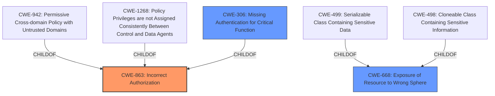

# Raw Analyzer Response for CVE-2025-24376

# Summary
| CWE ID | CWE Name | Confidence | CWE Abstraction Level | CWE Vulnerability Mapping Label | CWE-Vulnerability Mapping Notes |
|---|---|---|---|---|---|
| CWE-863 | Incorrect Authorization | 0.9 | Class | Primary CWE | Allowed-with-Review |
| CWE-668 | Exposure of Resource to Wrong Sphere | 0.7 | Class | Secondary Candidate | Discouraged |
| CWE-306 | Missing Authentication for Critical Function | 0.6 | Base | Secondary Candidate | Allowed |

## Evidence and Confidence

*   **Confidence Score:** 0.8
*   **Evidence Strength:** MEDIUM

## Relationship Analysis
The primary CWE is CWE-863 (**CWE-863: Incorrect Authorization**), which is a class-level CWE. While it is generally better to choose a base-level CWE, in this case, the description does not offer sufficient detail to determine the precise authorization failure mechanism. Therefore, the class level is appropriate. CWE-668 (**CWE-668: Exposure of Resource to Wrong Sphere**) is considered as a potential secondary CWE because the attacker gains access to the PolicyReport resource which they should not have. CWE-306 (**CWE-306: Missing Authentication for Critical Function**) might be relevant if the creation or modification of the AdmissionPolicy and AdmissionPolicyGroup resources lack proper authentication, but this is not explicitly stated in the provided information.

## Vulnerability Chain
The vulnerability chain starts with an **incorrect authorization** mechanism (CWE-863) in the kubewarden-controller that allows an attacker to create or modify AdmissionPolicy and AdmissionPolicyGroup resources. This leads to the attacker gaining the ability to **prevent PolicyReport object creation and update** or to **alter the contents of the PolicyReport**. This results in hiding non-compliant resources and manipulating audit data. The chain can be visualized as:

Incorrect Authorization (CWE-863) -> Prevent PolicyReport creation/update OR Alter PolicyReport Contents -> Hiding of non-compliant resources/Manipulation of audit data.

## Summary of Analysis
The vulnerability allows an attacker to **prevent the creation and update of PolicyReport objects to hide non-compliant resources** or **alter the contents of the PolicyReport created inside of the namespace**. The root cause is due to the **validation rules** applied to AdmissionPolicy and AdmissionPolicyGroup.

The primary CWE selected is CWE-863 (**CWE-863: Incorrect Authorization**). The retriever results listed this as the top candidate, and it aligns well with the provided description. The vulnerability involves an authorization issue, where an attacker is able to manipulate resources (PolicyReports) that they should not have access to. The description states "Starting from the 1.21.0 release, the validation rules applied to AdmissionPolicy and AdmissionPolicyGroup have been tightened to prevent them from validating sensitive types of namespaced resources." This indicates that the original rules were **incorrect**, leading to the authorization bypass.

CWE-668 (**CWE-668: Exposure of Resource to Wrong Sphere**) is a potential secondary CWE since the attacker is able to access PolicyReport which they should not have access to. However, CWE-668 is discouraged, and it is better to be more specific. The main issue is the incorrect authorization (CWE-863) that leads to the exposure.

CWE-306 (**CWE-306: Missing Authentication for Critical Function**) was considered because the vulnerability description does not explicitly mention whether authentication is performed when creating or modifying AdmissionPolicy and AdmissionPolicyGroup resources. If there is no authentication, it contributes to the ability to bypass authorization. However, due to insufficient evidence, it is a lower-confidence secondary candidate.