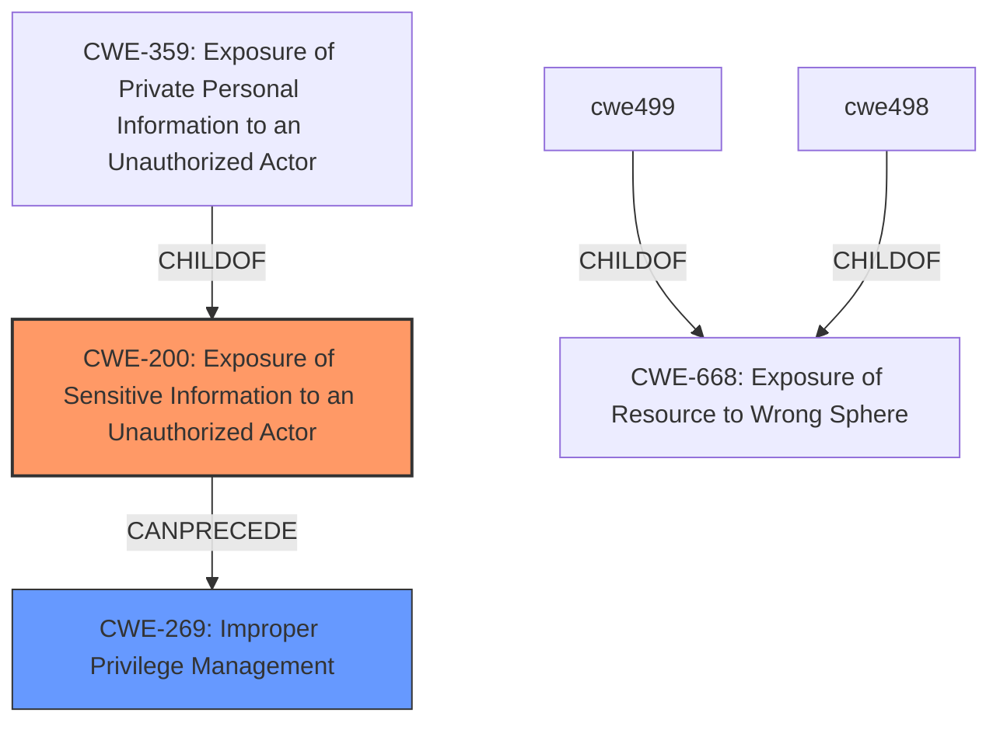

# Raw Analyzer Response for CVE-2025-24408

# Summary
| CWE ID | CWE Name | Confidence | CWE Abstraction Level | CWE Vulnerability Mapping Label | CWE-Vulnerability Mapping Notes |
|---|---|---|---|---|---|
| CWE-200 | Exposure of Sensitive Information to an Unauthorized Actor | 1.0 | Class | Primary | Allowed |
| CWE-269 | Improper Privilege Management | 0.6 | Class | Secondary | Discouraged |

## Evidence and Confidence

*   **Confidence Score:** 0.8
*   **Evidence Strength:** HIGH

## Relationship Analysis
The primary relationship influencing the decision is the hierarchical relationship where CWE-200 ([Exposure of Sensitive Information to an Unauthorized Actor](https://cwe.mitre.org/data/definitions/200.html)) is a class-level CWE that directly addresses the vulnerability's core issue of sensitive information exposure. Although the vulnerability description also mentions privilege escalation, the root cause is the information exposure itself, which could then lead to privilege escalation. Therefore, CWE-200 is the more direct and appropriate classification.

## Vulnerability Chain
The vulnerability chain begins with **Information Exposure** (CWE-200), which allows a low-privileged attacker to gain unauthorized access to sensitive information. This, in turn, leads to privilege escalation.

Information Exposure (CWE-200) -> Privilege Escalation (Potential Impact).

## Summary of Analysis
The initial assessment strongly points to CWE-200 ([Exposure of Sensitive Information to an Unauthorized Actor](https://cwe.mitre.org/data/definitions/200.html)) as the primary CWE due to the explicit mention of "**Information Exposure**" in the vulnerability description. This aligns directly with the definition of CWE-200. The vulnerability allows a low-privileged attacker to gain unauthorized access to sensitive information. The retriever results also list CWE-200, though not as the top result. Given the direct match to the stated weakness, CWE-200 is chosen as the primary CWE.

CWE-269 ([Improper Privilege Management](https://cwe.mitre.org/data/definitions/269.html)) is considered as a secondary CWE because the impact of the **information exposure** is privilege escalation. However, CWE-269 is discouraged for use as a primary CWE unless the root cause is directly related to privilege management issues. In this case, the root cause is **information exposure**, making CWE-200 a more appropriate primary classification.

The selected CWEs are at an appropriate level of specificity, with CWE-200 at the Class level, which accurately captures the nature of the **information exposure** vulnerability.