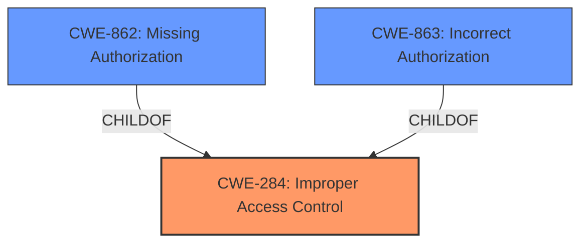

# Enhanced Analysis for CVE-2025-24422

# Summary
| CWE ID | CWE Name | Confidence | CWE Abstraction Level | CWE Vulnerability Mapping Label | CWE-Vulnerability Mapping Notes |
|---|---|---|---|---|---|
| CWE-284 | Improper Access Control | 0.8 | Pillar | Primary | Allowed |
| CWE-862 | Missing Authorization | 0.6 | Class | Secondary | Allowed-with-Review |
| CWE-863 | Incorrect Authorization | 0.5 | Class | Secondary | Allowed-with-Review |

## Evidence and Confidence

*   **Confidence Score:** 0.8
*   **Evidence Strength:** MEDIUM

## Relationship Analysis
The primary relationship influencing the decision is the hierarchical relationship between CWE-284 (Improper Access Control) and its children, such as CWE-862 (Missing Authorization) and CWE-863 (Incorrect Authorization). CWE-284 is a higher-level category, while CWE-862 and CWE-863 are more specific classes of authorization issues. Given the vulnerability description, **Improper Access Control** is explicitly stated as the root cause. While the specific type of access control issue (missing or incorrect authorization) is not fully detailed, both are considered. Since the description states "*Improper Access Control* vulnerability that could result in a Security feature bypass. A low-privileged attacker could leverage this vulnerability to bypass security measures and gain unauthorized read access", it's reasonable to consider the more specific authorization issues. The abstraction level played a role as well, with the aim of selecting the most specific applicable CWEs.



## Vulnerability Chain
The vulnerability chain starts with **Improper Access Control (CWE-284)**, which leads to a security feature bypass and unauthorized read access.
  - **Root Cause:** CWE-284 Improper Access Control
  - **Impact:** Security feature bypass, Unauthorized read access

## Summary of Analysis
The initial assessment focused on identifying the root cause based on the provided vulnerability description. The description explicitly mentions **"Improper Access Control"**, which immediately points to CWE-284. However, the description also indicates that this **Improper Access Control** leads to a security feature bypass and unauthorized read access, suggesting that the access control issue might be related to authorization.

The Retriever Results and Complete CWE Specifications were then analyzed to refine the classification. CWE-862 (Missing Authorization) and CWE-863 (Incorrect Authorization) were considered as potential candidates due to their relationship to authorization and their appearance in the Retriever Results.

The Mapping Guidance for Authentication vs. Authorization vs. Access Control further clarified the distinctions between these concepts. Given that the vulnerability results in unauthorized read access, it is plausible that either authorization is missing or is incorrectly implemented.

The decision to include both CWE-862 and CWE-863 as secondary CWEs acknowledges the possibility of either missing or incorrect authorization, while CWE-284 remains the primary CWE because it is the explicitly stated **rootcause**. This approach aims to capture the nuances of the vulnerability while adhering to the principle of selecting the most specific applicable CWEs.

The evidence for CWE-284 is the explicit mention of **"Improper Access Control"** in the Vulnerability Description Key Phrases. The evidence for CWE-862 and CWE-863 is the resulting "unauthorized read access", implying a flaw in authorization.

Ultimately, the selected CWEs represent the optimal level of specificity given the available evidence. While more detailed information about the specific access control flaw would allow for a more precise classification, the current assessment captures the core aspects of the vulnerability.

Relevant CWE Information:

**CWE-284: Improper Access Control**
The product does not adequately control access to resources or functions, allowing unintended access.

**CWE-862: Missing Authorization**
The product does not perform any authorization checks before allowing an actor to access a resource or perform an action.

**CWE-863: Incorrect Authorization**
The product performs an authorization check when an actor attempts to access a resource or perform an action, but it does not correctly perform the check.


## CWE Relationship Analysis

Current CWEs represent these abstraction levels: .


### Vulnerability Chain Analysis

**Chain starting from CWE-284:**
- 284 (Improper Access Control) - ROOT


**Chain starting from CWE-863:**
- 863 (Incorrect Authorization) - ROOT


### CWE Relationship Diagram

```mermaid
graph TD
    classDef primary fill:#f96,stroke:#333,stroke-width:2px
    classDef secondary fill:#69f,stroke:#333
    classDef tertiary fill:#9e9,stroke:#333
```