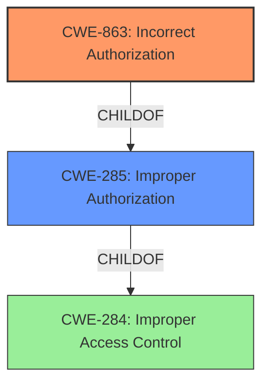

# Raw Analyzer Response for CVE-2025-24437

# Summary

| CWE ID  | CWE Name                                                                  | Confidence | CWE Abstraction Level | CWE Vulnerability Mapping Label | CWE-Vulnerability Mapping Notes |
| :-------- | :------------------------------------------------------------------------ | :--------- | :-------------------- | :------------------------------ | :------------------------------ |
| CWE-863   | Incorrect Authorization                                                   | 0.9        | Class                 | Primary CWE                     | Allowed-with-Review             |
| CWE-285   | Improper Authorization                                                    | 0.7        | Class                 | Secondary Candidate             | Discouraged                     |
| CWE-284   | Improper Access Control                                                   | 0.5        | Pillar                | Secondary Candidate             | Discouraged                     |

## Evidence and Confidence

*   **Confidence Score:** 0.9
*   **Evidence Strength:** HIGH

## Relationship Analysis

The primary CWE selected is CWE-863, Incorrect Authorization. This CWE is a Class-level weakness that describes scenarios where an authorization check is performed, but it's done incorrectly. This is more specific than its parent CWE, CWE-285 Improper Authorization, which is a more general class. CWE-284 Improper Access Control is a very general pillar and should be avoided if a more specific root cause can be determined.

## Vulnerability Chain

The vulnerability chain starts with **Incorrect Authorization** (CWE-863), which leads to a security feature bypass. A low-privileged attacker can then view or modify select information. The root cause is the flawed authorization check, and the impact is unauthorized data access and modification.

## Summary of Analysis

The initial assessment, based on the provided evidence, points towards an authorization issue. The vulnerability description clearly states "**Incorrect Authorization**" as the root cause. The CVE Reference Links Content Summary also mentions "Improper Access Control" which is related to authorization.

The guidance provided distinguishes between authentication and authorization issues. Since the description indicates that a low-privileged attacker can exploit the vulnerability, it suggests that the attacker is already authenticated but lacks the necessary privileges for the actions they are performing. This points towards an authorization flaw rather than an authentication one.

CWE-863 (Incorrect Authorization) is chosen as the primary CWE because the authorization check is performed but is flawed. CWE-285 (Improper Authorization) is a broader category and less specific and is a secondary candidate. CWE-284 (Improper Access Control) is even more general and is only considered as a tertiary candidate because a more specific root cause is identifiable.

The selection of CWE-863 is at the optimal level of specificity because it accurately reflects the **incorrect** implementation of the authorization check, which leads to the security feature bypass and unauthorized access.

Relevant CWE Information:

# Enhanced Context (25 CWEs)
The following CWEs were identified as potentially relevant to this vulnerability:

## CWE-639: Authorization Bypass Through User-Controlled Key
**Abstraction Level**: Base
**Similarity Score**: 0.75
**Source**: dense

**Description**:
The system's authorization functionality does not prevent one user from gaining access to another user's data or record by modifying the key value identifying the data.

**Mapping Guidance**:
- Usage: Allowed
- Rationale: This CWE entry is at the Base level of abstraction, which is a preferred level of abstraction for mapping to the root causes of vulnerabilities.

## CWE-285: Improper Authorization
**Abstraction Level**: Class
**Similarity Score**: 1549.09
**Source**: sparse

**Description**:
The product does not perform or incorrectly performs an authorization check when an actor attempts to access a resource or perform an action.

**Mapping Guidance**:
- Usage: Discouraged
- Rationale: CWE-285 is high-level and lower-level CWEs can frequently be used instead. It is a level-1 Class (i.e., a child of a Pillar).

## CWE-863: Incorrect Authorization
**Abstraction Level**: Class
**Similarity Score**: 1526.73
**Source**: sparse

**Description**:
The product performs an authorization check when an actor attempts to access a resource or perform an action, but it does not correctly perform the check.

**Mapping Guidance**:
- Usage: Allowed-with-Review
- Rationale: This CWE entry is a Class and might have Base-level children that would be more appropriate

## CWE-284: Improper Access Control
**Abstraction Level**: Pillar

**Description**: This CWE is a very general catch-all for access control problems

## CWE-862: Missing Authorization
**Abstraction Level**: Class
**Description**: This CWE is for when there is missing authorization. This is for when there is no authorization check present at all.

CWE-284 was considered but not used as the primary CWE because a more specific cause (**Incorrect Authorization**) was identified. CWE-862 was also considered but ruled out because the vulnerability description and CVE summary both indicate that an authorization mechanism exists but is flawed, not missing entirely. CWE-639 was considered but not used, as the description does not indicate the authorization bypass is due to a user-controlled key.