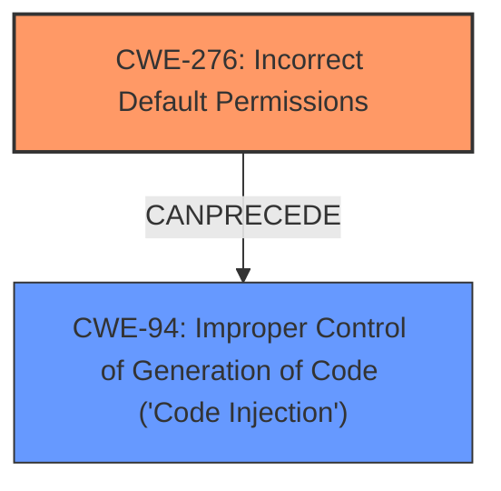

# Raw Analyzer Response for CVE-2025-24482

# Summary

| CWE ID  | CWE Name                                                     | Confidence | CWE Abstraction Level | CWE Vulnerability Mapping Label | CWE-Vulnerability Mapping Notes |
| :-------- | :----------------------------------------------------------- | :--------- | :-------------------- | :------------------------------ | :------------------------------ |
| CWE-276 | Incorrect Default Permissions                                | 1.0        | Base                  | Primary                         | Allowed                       |
| CWE-94  | Improper Control of Generation of Code ('Code Injection') | 0.7        | Base                  | Secondary                       | Allowed-with-Review           |

## Evidence and Confidence

*   **Confidence Score:** 0.85
*   **Evidence Strength:** HIGH

## Relationship Analysis

The primary CWE, CWE-276, is a Base level weakness which is desired. The secondary CWE, CWE-94, is also a Base level weakness. CWE-276 directly addresses the root cause of **incorrect default permissions**. CWE-94 describes the **local code injection vulnerability**, which is the weakness. The relationship here is that **incorrect default permissions** (CWE-276) allow for **local code injection** (CWE-94), which leads to execution of DLLs with elevated permissions.

## Vulnerability Chain

The vulnerability chain starts with **incorrect default permissions** (CWE-276), leading to a **local code injection vulnerability** (CWE-94), which results in the execution of DLLs with higher-level permissions.

## Summary of Analysis

Based on the provided vulnerability description and supporting information, the primary root cause is **incorrect default permissions** (CWE-276), which directly enables a **local code injection vulnerability** (CWE-94).

The evidence from the vulnerability description is: "The vulnerability is due to **incorrect default permissions** and allows for DLLs to be executed with higher level permissions." Additionally, the 'Vulnerability Description Key Phrases' section identifies **incorrect default permissions** as the root cause. The CVE reference link also calls out **incorrect default permissions** as the root cause and local code injection as a weakness.

The retriever results list CWE-276 as a possible candidate, and the complete CWE specifications confirm that it is a Base level weakness and ALLOWED.

CWE-94 is included because the reference link identifies local code injection as a weakness.

Other CWEs considered:

*   CWE-732: Incorrect Permission Assignment for Critical Resource - While related to permissions, this CWE is more specific to critical resources, and the description doesn't provide evidence that a critical resource is involved.
*   CWE-427: Uncontrolled Search Path Element - This CWE is about the search path being under the control of unintended actors, which is not the primary issue described.
*   CWE-266: Incorrect Privilege Assignment - The vulnerability description focuses on permissions rather than privileges.
*   CWE-269: Improper Privilege Management - This is discouraged and less specific than CWE-276.
*   CWE-863: Incorrect Authorization - This is a class level CWE, less specific than CWE-276, and the description focuses on incorrect permissions, not authorization checks.
*   CWE-250: Execution with Unnecessary Privileges - This is related to privilege management, but the vulnerability is caused by permissions.
*   CWE-379: Creation of Temporary File in Directory with Insecure Permissions - This CWE focuses on temporary files, which is not mentioned in the vulnerability description.

The final CWEs selected, CWE-276 and CWE-94, are at the optimal level of specificity because they directly address the root cause and weakness.

Relevant CWE Information:

# Enhanced Context (25 CWEs)

## CWE-266: Incorrect Privilege Assignment
**Abstraction Level**: Base
**Similarity Score**: 0.80
**Source**: dense

**Description**:
A product incorrectly assigns a privilege to a particular actor, creating an unintended sphere of control for that actor.

**Mapping Guidance**:
- Usage: Allowed
- Rationale: This CWE entry is at the Base level of abstraction, which is a preferred level of abstraction for mapping to the root causes of vulnerabilities.

## CWE-280: Improper Handling of Insufficient Permissions or Privileges
**Abstraction Level**: Base
**Similarity Score**: 0.79
**Source**: dense

**Description**:
The product does not handle or incorrectly handles when it has insufficient privileges to access resources or functionality as specified by their permissions. This may cause it to follow unexpected code paths that may leave the product in an invalid state.

**Mapping Guidance**:
- Usage: Allowed
- Rationale: This CWE entry is at the Base level of abstraction, which is a preferred level of abstraction for mapping to the root causes of vulnerabilities.

## CWE-267: Privilege Defined With Unsafe Actions
**Abstraction Level**: Base
**Similarity Score**: 0.78
**Source**: dense

**Description**:
A particular privilege, role, capability, or right can be used to perform unsafe actions that were not intended, even when it is assigned to the correct entity.

**Mapping Guidance**:
- Usage: Allowed
- Rationale: This CWE entry is at the Base level of abstraction, which is a preferred level of abstraction for mapping to the root causes of vulnerabilities.

## CWE-274: Improper Handling of Insufficient Privileges
**Abstraction Level**: Base
**Similarity Score**: 0.78
**Source**: dense

**Description**:
The product does not handle or incorrectly handles when it has insufficient privileges to perform an operation, leading to resultant weaknesses.

**Mapping Guidance**:
- Usage: Discouraged
- Rationale: This CWE entry could be deprecated in a future version of CWE.

## CWE-276: Incorrect Default Permissions
**Abstraction Level**: Base
**Similarity Score**: 0.77
**Source**: dense

**Description**:
During installation, installed file permissions are set to allow anyone to modify those files.

**Mapping Guidance**:
- Usage: Allowed
- Rationale: This CWE entry is at the Base level of abstraction, which is a preferred level of abstraction for mapping to the root causes of vulnerabilities.

## CWE-59: Improper Link Resolution Before File Access ('Link Following')
**Abstraction Level**: Base
**Similarity Score**: 0.76
**Source**: dense

**Description**:
The product attempts to access a file based on the filename, but it does not properly prevent that filename from identifying a link or shortcut that resolves to an unintended resource.

**Mapping Guidance**:
- Usage: Allowed
- Rationale: This CWE entry is at the Base level of abstraction, which is a preferred level of abstraction for mapping to the root causes of vulnerabilities.

## CWE-668: Exposure of Resource to Wrong Sphere
**Abstraction Level**: Class
**Similarity Score**: 0.76
**Source**: dense

**Description**:
The product exposes a resource to the wrong control sphere, providing unintended actors with inappropriate access to the resource.

**Mapping Guidance**:
- Usage: Discouraged
- Rationale: CWE-668 is high-level and is often misused as a catch-all when lower-level CWE IDs might be applicable. It is sometimes used for low-information vulnerability reports [REF-1287]. It is a level-1 Class (i.e., a child of a Pillar). It is not useful for trend analysis.

## CWE-41: Improper Resolution of Path Equivalence
**Abstraction Level**: Base
**Similarity Score**: 0.75
**Source**: dense

**Description**:
The product is vulnerable to file system contents disclosure through path equivalence. Path equivalence involves the use of special characters in file and directory names. The associated manipulations are intended to generate multiple names for the same object.

**Mapping Guidance**:
- Usage: Allowed
- Rationale: This CWE entry is at the Base level of abstraction, which is a preferred level of abstraction for mapping to the root causes of vulnerabilities.

## CWE-497: Exposure of Sensitive System Information to an Unauthorized Control Sphere
**Abstraction Level**: Base
**Similarity Score**: 0.75
**Source**: dense

**Description**:
The product does not properly prevent sensitive system-level information from being accessed by unauthorized actors who do not have the same level of access to the underlying system as the product does.

**Mapping Guidance**:
- Usage: Allowed
- Rationale: This CWE entry is at the Base level of abstraction, which is a preferred level of abstraction for mapping to the root causes of vulnerabilities.

## CWE-73: External Control of File Name or Path
**Abstraction Level**: Base
**Similarity Score**: 0.75
**Source**: dense

**Description**:
The product allows user input to control or influence paths or file names that are used in filesystem operations.

**Mapping Guidance**:
- Usage: Allowed
-