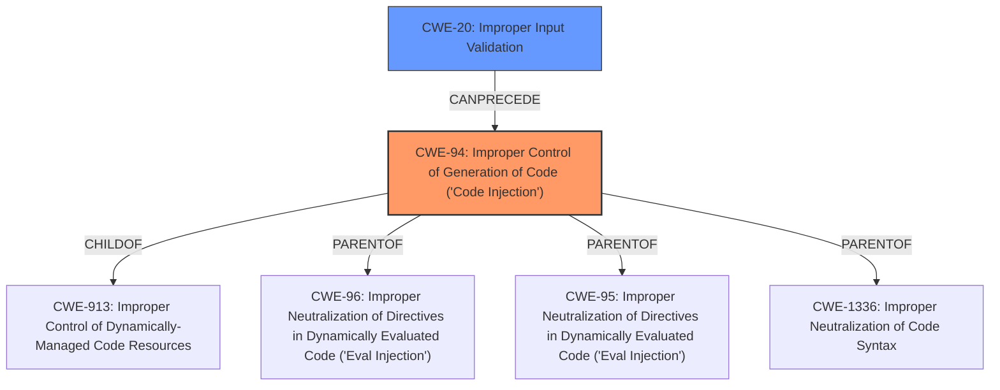

# Analysis Report for CVE-2025-24514

# Vulnerability Analysis Report: CVE-2025-24514

## Description

A security issue was discovered in ingress-nginx https//github.com/kubernetes/ingress-nginx where the `auth-url` Ingress annotation can be used to inject configuration into nginx. This can lead to arbitrary code execution in the context of the ingress-nginx controller, and disclosure of Secrets accessible to the controller. (Note that in the default installation, the controller can access all Secrets cluster-wide.)

## Vulnerability Description Key Phrases

- **Vector:** ingress-nginx auth-url Ingress annotation
- **Product:** ingress-nginx
- **Impact:** ['arbitrary code execution', 'disclosure of Secrets']

## Analysis (with Relationship Data)

# Summary
| CWE ID | CWE Name | Confidence | CWE Abstraction Level | CWE Vulnerability Mapping Label | CWE-Vulnerability Mapping Notes |
|---|---|---|---|---|---|
| CWE-94 | Improper Control of Generation of Code ('Code Injection') | 0.9 | Base | Allowed-with-Review | Primary CWE |
| CWE-20 | Improper Input Validation | 0.7 | Base | Allowed | Secondary Candidate |

## Evidence and Confidence

*   **Confidence Score:** 0.8
*   **Evidence Strength:** HIGH

## Relationship Analysis
The primary CWE is CWE-94, which is a base-level CWE. It has hierarchical relationships as a child of CWE-913 (execution within a control sphere) and parent to CWE-96, CWE-95, and CWE-1336, showing different types of code injection. CWE-20 relates as a potential cause, and can precede CWE-94. The abstraction levels influenced the selection, preferring the Base level for the root cause.



## Vulnerability Chain
The vulnerability chain begins with **improper input validation** (potentially CWE-20), which leads to **improper control of code generation** (CWE-94), resulting in **arbitrary code execution** and **disclosure of secrets**.

## Summary of Analysis
The analysis indicates that the primary weakness is CWE-94, **Improper Control of Generation of Code ('Code Injection')**, due to the `auth-url` Ingress annotation allowing configuration injection into nginx, leading to arbitrary code execution. The vulnerability description clearly states that the `auth-url` Ingress annotation can be used to inject configuration into nginx, leading to arbitrary code execution. This aligns directly with the description of CWE-94. CWE-20, **Improper Input Validation**, is a secondary candidate as it can often precede CWE-94.

The evidence provided in the "CVE Reference Links Content Summary" section supports this classification. Specifically, it states that the root cause of the vulnerability is that the `auth-url` Ingress annotation in ingress-nginx can be used to inject configuration into nginx. This directly implies that the product **does not properly control the generation of code**, which is the core characteristic of CWE-94.

The selection of CWE-94 is at the optimal level of specificity because it directly addresses the root cause, which is the **improper control of code generation** due to the injectable `auth-url` annotation. While other CWEs like CWE-74 (**Improper Neutralization of Special Elements in Output Used by a Downstream Component ('Injection')**) and CWE-20 (**Improper Input Validation**) were considered, CWE-94 is more specific to the code injection aspect of the vulnerability.

Relevant CWE Information:

# Enhanced Context (25 CWEs)
The following CWEs were identified as potentially relevant to this vulnerability:

## CWE-74: Improper Neutralization of Special Elements in Output Used by a Downstream Component ('Injection')
**Abstraction Level**: Class
**Similarity Score**: 0.73
**Source**: dense

**Description**:
The product constructs all or part of a command, data structure, or record using externally-influenced input from an upstream component, but it does not neutralize or incorrectly neutralizes special elements that could modify how it is parsed or interpreted when it is sent to a downstream component.

**Mapping Guidance**:
- Usage: Discouraged
- Rationale: CWE-74 is high-level and often misused when lower-level weaknesses are more appropriate.

## CWE-20: Improper Input Validation
**Abstraction Level**: Base
**Similarity Score**: 3.65
**Source**: graph

**Description**:
The product receives input or data, but it does not validate or incorrectly validates that the input has the properties that are required to process the data safely and correctly.

**Mapping Guidance**:
- Usage: Allowed
- Rationale: This CWE entry is at the Base level of abstraction, which is a preferred level of abstraction for mapping to the root causes of vulnerabilities.

## CWE-94: Improper Control of Generation of Code ('Code Injection')
**Abstraction Level**: base
**Similarity Score**: 2.02
**Source**: graph

**Description**:
The product constructs all or part of a command, data structure, or record using externally-influenced input from an upstream component, but it does not neutralize or incorrectly neutralizes special elements that could modify how it is parsed or interpreted when it is sent to a downstream component.

**Mapping Guidance**:
- Usage: Allowed-with-Review
- Rationale: This entry is frequently misused for vulnerabilities with a technical impact of "code execution," which does not by itself indicate a root cause weakness, since dozens of weaknesses can enable code execution.


## CWE Relationship Analysis

Current CWEs represent these abstraction levels: .


### Vulnerability Chain Analysis

**Chain starting from CWE-94:**
- 94 (Improper Control of Generation of Code ('Code Injection')) - ROOT


**Chain starting from CWE-1336:**
- 1336 (Improper Neutralization of Special Elements Used in a Template Engine) - ROOT


### CWE Relationship Diagram

```mermaid
graph TD
    classDef primary fill:#f96,stroke:#333,stroke-width:2px
    classDef secondary fill:#69f,stroke:#333
    classDef tertiary fill:#9e9,stroke:#333
```


*Report generated on 2025-07-14 12:47:29*
