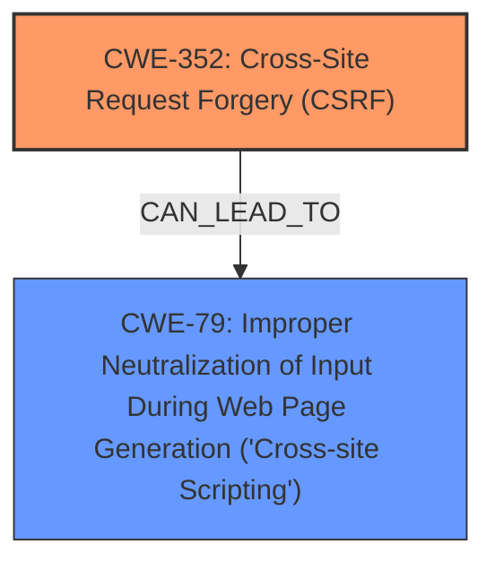

# Analysis for CVE-2025-24636

# Summary
| CWE ID | CWE Name | Confidence | CWE Abstraction Level | CWE Vulnerability Mapping Label | CWE-Vulnerability Mapping Notes |
|---|---|---|---|---|---|
| CWE-352 | Cross-Site Request Forgery (CSRF) | 0.9 | Compound | Allowed | Primary CWE. The root cause of the vulnerability is a **Cross-Site Request Forgery**. |
| CWE-79 | Improper Neutralization of Input During Web Page Generation ('Cross-site Scripting') | 0.7 | Base | Allowed | Secondary CWE. The CSRF allows for **Stored XSS** to occur. |

## Evidence and Confidence

*   **Confidence Score:** 0.8
*   **Evidence Strength:** MEDIUM

## Relationship Analysis
The primary weakness is CWE-352, which is a compound weakness. The secondary weakness is CWE-79, which is a base weakness. CWE-352 allows for the exploitation of CWE-79 in this case. There isn't a direct relationship between CWE-352 and CWE-79 in the CWE definitions, but the vulnerability description makes it clear that the CSRF vulnerability enables the stored XSS.

## Vulnerability Chain
The vulnerability chain starts with a **Cross-Site Request Forgery** (CWE-352) which allows an attacker to inject malicious code. The injected code is then stored, leading to **Stored XSS** (CWE-79).
  - CWE-352 (Root Cause) -> CWE-79 (Impact)

## Summary of Analysis
The primary vulnerability is CWE-352, **Cross-Site Request Forgery (CSRF)**, because the vulnerability description states "Cross-Site Request Forgery (CSRF) vulnerability in Laymance Technologies LLC MachForm Shortcode allows Stored XSS". The **rootcause** is the CSRF. The CSRF allows an attacker to perform actions on behalf of another user, which in this case leads to the **Stored XSS**.

The **Stored XSS** is CWE-79, **Improper Neutralization of Input During Web Page Generation ('Cross-site Scripting')**. This is because the CSRF allows an attacker to inject malicious input that is not properly neutralized, leading to XSS.

The retriever results show CWE-79 and CWE-352 as the top candidates. CWE-79 has a higher score, but that is because it is a more common vulnerability. The vulnerability description clearly states that the CSRF is the root cause.

I am confident in this assessment because the vulnerability description clearly states that the CSRF allows for the Stored XSS. The evidence is "Cross-Site Request Forgery (CSRF) vulnerability in Laymance Technologies LLC MachForm Shortcode allows Stored XSS".

Relevant CWE Information:
- CWE-79: Improper Neutralization of Input During Web Page Generation ('Cross-site Scripting')
- CWE-352: Cross-Site Request Forgery (CSRF)