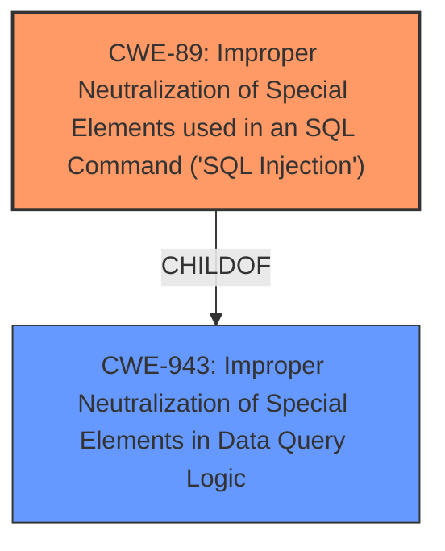

# Analysis Report for CVE-2025-2478

# Vulnerability Analysis Report: CVE-2025-2478

## Description

The Code Clone plugin for WordPress is vulnerable to time-based SQL Injection via the snippetId parameter in all versions up to, and including, 0.9 due to **insufficient escaping on the user supplied parameter and lack of sufficient preparation on the existing SQL query**. This makes it possible for authenticated attackers, with Administrator-level access and above, to append additional SQL queries into already existing queries that can be used to extract sensitive information from the database.

## Vulnerability Description Key Phrases

- **Rootcause:** insufficient escaping on the user supplied parameter and lack of sufficient preparation on the existing SQL query
- **Weakness:** time-based SQL injection
- **Product:** Code Clone plugin for WordPress
- **Impact:** append additional SQL queries into already existing queries, extract sensitive information from the database
- **Attacker:** authenticated attackers
- **Version:** all versions up to and including 0.9

## Analysis (with Relationship Data)

# Summary

| CWE ID | CWE Name | Confidence | CWE Abstraction Level | CWE Vulnerability Mapping Label | CWE-Vulnerability Mapping Notes |
|---|---|---|---|---|---|
| CWE-89 | Improper Neutralization of Special Elements used in an SQL Command ('SQL Injection') | 1.0 | Base | Allowed | Primary CWE |

## Evidence and Confidence

*   **Confidence Score:** 1.0
*   **Evidence Strength:** HIGH

## Relationship Analysis
The primary relationship that influenced my decision was the hierarchical relationship between CWE-943 (Improper Neutralization of Special Elements in Data Query Logic) and CWE-89 (Improper Neutralization of Special Elements used in an SQL Command ('SQL Injection')). CWE-89 is a child of CWE-943, providing a more specific classification for the **SQL Injection** vulnerability described. Additionally, CWE-89's relationships such as `CANFOLLOW` -> `CWE-456` (Missing Initialization of a Variable) and `CHILDOF` -> `CWE-74` (Improper Neutralization of Special Elements in Output Used as an Argument) were reviewed but not applicable in this case. The base abstraction level of CWE-89 aligns well with the detailed nature of the vulnerability.



## Vulnerability Chain
The vulnerability chain begins with **insufficient escaping on the user supplied parameter and lack of sufficient preparation on the existing SQL query**, leading to **time-based SQL Injection**. This allows attackers to append additional SQL queries and extract sensitive information.

## Summary of Analysis
The primary weakness is **time-based SQL Injection** due to **insufficient escaping** and **lack of sufficient preparation on the existing SQL query**. The description explicitly mentions the ability to append additional SQL queries and extract sensitive information from the database.

The selection of CWE-89 is based on the following:

1.  The vulnerability description includes the key phrase "**insufficient escaping on the user supplied parameter and lack of sufficient preparation on the existing SQL query**", which directly aligns with the concept of **improper neutralization** in SQL commands.
2.  The vulnerability is identified as "**time-based SQL injection**" which is a specific type of SQL Injection.
3.  The "CVE Reference Links Content Summary" confirms the existence of a security issue, reinforcing the vulnerability's validity.
4.  The Retriever Results identifies CWE-89 as the top candidate with a score of 0.800.
5.  CWE-89 is at the Base level of abstraction, which is preferred.
6.  The MITRE mapping guidance for CWE-89 indicates that it is ALLOWED.

Other CWEs Considered:

*   CWE-90 (Improper Neutralization of Special Elements used in an LDAP Query ('LDAP Injection')): While similar to SQL injection, this is specific to LDAP queries, and the vulnerability description explicitly mentions SQL.
*   CWE-96 (Improper Neutralization of Directives in Statically Saved Code ('Static Code Injection')): This is related to static code injection, which is not the case here as the SQL query is dynamically constructed.
*   CWE-116 (Improper Encoding or Escaping of Output): This is a more general case of encoding/escaping issues. The specific issue here is related to SQL, making CWE-89 a better fit.
*   CWE-352 (Cross-Site Request Forgery (CSRF)): This is a different type of vulnerability that exploits trust between a user and a website. Not relevant here.
*   CWE-425 (Direct Request ('Forced Browsing')): This is related to authorization issues, which is not the primary concern in this vulnerability.
*   CWE-502 (Deserialization of Untrusted Data): This is related to deserialization issues, which is not relevant to the vulnerability description.
*   CWE-639 (Authorization Bypass Through User-Controlled Key): This is related to authorization bypass, but the vulnerability is primarily about injecting SQL commands, not bypassing authorization checks.
*   CWE-472 (External Control of Assumed-Immutable Web Parameter): Not directly related to SQL injection.
*   CWE-94 (Improper Control of Generation of Code ('Code Injection')): While SQL injection can lead to code execution, the root cause is the improper neutralization of SQL elements, making CWE-89 a more accurate classification.

The selection of CWE-89 is at the optimal level of specificity because it accurately reflects the root cause of the vulnerability: the **improper neutralization of special elements in an SQL command**.


## CWE Relationship Analysis

Current CWEs represent these abstraction levels: .


### Vulnerability Chain Analysis

**Chain starting from CWE-90:**
- 90 (Improper Neutralization of Special Elements used in an LDAP Query ('LDAP Injection')) - ROOT


**Chain starting from CWE-89:**
- 89 (Improper Neutralization of Special Elements used in an SQL Command ('SQL Injection')) - ROOT


### CWE Relationship Diagram

```mermaid
graph TD
    classDef primary fill:#f96,stroke:#333,stroke-width:2px
    classDef secondary fill:#69f,stroke:#333
    classDef tertiary fill:#9e9,stroke:#333
```


*Report generated on 2025-07-14 12:52:15*
