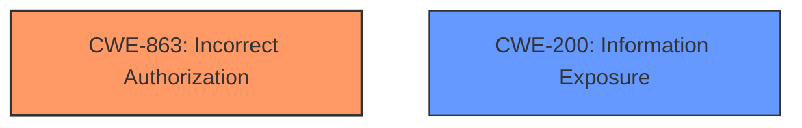

# Analysis Report for CVE-2025-24784

# Vulnerability Analysis Report: CVE-2025-24784

## Description

kubewarden-controller is a Kubernetes controller that allows you to dynamically register Kubewarden admission policies. The policy group feature, added to by the 1.17.0 release. By being namespaced, the AdmissionPolicyGroup has a well constrained impact on cluster resources. Hence, its considered safe to allow non-admin users to create and manage these resources in the namespaces they own. Kubewarden policies can be allowed to **query the Kubernetes API at evaluation time** these types of policies are called context aware. Context aware policies can perform list and get operations against a Kubernetes cluster. The queries are done using the ServiceAccount of the Policy Server instance that hosts the policy. That means that access to the cluster is determined by the RBAC rules that apply to that ServiceAccount. **The AdmissionPolicyGroup CRD allowed the deployment of context aware policies**. This could allow an attacker to obtain information about resources that are out of their reach, by leveraging a higher access to the cluster granted to the ServiceAccount token used to run the policy. The impact of this vulnerability depends on the privileges that have been granted to the ServiceAccount used to run the Policy Server and assumes that users are using the recommended best practices of keeping the Policy Servers ServiceAccount least privileged. By default, the Kubewarden helm chart grants access to the following resources (cluster wide) only Namespace, Pod, Deployment and Ingress. This vulnerability is fixed in 1.21.0.

## Vulnerability Description Key Phrases

- **Rootcause:** The AdmissionPolicyGroup CRD allowed the deployment of context aware policies
- **Weakness:** query the Kubernetes API at evaluation time
- **Impact:** obtain information about resources that are out of their reach
- **Product:** kubewarden-controller

## Analysis (with Relationship Data)

# Summary
| CWE ID | CWE Name | Confidence | CWE Abstraction Level | CWE Vulnerability Mapping Label | CWE-Vulnerability Mapping Notes |
|---|---|---|---|---|---|
| CWE-863 | Incorrect Authorization | 0.9 | Class | Allowed-with-Review | Primary CWE. The product performs an authorization check, but it does not correctly perform the check. |
| CWE-200 | Information Exposure | 0.7 | Class | Allowed | Secondary Candidate. The application exposes sensitive information to an unauthorized actor. |

## Evidence and Confidence

*   **Confidence Score:** 0.8
*   **Evidence Strength:** HIGH

## Relationship Analysis
The primary CWE is CWE-863, which is a Class-level CWE. No child CWEs of CWE-863 fully matched the vulnerability description. CWE-200 is a Class-level CWE, representing the information exposure impact of the vulnerability.



## Vulnerability Chain
The vulnerability chain starts with **The AdmissionPolicyGroup CRD allowed the deployment of context aware policies** which leads to **query the Kubernetes API at evaluation time**, and finally results in an impact where an attacker can **obtain information about resources that are out of their reach**.

## Summary of Analysis
The analysis is based on the provided evidence, particularly the vulnerability description and CVE reference links. The root cause is that the AdmissionPolicyGroup CRD incorrectly authorized context-aware policies. This allows an attacker to obtain information about resources they should not have access to, resulting in information exposure.

The selection of CWE-863 is influenced by the retriever results and the description of the vulnerability, stating that the **AdmissionPolicyGroup CRD allowed the deployment of context aware policies**. This aligns with CWE-863 because the product (Kubewarden) performs an authorization check, but it does not correctly perform the check. The fact that the AdmissionPolicyGroup CRD *allowed* something it shouldn't have highlights that it's an authorization problem not an authentication problem (CWE-306).

CWE-200 is selected as a secondary CWE because it represents the impact of the vulnerability, where an attacker could **obtain information about resources that are out of their reach**.

The selected CWEs are at the optimal level of specificity because there are no more specific child CWEs that accurately describe the vulnerability based on the provided evidence.

Relevant CWE Information:

# Enhanced Context (25 CWEs)
The following CWEs were identified as potentially relevant to this vulnerability:

## CWE-267: Privilege Defined With Unsafe Actions
**Abstraction Level**: Base
**Similarity Score**: 0.79
**Source**: dense

**Description**:
A particular privilege, role, capability, or right can be used to perform unsafe actions that were not intended, even when it is assigned to the correct entity.

**Mapping Guidance**:
- Usage: Allowed
- Rationale: This CWE entry is at the Base level of abstraction, which is a preferred level of abstraction for mapping to the root causes of vulnerabilities.


## CWE-266: Incorrect Privilege Assignment
**Abstraction Level**: Base
**Similarity Score**: 0.79
**Source**: dense

**Description**:
A product incorrectly assigns a privilege to a particular actor, creating an unintended sphere of control for that actor.

**Mapping Guidance**:
- Usage: Allowed
- Rationale: This CWE entry is at the Base level of abstraction, which is a preferred level of abstraction for mapping to the root causes of vulnerabilities.


## CWE-280: Improper Handling of Insufficient Permissions or Privileges 
**Abstraction Level**: Base
**Similarity Score**: 0.77
**Source**: dense

**Description**:
The product does not handle or incorrectly handles when it has insufficient privileges to access resources or functionality as specified by their permissions. This may cause it to follow unexpected code paths that may leave the product in an invalid state.

**Mapping Guidance**:
- Usage: Allowed
- Rationale: This CWE entry is at the Base level of abstraction, which is a preferred level of abstraction for mapping to the root causes of vulnerabilities.


## CWE-668: Exposure of Resource to Wrong Sphere
**Abstraction Level**: Class
**Similarity Score**: 0.77
**Source**: dense

**Description**:
The product exposes a resource to the wrong control sphere, providing unintended actors with inappropriate access to the resource.

**Mapping Guidance**:
- Usage: Discouraged
- Rationale: CWE-668 is high-level and is often misused as a catch-all when lower-level CWE IDs might be applicable. It is sometimes used for low-information vulnerability reports [REF-1287]. It is a level-1 Class (i.e., a child of a Pillar). It is not useful for trend analysis.


## CWE-274: Improper Handling of Insufficient Privileges
**Abstraction Level**: Base
**Similarity Score**: 0.77
**Source**: dense

**Description**:
The product does not handle or incorrectly handles when it has insufficient privileges to perform an operation, leading to resultant weaknesses.

**Mapping Guidance**:
- Usage: Discouraged
- Rationale: This CWE entry could be deprecated in a future version of CWE.


## CWE-212: Improper Removal of Sensitive Information Before Storage or Transfer
**Abstraction Level**: Base
**Similarity Score**: 0.76
**Source**: dense

**Description**:
The product stores, transfers, or shares a resource that contains sensitive information, but it does not properly remove that information before the product makes the resource available to unauthorized actors.

**Mapping Guidance**:
- Usage: Allowed
- Rationale: This CWE entry is at the Base level of abstraction, which is a preferred level of abstraction for mapping to the root causes of vulnerabilities.


## CWE-472: External Control of Assumed-Immutable Web Parameter
**Abstraction Level**: Base
**Similarity Score**: 0.76
**Source**: dense

**Description**:
The web application does not sufficiently verify inputs that are assumed to be immutable but are actually externally controllable, such as hidden form fields.

**Mapping Guidance**:
- Usage: Allowed
- Rationale: This CWE entry is at the Base level of abstraction, which is a preferred level of abstraction for mapping to the root causes of vulnerabilities.


## CWE-497: Exposure of Sensitive System Information to an Unauthorized Control Sphere
**Abstraction Level**: Base
**Similarity Score**: 0.76
**Source**: dense

**Description**:
The product does not properly prevent sensitive system-level information from being accessed by unauthorized actors who do not have the same level of access to the underlying system as the product does.

**Mapping Guidance**:
- Usage: Allowed
- Rationale: This CWE entry is at the Base level of abstraction, which is a preferred level of abstraction for mapping to the root causes of vulnerabilities.


## CWE-639: Authorization Bypass Through User-Controlled Key
**Abstraction Level**: Base
**Similarity Score**: 0.75
**Source**: dense

**Description**:
The system's authorization functionality does not prevent one user from gaining access to another user's data or record by modifying the key value identifying the data.

**Mapping Guidance**:
- Usage: Allowed
- Rationale: This CWE entry is at the Base level of abstraction, which is a preferred level of abstraction for mapping to the root causes of vulnerabilities.


## CWE-276: Incorrect Default Permissions
**Abstraction Level**: Base
**Similarity Score**: 0.75
**Source**: dense

**Description**:
During installation, installed file permissions are set to allow anyone to modify those files.

**Mapping Guidance**:
- Usage: Allowed
- Rationale: This CWE entry is at the Base level of abstraction, which is a preferred level of abstraction for mapping to the root causes of vulnerabilities.


## CWE-863: Incorrect Authorization
**Abstraction Level**: Class
**Similarity Score**: 1988.37
**Source**: sparse

**Description**:
The product performs an authorization check when an actor attempts to access a resource or perform an action, but it does not correctly perform the check.

**Mapping Guidance**:
- Usage: Allowed-with-Review
- Rationale: This CWE entry is a Class and might have Base-level children that would be more appropriate


## CWE-285: Improper Authorization
**Abstraction Level**: Class
**Similarity Score**: 1896.74
**Source**: sparse

**Description**:
The product does not perform or incorrectly performs an authorization check when an actor attempts to access a resource or perform an action.

**Mapping Guidance**:
- Usage: Discouraged
- Rationale: CWE-285 is high-level and lower-level CWEs can frequently be used instead. It is a level-1 Class (i.e., a child of a Pillar).


## CWE-269: Improper Privilege Management
**Abstraction Level**: Class
**Similarity Score**: 1833.59
**Source**: sparse

**Description**:
The product does not properly assign


## CWE Relationship Analysis

Current CWEs represent these abstraction levels: .


### Vulnerability Chain Analysis

**Chain starting from CWE-274:**
- 274 (Improper Handling of Insufficient Privileges) - ROOT


**Chain starting from CWE-863:**
- 863 (Incorrect Authorization) - ROOT


### CWE Relationship Diagram

```mermaid
graph TD
    classDef primary fill:#f96,stroke:#333,stroke-width:2px
    classDef secondary fill:#69f,stroke:#333
    classDef tertiary fill:#9e9,stroke:#333
```


*Report generated on 2025-07-14 12:52:38*
