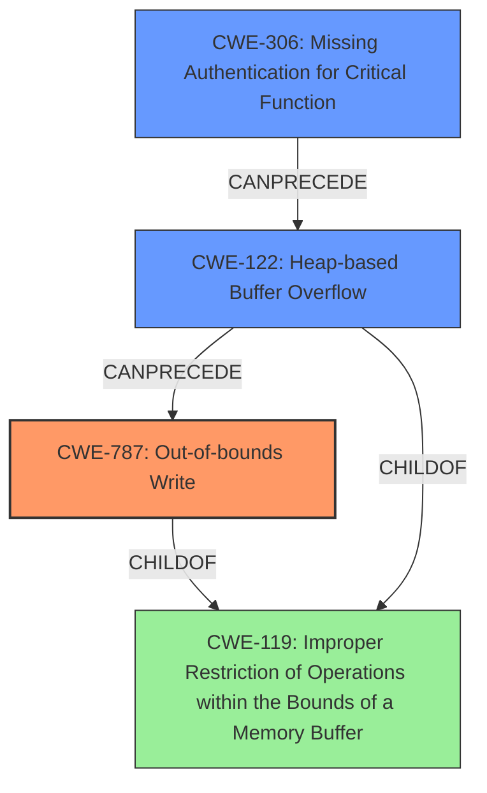

# Analysis Report for CVE-2025-24797

# Vulnerability Analysis Report: CVE-2025-24797

## Description

Meshtastic is an open source mesh networking solution. A fault in the handling of mesh packets containing invalid protobuf data can result in an attacker-controlled **buffer overflow**, allowing an attacker to hijack execution flow, potentially resulting in remote code execution. This attack **does not require authentication** or user interaction, as long as the target device rebroadcasts packets on the default channel. This vulnerability fixed in 2.6.2.

## Vulnerability Description Key Phrases

- **Rootcause:** does not require authentication
- **Weakness:** buffer overflow
- **Impact:** remote code execution
- **Vector:** packets containing invalid protobuf data
- **Attacker:** attacker
- **Product:** Meshtastic

## Analysis (with Relationship Data)

# Summary
| CWE ID    | CWE Name                                                                 | Confidence | CWE Abstraction Level | CWE Vulnerability Mapping Label | CWE-Vulnerability Mapping Notes |
| --------- | ------------------------------------------------------------------------ | ---------- | --------------------- | ------------------------------- | ------------------------------- |
| CWE-787   | Out-of-bounds Write                                                      | 0.9        | Base                  | Primary                         | Allowed                         |
| CWE-122   | Heap-based Buffer Overflow                                               | 0.8        | Base                  | Secondary                       | Allowed                         |
| CWE-306   | Missing Authentication for Critical Function                             | 0.7        | Base                  | Secondary                       | Allowed                         |

## Evidence and Confidence

*   **Confidence Score:** 0.8
*   **Evidence Strength:** HIGH

## Relationship Analysis
The primary CWE is CWE-787 (Out-of-bounds Write), a base-level CWE. CWE-122 (Heap-based Buffer Overflow) is a more specific type of buffer overflow than CWE-119 (Improper Restriction of Operations within the Bounds of a Memory Buffer) and is considered as a more detailed cause due to the invalid protobuf data. CWE-306 (Missing Authentication for Critical Function) is relevant as the vulnerability **does not require authentication**, as noted in the description. The relationships show how a lack of authentication can lead to a buffer overflow, and how a general buffer overflow can be further specified as a heap-based overflow leading to out-of-bounds write.



## Vulnerability Chain
The vulnerability chain starts with **missing authentication (CWE-306)**, allowing an attacker to send malformed packets. These packets with invalid protobuf data cause a **heap-based buffer overflow (CWE-122)**, which then leads to an **out-of-bounds write (CWE-787)**. This allows the attacker to hijack execution flow and potentially achieve remote code execution.

CWE-306 -> CWE-122 -> CWE-787

## Summary of Analysis
The initial assessment, based on the **weakness** "**buffer overflow**" in the vulnerability description and "**attacker-controlled buffer overflow**" in the CVE reference summary, pointed towards CWE-120 (Buffer Copy without Checking Size of Input ('Classic Buffer Overflow')) or CWE-787 (Out-of-bounds Write). However, the CVE reference summary also mentions CWE-122 (Heap-based Buffer Overflow) and CWE-119 (Improper Restriction of Operations within the Bounds of a Memory Buffer).

The retriever results listed CWE-119 (Improper Restriction of Operations within the Bounds of a Memory Buffer) at the top, but this is a class-level CWE and less specific. CWE-787 (Out-of-bounds Write) is a base-level CWE and is more descriptive of the actual **root cause** and impact, since the buffer overflow leads to writing outside the allocated memory region. The vulnerability description key phrases also indicated that **does not require authentication** is a rootcause, and this maps to CWE-306 (Missing Authentication for Critical Function).

Therefore, the primary CWE is CWE-787 (Out-of-bounds Write), a Base level weakness, with CWE-122 (Heap-based Buffer Overflow) and CWE-306 (Missing Authentication for Critical Function) being contributing factors.

Relevant CWE Information:
*   **CWE-787 (Out-of-bounds Write):** This CWE accurately describes the vulnerability, as the **attacker-controlled buffer overflow** allows writing data outside the intended memory region. The security implication is that an attacker can overwrite critical data or code, leading to arbitrary code execution.
*   **CWE-122 (Heap-based Buffer Overflow):** This CWE is relevant because the buffer overflow occurs on the heap, as suggested by the "invalid protobuf data" triggering the issue. The security implication is similar to CWE-787, enabling attackers to overwrite heap memory and potentially execute arbitrary code.
*   **CWE-306 (Missing Authentication for Critical Function):** This CWE is also relevant because the attack **does not require authentication**. This missing authentication allows the attacker to send malicious packets to the target device without any prior authorization.

CWEs considered but not used:
*   CWE-119 (Improper Restriction of Operations within the Bounds of a Memory Buffer): This is a class-level CWE and too general. The vulnerability is more specifically an out-of-bounds write (CWE-787).
*   CWE-120 (Buffer Copy without Checking Size of Input ('Classic Buffer Overflow')): While this CWE relates to buffer overflows, the description does not indicate the classic buffer copy scenario where the size of the input is not checked.
*   CWE-190 (Integer Overflow or Wraparound): This CWE is not directly related to the vulnerability, as there is no mention of integer overflow or wraparound in the description.
*   CWE-1284 (Improper Validation of Specified Quantity in Input): This CWE is not directly related as the issue is not a failure to validate a specified quantity in input.
*   CWE-287 (Improper Authentication) and CWE-290 (Authentication Bypass by Spoofing): These CWEs are not as accurate as CWE-306 because the description states that authentication is **not required** rather than being improper or bypassed.


## CWE Relationship Analysis

Current CWEs represent these abstraction levels: .


### Vulnerability Chain Analysis

**Chain starting from CWE-1284:**
- 1284 (Improper Validation of Specified Quantity in Input) - ROOT


**Chain starting from CWE-290:**
- 290 (Authentication Bypass by Spoofing) - ROOT


### CWE Relationship Diagram

```mermaid
graph TD
    classDef primary fill:#f96,stroke:#333,stroke-width:2px
    classDef secondary fill:#69f,stroke:#333
    classDef tertiary fill:#9e9,stroke:#333
```


*Report generated on 2025-07-14 12:53:18*
