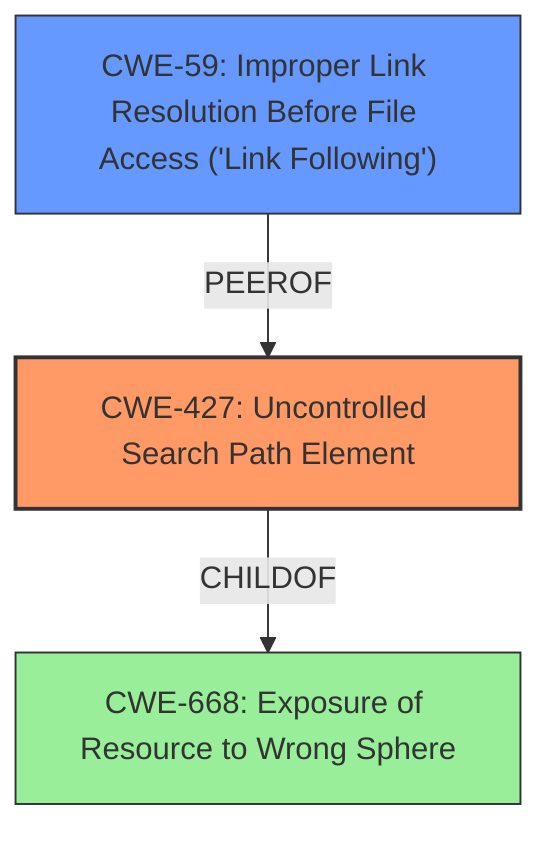

# Raw Analyzer Response for CVE-2025-24827

# Summary
| CWE ID | CWE Name | Confidence | CWE Abstraction Level | CWE Vulnerability Mapping Label | CWE-Vulnerability Mapping Notes |
|---|---|---|---|---|---|
| CWE-427 | Uncontrolled Search Path Element | 0.9 | Base | Allowed | Primary CWE: The **DLL hijacking vulnerability** stems from the application's use of an **uncontrolled search path**, allowing a malicious DLL to be loaded from an attacker-controlled location. |
| CWE-59 | Improper Link Resolution Before File Access ('Link Following') | 0.6 | Base | Allowed | Secondary Candidate: The **DLL hijacking** could involve the use of symbolic links or shortcuts, where the application **improperly** resolves the link to an unintended resource. |

## Evidence and Confidence

*   **Confidence Score:** 0.8
*   **Evidence Strength:** MEDIUM

## Relationship Analysis
The primary CWE is CWE-427, which describes the vulnerability where an application uses a search path that includes locations controlled by an attacker. This allows the attacker to place a malicious DLL in the search path, which the application then loads, leading to code execution. CWE-59, while related to file access issues, is a secondary consideration since the core issue revolves around the **uncontrolled search path** rather than just link following.

## Vulnerability Chain
The vulnerability chain starts with the application's use of an **uncontrolled search path** (CWE-427). An attacker places a malicious DLL in a directory within this search path. When the application attempts to load the DLL, it loads the attacker's DLL instead, leading to arbitrary code execution and privilege escalation.
  - Root Cause: CWE-427: Uncontrolled Search Path Element
  - Impact: Privilege escalation

## Summary of Analysis
The analysis identified the **DLL hijacking vulnerability** as being primarily caused by an **uncontrolled search path** in the Acronis Cyber Protect Cloud Agent. This aligns directly with CWE-427. The evidence for this is the vulnerability description stating **"DLL hijacking vulnerability"**. The retriever results also list CWE-427 as a strong candidate.

CWE-427 is selected because the root cause of the issue is that the application searches in locations that an attacker can control, allowing them to introduce a malicious DLL. Other CWEs like CWE-732, CWE-276, and CWE-278, relate to permission issues, which are not the primary factor in this vulnerability. CWE-59 is a related issue but not the main weakness being exploited. CWE-287 is related to authentication which is not present in the **DLL hijacking vulnerability**.

Relevant CWE Information:
*   **CWE-427: Uncontrolled Search Path Element**: The product uses a fixed or controlled search path to find resources, but one or more locations in that path can be under the control of unintended actors.
*   **CWE-59: Improper Link Resolution Before File Access ('Link Following')**: The product attempts to access a file based on the filename, but it does not properly prevent that filename from identifying a link or shortcut that resolves to an unintended resource.

---
# Summary
| CWE ID | CWE Name | Confidence | CWE Abstraction Level | CWE Vulnerability Mapping Label | CWE-Vulnerability Mapping Notes |
|---|---|---|---|---|---|
| CWE-427 | Uncontrolled Search Path Element | 0.9 | Base | Allowed | Primary CWE: The **DLL hijacking vulnerability** stems from the application's use of an **uncontrolled search path**, allowing a malicious DLL to be loaded from an attacker-controlled location. |
| CWE-59 | Improper Link Resolution Before File Access ('Link Following') | 0.6 | Base | Allowed | Secondary Candidate: The **DLL hijacking** could involve the use of symbolic links or shortcuts, where the application **improperly** resolves the link to an unintended resource. |

## Evidence and Confidence

*   **Confidence Score:** 0.8
*   **Evidence Strength:** MEDIUM

## Relationship Analysis
The primary CWE is CWE-427, which describes the vulnerability where an application uses a search path that includes locations controlled by an attacker. This allows the attacker to place a malicious DLL in the search path, which the application then loads, leading to code execution. CWE-59, while related to file access issues, is a secondary consideration since the core issue revolves around the **uncontrolled search path** rather than just link following.

## Vulnerability Chain
The vulnerability chain starts with the application's use of an **uncontrolled search path** (CWE-427). An attacker places a malicious DLL in a directory within this search path. When the application attempts to load the DLL, it loads the attacker's DLL instead, leading to arbitrary code execution and privilege escalation.
  - Root Cause: CWE-427: Uncontrolled Search Path Element
  - Impact: Privilege escalation

## Summary of Analysis
The analysis identified the **DLL hijacking vulnerability** as being primarily caused by an **uncontrolled search path** in the Acronis Cyber Protect Cloud Agent. This aligns directly with CWE-427. The evidence for this is the vulnerability description stating **"DLL hijacking vulnerability"**. The retriever results also list CWE-427 as a strong candidate.

CWE-427 is selected because the root cause of the issue is that the application searches in locations that an attacker can control, allowing them to introduce a malicious DLL. Other CWEs like CWE-732, CWE-276, and CWE-278, relate to permission issues, which are not the primary factor in this vulnerability. CWE-59 is a related issue but not the main weakness being exploited. CWE-287 is related to authentication which is not present in the **DLL hijacking vulnerability**.

Relevant CWE Information:
*   **CWE-427: Uncontrolled Search Path Element**: The product uses a fixed or controlled search path to find resources, but one or more locations in that path can be under the control of unintended actors.
*   **CWE-59: Improper Link Resolution Before File Access ('Link Following')**: The product attempts to access a file based on the filename, but it does not properly prevent that filename from identifying a link or shortcut that resolves to an unintended resource.