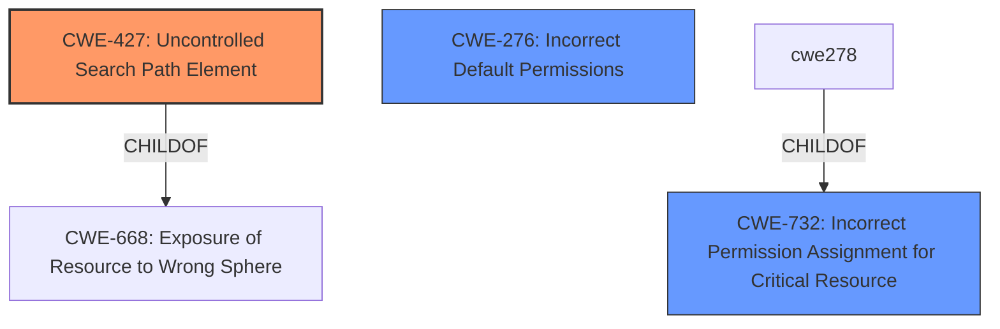

# Raw Analyzer Response for CVE-2025-24830

# Summary
| CWE ID | CWE Name | Confidence | CWE Abstraction Level | CWE Vulnerability Mapping Label | CWE-Vulnerability Mapping Notes |
|---|---|---|---|---|---|
| CWE-427 | Uncontrolled Search Path Element | 0.9 | Base | Allowed | Primary CWE |
| CWE-732 | Incorrect Permission Assignment for Critical Resource | 0.7 | Class | Allowed-with-Review | Secondary Candidate |
| CWE-276 | Incorrect Default Permissions | 0.6 | Base | Allowed | Secondary Candidate |

## Evidence and Confidence

*   **Confidence Score:** 0.9
*   **Evidence Strength:** MEDIUM

## Relationship Analysis
The primary CWE selected is CWE-427, which falls under the Class-level CWE-668 (Exposure of Resource to Wrong Sphere). CWE-427 is a Base CWE, making it more specific and appropriate for describing the **DLL hijacking vulnerability** described. CWE-427 has peer relationships with CWE-426 (Untrusted Search Path) and CWE-428 (Unquoted Search Path or Element). While CWE-732 and CWE-276 were also considered, they are less directly related to the **DLL hijacking vulnerability**.

## Vulnerability Chain
The vulnerability chain begins with the **DLL hijacking vulnerability** (CWE-427), which allows an attacker to place a malicious DLL in an **uncontrolled search path**. When the application searches for the DLL, it loads the malicious one, leading to code execution with the privileges of the application, resulting in local privilege escalation.

## Summary of Analysis
The analysis is primarily based on the provided vulnerability description, which clearly indicates a **DLL hijacking vulnerability**. The key phrase "**DLL hijacking vulnerability**" strongly suggests CWE-427 (Uncontrolled Search Path Element) as the root cause. This CWE aligns with the vulnerability's technical details, where an application loads a malicious DLL from an **uncontrolled search path**.

The choice of CWE-427 is further supported by its Base level of abstraction, making it a more specific and accurate representation of the weakness compared to higher-level Class CWEs. While CWE-732 and CWE-276 were considered, they are less directly relevant to the specific mechanism of **DLL hijacking**. The confidence in this mapping is high (0.9) due to the clear indication of the **DLL hijacking vulnerability** in the description.

Relevant CWE Information:

*   **CWE-427: Uncontrolled Search Path Element** - The product uses a fixed or controlled search path to find resources, but one or more locations in that path can be under the control of unintended actors. This perfectly aligns with the **DLL hijacking vulnerability**, where a malicious DLL is placed in a directory that the application searches, leading to its execution.
*   **CWE-732: Incorrect Permission Assignment for Critical Resource** - The product specifies permissions for a security-critical resource in a way that allows that resource to be read or modified by unintended actors. This is a possible consequence.
*   **CWE-276: Incorrect Default Permissions** - During installation, installed file permissions are set to allow anyone to modify those files. This could contribute to DLL hijacking.

CWEs Considered but Not Used:

*   CWE-287 (Improper Authentication): Not applicable as the vulnerability is related to DLL loading, not authentication.
*   CWE-250 (Execution with Unnecessary Privileges): While the impact is privilege escalation, the root cause is the **DLL hijacking vulnerability**, not the execution with unnecessary privileges.
*   CWE-59 (Improper Link Resolution Before File Access ('Link Following')): This CWE is not applicable because the vulnerability is not related to improper link resolution.
*   CWE-1386 (Insecure Operation on Windows Junction / Mount Point): This CWE is specific to Windows Junction / Mount Point and the description doesn't mention this technology.
*   CWE-613 (Insufficient Session Expiration): This CWE is not applicable as the vulnerability is not related to session expiration.