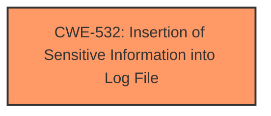

# Raw Analyzer Response for CVE-2025-24884

# Summary
| CWE ID | CWE Name | Confidence | CWE Abstraction Level | CWE Vulnerability Mapping Label | CWE-Vulnerability Mapping Notes |
|---|---|---|---|---|---|
| CWE-532 | Insertion of Sensitive Information into Log File | 1.0 | Base | Allowed | Primary CWE. This is the root cause of the vulnerability as the system wrote sensitive information (kubernetes secrets) to a log file. |

## Evidence and Confidence

*   **Confidence Score:** 1.0
*   **Evidence Strength:** HIGH

## Relationship Analysis
The primary CWE is CWE-532, which is a Base level CWE. There are no direct parent-child or chain relationships that significantly influence the selection in this case. The abstraction level is appropriate as it directly describes the **insertion of sensitive information into log files**.

## Vulnerability Chain
The vulnerability chain consists of the following:
1.  **Root Cause:** CWE-532 (Insertion of Sensitive Information into Log File) - The application **inserted sensitive information** (Kubernetes secrets) into the log file due to incorrect configuration.
2.  **Impact:** Disclosure of sensitive information (Kubernetes secrets).

## Summary of Analysis
The analysis is based on the provided evidence, particularly the vulnerability description and CVE reference links content summary. The vulnerability description explicitly states that the previous values of Kubernetes secrets were disclosed in the audit messages due to the "full-elastic-stack" example vector configuration. The CVE reference links content summary confirms that the root cause of the vulnerability is that the original configuration only redacted the secret data, but not the data stored in the annotation.
The retriever results listed CWE-532 as the top candidate.
The selected CWE, CWE-532, is at the optimal level of specificity as it directly describes the root cause of the vulnerability: **insertion of sensitive information into a log file**.

Relevant CWE Information:

# Enhanced Context (25 CWEs)
The following CWEs were identified as potentially relevant to this vulnerability:

## CWE-212: Improper Removal of Sensitive Information Before Storage or Transfer
**Abstraction Level**: Base
**Similarity Score**: 0.73
**Source**: dense

**Description**:
The product stores, transfers, or shares a resource that contains sensitive information, but it does not properly remove that information before the product makes the resource available to unauthorized actors.

**Mapping Guidance**:
- Usage: Allowed
- Rationale: This CWE entry is at the Base level of abstraction, which is a preferred level of abstraction for mapping to the root causes of vulnerabilities.

*   **Why Not Selected:** This CWE is similar to CWE-532, but it focuses on the general case of improper removal of sensitive information before storage or transfer. CWE-532 is more specific to the case where the sensitive information is being written to a log file, which is the case for this vulnerability.

## CWE-532: Insertion of Sensitive Information into Log File
**Abstraction Level**: Base
**Similarity Score**: 0.71
**Source**: dense

**Description**:
The product writes sensitive information to a log file.

**Mapping Guidance**:
- Usage: Allowed
- Rationale: This CWE entry is at the Base level of abstraction, which is a preferred level of abstraction for mapping to the root causes of vulnerabilities.

*   **Why Selected:** This CWE accurately describes the vulnerability where Kubernetes secrets are being written to a log file. The vulnerability description clearly indicates that the "previous values of kubernetes secrets would have been disclosed in the audit messages," which directly aligns with CWE-532's description.

## CWE-497: Exposure of Sensitive System Information to an Unauthorized Control Sphere
**Abstraction Level**: Base
**Similarity Score**: 0.70
**Source**: dense

**Description**:
The product does not properly prevent sensitive system-level information from being accessed by unauthorized actors who do not have the same level of access to the underlying system as the product does.

**Mapping Guidance**:
- Usage: Allowed
- Rationale: This CWE entry is at the Base level of abstraction, which is a preferred level of abstraction for mapping to the root causes of vulnerabilities.

*   **Why Not Selected:** While this CWE is relevant, it is more generic than CWE-532. The vulnerability description specifically mentions log files, making CWE-532 a more precise fit.

## CWE-538: Insertion of Sensitive Information into Externally-Accessible File or Directory
**Abstraction Level**: Base
**Similarity Score**: 0.70
**Source**: dense

**Description**:
The product places sensitive information into files or directories that are accessible to actors who are allowed to have access to the files, but not to the sensitive information.

**Mapping Guidance**:
- Usage: Allowed
- Rationale: This CWE entry is at the Base level of abstraction, which is a preferred level of abstraction for mapping to the root causes of vulnerabilities.

*   **Why Not Selected:** This is very similar to CWE-532, but it speaks more towards externally accessible files, while CWE-532 focuses on the logging aspect of the vulnerability.

## CWE-201: Insertion of Sensitive Information Into Sent Data
**Abstraction Level**: Base
**Similarity Score**: 0.70
**Source**: dense

**Description**:
The code transmits data to another actor, but a portion of the data includes sensitive information that should not be accessible to that actor.

**Mapping Guidance**:
- Usage: Allowed
- Rationale: This CWE entry is at the Base level of abstraction, which is a preferred level of abstraction for mapping to the root causes of vulnerabilities.

*   **Why Not Selected:** This CWE focuses on data transmission, while the vulnerability is related to logging. Therefore, CWE-532 is more appropriate.

## CWE-1286: Improper Validation of Syntactic Correctness of Input
**Abstraction Level**: Base
**Similarity Score**: 0.70
**Source**: dense

**Description**:
The product receives input that is expected to be well-formed - i.e., to comply with a certain syntax - but it does not validate or incorrectly validates that the input complies with the syntax.

**Mapping Guidance**:
- Usage: Allowed
- Rationale: This CWE entry is at the Base level of abstraction, which is a preferred level of abstraction for mapping to the root causes of vulnerabilities.

*   **Why Not Selected:** This CWE is not related to the vulnerability. The vulnerability does not involve improper input validation.

## CWE-923: Improper Restriction of Communication Channel to Intended Endpoints
**Abstraction Level**: Class
**Similarity Score**: 0.70
**Source**: dense

**Description**:
The product establishes a communication channel to (or from) an endpoint for privileged or protected operations, but it does not properly ensure that it is communicating with the correct endpoint.

**Mapping Guidance**:
- Usage: Allowed-with-Review
- Rationale: This CWE entry is a Class and might have Base-level children that would be more appropriate

*   **Why Not Selected:** This CWE is not related to the vulnerability. The vulnerability does not involve improper restriction of communication channels.

## CWE-639: Authorization Bypass Through User-Controlled Key
**Abstraction Level**: Base
**Similarity Score**: 0.69
**Source**: dense

**Description**:
The system's authorization functionality does not prevent one user from gaining access to another user's data or record by modifying the key value identifying the data.

**Mapping Guidance**:
- Usage: Allowed
- Rationale: This CWE entry is at the Base level of abstraction, which is a preferred level of abstraction for mapping to the root causes of vulnerabilities.

*   **Why Not Selected:** This CWE is not related to the vulnerability. The vulnerability is not related to authorization bypass.

## CWE-668: Exposure of Resource to Wrong Sphere
**Abstraction Level**: Class
**Similarity Score**: 0.69
**Source**: dense

**Description**:
The product exposes a resource to the wrong control sphere, providing unintended actors with inappropriate access to the resource.

**Mapping Guidance**:
- Usage: Discouraged
- Rationale: CWE-668 is high-level and is often misused as a catch-all when lower-level CWE IDs might be applicable. It is sometimes used for low-information vulnerability reports [REF-1287]. It is a level-1 Class (i.e., a child of a Pillar). It is not useful for trend analysis.

*   **Why Not Selected:** This is too generic. CWE-532 is more specific and provides a better description of the vulnerability.

## CWE-319: Cleartext Transmission of Sensitive Information
**Abstraction Level**: Base
**Similarity Score**: 0.69
**Source**: dense

**Description**:
The product transmits sensitive or security-critical data in cleartext in a communication channel that can be sniffed by unauthorized actors.

**Mapping Guidance**:
- Usage: Allowed
- Rationale: This CWE entry is at the Base level of abstraction, which is a preferred level of abstraction for mapping to the root causes of vulnerabilities.

*   **Why Not Selected:** This CWE is not related to the vulnerability. The vulnerability is not related to cleartext transmission