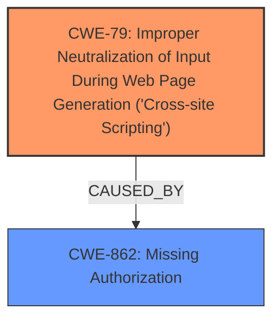

# Raw Analyzer Response for CVE-2025-24885

# Summary
| CWE ID | CWE Name | Confidence | CWE Abstraction Level | CWE Vulnerability Mapping Label | CWE-Vulnerability Mapping Notes |
|---|---|---|---|---|---|
| CWE-79 | Improper Neutralization of Input During Web Page Generation ('Cross-site Scripting') | 1.0 | Base | Allowed | Primary CWE: The vulnerability description explicitly mentions "stored XSS," and the CVE content confirms the presence of CWE-79. |
| CWE-862 | Missing Authorization | 0.9 | Class | Allowed-with-Review | Secondary CWE: The root cause is identified as "**Missing access control**," aligning with the concept of missing authorization. |

## Evidence and Confidence

*   **Confidence Score:** 0.95
*   **Evidence Strength:** HIGH

## Relationship Analysis
The primary weakness is **CWE-79 (Improper Neutralization of Input During Web Page Generation ('Cross-site Scripting'))**, which results from the **CWE-862 (Missing Authorization)**. The **missing access control** allows unauthorized users to inject scripts, which are then stored and executed, leading to the XSS vulnerability.

## Vulnerability Chain
The vulnerability chain starts with **CWE-862 (Missing Authorization)**, where there is a **lack of access control**. This leads to a user injecting malicious scripts without proper authorization. Subsequently, the injected script is not properly neutralized, resulting in **CWE-79 (Improper Neutralization of Input During Web Page Generation ('Cross-site Scripting'))**. This results in stored XSS.

## Summary of Analysis
The initial analysis identified two key weaknesses: **missing access control** and **stored XSS**. The retriever results and the CVE content confirm the relevance of CWE-79. The guidance on Authentication vs Authorization vs Access Control helps to correctly map the **missing access control** to **CWE-862 (Missing Authorization)**.

The evidence provided is strong, with explicit mentions of "**Missing access control**" as the root cause and "**stored XSS**" as the weakness. The CVE reference further validates these findings by listing both **CWE-79 (Improper Neutralization of Input During Web Page Generation ('Cross-site Scripting'))** and **CWE-284 (Improper Access Control)**. However, given the clearer root cause of **missing access control**, CWE-862 is a more appropriate fit than the more general CWE-284.

**CWEs Considered But Not Used:**

*   **CWE-284 (Improper Access Control)**: While related, **CWE-862 (Missing Authorization)** is more specific and accurately reflects the root cause of the vulnerability.
*   **CWE-306 (Missing Authentication for Critical Function)**: This is not the primary issue, as the problem lies in the **lack of authorization** for specific actions after authentication.
*   **CWE-352 (Cross-Site Request Forgery (CSRF))**: Not applicable as the vulnerability does not involve forging requests.
*   **CWE-434 (Unrestricted Upload of File with Dangerous Type)**: Not applicable as the vulnerability does not involve file uploads.
*   **CWE-290 (Authentication Bypass by Spoofing)**: Not applicable as the vulnerability does not involve bypassing authentication.
*   **CWE-1390 (Weak Authentication)**: Not applicable as the vulnerability does not involve weak authentication.
*   **CWE-116 (Improper Encoding or Escaping of Output)**: While related to XSS, **CWE-79 (Improper Neutralization of Input During Web Page Generation ('Cross-site Scripting'))** is a more direct and specific classification.
*   **CWE-80 (Improper Neutralization of Script-Related HTML Tags in a Web Page (Basic XSS))**: **CWE-79 (Improper Neutralization of Input During Web Page Generation ('Cross-site Scripting'))** is more appropriate as it is a more general form of XSS and is the classification given in the CVE content.
*   **CWE-471 (Modification of Assumed-Immutable Data (MAID))**: Not applicable as the vulnerability does not involve modification of assumed-immutable data.
*   **CWE-863 (Incorrect Authorization)**: Not applicable as the vulnerability involves missing authorization checks, not incorrect ones.
*   **CWE-425 (Direct Request ('Forced Browsing'))**: Not applicable as the vulnerability does not involve direct requests.
*   **CWE-41 (Improper Resolution of Path Equivalence)**: Not applicable as the vulnerability does not involve path equivalence.
*   **CWE-113 (Improper Neutralization of CRLF Sequences in HTTP Headers ('HTTP Request/Response Splitting'))**: Not applicable as the vulnerability does not involve CRLF sequences in HTTP headers.
*   **CWE-1275 (Sensitive Cookie with Improper SameSite Attribute)**: Not applicable as the vulnerability does not involve cookies.
*   **CWE-74 (Improper Neutralization of Special Elements in Output Used by a Downstream Component ('Injection'))**: Not applicable as the vulnerability is specifically XSS.
*   **CWE-639 (Authorization Bypass Through User-Controlled Key)**: Not applicable as the vulnerability does not involve user-controlled keys.
*   **CWE-212 (Improper Removal of Sensitive Information Before Storage or Transfer)**: Not applicable as the vulnerability does not involve the removal of sensitive information.
*   **CWE-923 (Improper Restriction of Communication Channel to Intended Endpoints)**: Not applicable as the vulnerability does not involve communication channels.
*   **CWE-184 (Incomplete List of Disallowed Inputs)**: Not applicable as the vulnerability does not involve a list of disallowed inputs.
*   **CWE-807 (Reliance on Untrusted Inputs in a Security Decision)**: Not applicable as the vulnerability does not involve security decisions based on untrusted inputs.