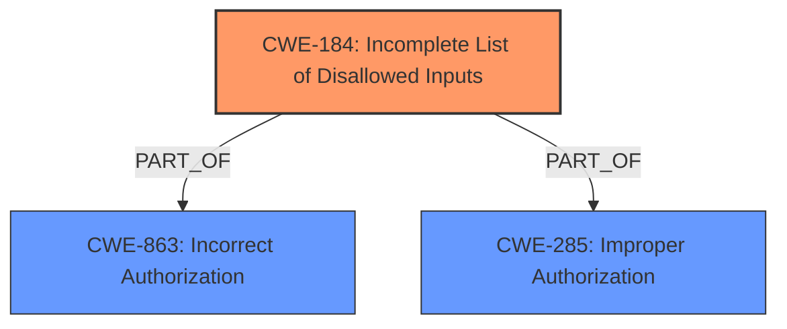

# Analysis for CVE-2025-24887

# Summary

| CWE ID  | CWE Name                                                                        | Confidence | CWE Abstraction Level | CWE Vulnerability Mapping Label | CWE-Vulnerability Mapping Notes |
| :-------- | :------------------------------------------------------------------------------ | :--------- | :---------------------- | :------------------------------ | :------------------------------ |
| CWE-184 | Incomplete List of Disallowed Inputs                                           | 0.9        | Base                    | Primary CWE                     | Allowed                       |
| CWE-863 | Incorrect Authorization                                                           | 0.7        | Class                   | Secondary Candidate             | Allowed-with-Review           |
| CWE-285 | Improper Authorization                                                           | 0.6        | Class                   | Secondary Candidate             | Discouraged                    |

## Evidence and Confidence

*   **Confidence Score:** 0.8
*   **Evidence Strength:** HIGH

## Relationship Analysis

The primary relationship that influenced my decision was the parent-child relationship. CWE-184 (Incomplete List of Disallowed Inputs) is a more specific, base-level weakness compared to the class-level CWE-863 (Incorrect Authorization) and CWE-285 (Improper Authorization). The vulnerability description explicitly mentions the **bypassing of allow/deny lists**, which aligns directly with the concept of an incomplete list of disallowed inputs. While broader authorization issues are present, the root cause lies in the incomplete enforcement of input restrictions.

## Vulnerability Chain

The vulnerability chain starts with the **incomplete allow/deny list (CWE-184)**. This allows an attacker (a low-privileged user in this case) to modify attributes they shouldn't be able to, leading to **improper authorization (CWE-863/CWE-285)**. The impact of this is the ability to toggle flags, change token values, edit unauthorized attributes, and potentially enumerate user accounts.

## Summary of Analysis

The primary CWE selected is CWE-184 (Incomplete List of Disallowed Inputs) with high confidence. The vulnerability description states, "the **allow/deny lists can be bypassed**, allowing a user to change attributes that are intended to be unmodifiable by the user." This directly maps to the definition of CWE-184, where a protection mechanism relies on a list of disallowed inputs, but the list is incomplete, allowing unauthorized modifications.

CWE-863 (Incorrect Authorization) and CWE-285 (Improper Authorization) were considered because the **bypass** leads to unauthorized actions. However, these are higher-level classifications and less specific than CWE-184, which directly addresses the root cause of the **bypassed allow/deny lists**. The retriever results also suggest CWE-184 as the best fit.

The decision to prioritize CWE-184 is based on the principle of selecting the most specific CWE that accurately represents the root cause. The evidence from the vulnerability description strongly supports this choice, and the relationship analysis confirms that it is a more granular representation than the broader authorization-related CWEs. The ability for a low privileged user to **bypass** the intended restrictions on which fields they can modify, allowing them to change attributes and potentially enumerate user accounts, is a direct consequence of the **incomplete** nature of the **allow/deny list**.

Relevant CWE Information:

# Enhanced Context (25 CWEs)
The following CWEs were identified as potentially relevant to this vulnerability:

## CWE-303: Incorrect Implementation of Authentication Algorithm
**Abstraction Level**: Base
**Similarity Score**: 0.78
**Source**: dense

**Description**:
The requirements for the product dictate the use of an established authentication algorithm, but the implementation of the algorithm is incorrect.

**Mapping Guidance**:
- Usage: Allowed
- Rationale: This CWE entry is at the Base level of abstraction, which is a preferred level of abstraction for mapping to the root causes of vulnerabilities.

## CWE-472: External Control of Assumed-Immutable Web Parameter
**Abstraction Level**: Base
**Similarity Score**: 0.77
**Source**: dense

**Description**:
The web application does not sufficiently verify inputs that are assumed to be immutable but are actually externally controllable, such as hidden form fields.

**Mapping Guidance**:
- Usage: Allowed
- Rationale: This CWE entry is at the Base level of abstraction, which is a preferred level of abstraction for mapping to the root causes of vulnerabilities.

## CWE-807: Reliance on Untrusted Inputs in a Security Decision
**Abstraction Level**: Base
**Similarity Score**: 0.76
**Source**: dense

**Description**:
The product uses a protection mechanism that relies on the existence or values of an input, but the input can be modified by an untrusted actor in a way that bypasses the protection mechanism.

**Mapping Guidance**:
- Usage: Allowed
- Rationale: This CWE entry is at the Base level of abstraction, which is a preferred level of abstraction for mapping to the root causes of vulnerabilities.

## CWE-267: Privilege Defined With Unsafe Actions
**Abstraction Level**: Base
**Similarity Score**: 0.76
**Source**: dense

**Description**:
A particular privilege, role, capability, or right can be used to perform unsafe actions that were not intended, even when it is assigned to the correct entity.

**Mapping Guidance**:
- Usage: Allowed
- Rationale: This CWE entry is at the Base level of abstraction, which is a preferred level of abstraction for mapping to the root causes of vulnerabilities.

## CWE-497: Exposure of Sensitive System Information to an Unauthorized Control Sphere
**Abstraction Level**: Base
**Similarity Score**: 0.76
**Source**: dense

**Description**:
The product does not properly prevent sensitive system-level information from being accessed by unauthorized actors who do not have the same level of access to the underlying system as the product does.

**Mapping Guidance**:
- Usage: Allowed
- Rationale: This CWE entry is at the Base level of abstraction, which is a preferred level of abstraction for mapping to the root causes of vulnerabilities.

## CWE-1286: Improper Validation of Syntactic Correctness of Input
**Abstraction Level**: Base
**Similarity Score**: 0.76
**Source**: dense

**Description**:
The product receives input that is expected to be well-formed - i.e., to comply with a certain syntax - but it does not validate or incorrectly validates that the input complies with the syntax.

**Mapping Guidance**:
- Usage: Allowed
- Rationale: This CWE entry is at the Base level of abstraction, which is a preferred level of abstraction for mapping to the root causes of vulnerabilities.

## CWE-639: Authorization Bypass Through User-Controlled Key
**Abstraction Level**: Base
**Similarity Score**: 0.76
**Source**: dense

**Description**:
The system's authorization functionality does not prevent one user from gaining access to another user's data or record by modifying the key value identifying the data.

**Mapping Guidance**:
- Usage: Allowed
- Rationale: This CWE entry is at the Base level of abstraction, which is a preferred level of abstraction for mapping to the root causes of vulnerabilities.

## CWE-1391: Use of Weak Credentials
**Abstraction Level**: Class
**Similarity Score**: 0.75
**Source**: dense

**Description**:
The product uses weak credentials (such as a default key or hard-coded password) that can be calculated, derived, reused, or guessed by an attacker.

**Mapping Guidance**:
- Usage: Allowed-with-Review
- Rationale: This CWE entry is a Class and might have Base-level children that would be more appropriate

## CWE-923: Improper Restriction of Communication Channel to Intended Endpoints
**Abstraction Level**: Class
**Similarity Score**: 0.75
**Source**: dense

**Description**:
The product establishes a communication channel to (or from) an endpoint for privileged or protected operations, but it does not properly ensure that it is communicating with the correct endpoint.

**Mapping Guidance**:
- Usage: Allowed-with-Review
- Rationale: This CWE entry is a Class and might have Base-level children that would be more appropriate

## CWE-294: Authentication Bypass by Capture-replay
**Abstraction Level**: Base
**Similarity Score**: 0.75
**Source**: dense

**Description**:
A capture-replay flaw exists when the design of the product makes it possible for a malicious user to sniff network traffic and bypass authentication by replaying it to the server in question to the same effect as the original message (or with minor changes).

**Mapping Guidance**:
- Usage: Allowed
- Rationale: This CWE entry is at the Base