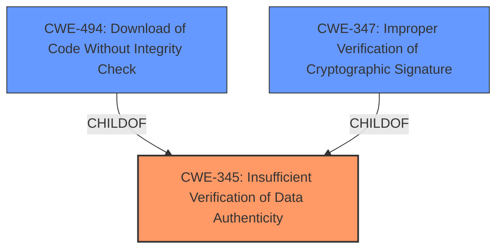

# Analysis Report for CVE-2025-24904

# Vulnerability Analysis Report: CVE-2025-24904

## Description

libsignal-service-rs is a Rust version of the libsignal-service-java library which implements the core functionality to communicate with Signal servers. Prior to commit 82d70f6720e762898f34ae76b0894b0297d9b2f8, **plaintext content envelopes could be injected** by a server or a malicious client, and may have been able to bypass the end-to-end encryption and authentication. The vulnerability is fixed per 82d70f6720e762898f34ae76b0894b0297d9b2f8. The `Metadata` struct contains an additional `was_encrypted` field, which breaks the API, but should be easily resolvable. No known workarounds are available.

## Vulnerability Description Key Phrases

- **Weakness:** plaintext content envelopes could be injected
- **Impact:** bypass the end-to-end encryption and authentication
- **Attacker:** server or malicious client
- **Product:** libsignal-service-rs
- **Version:** Prior to commit 82d70f6720e762898f34ae76b0894b0297d9b2f8

## Analysis (with Relationship Data)

# Summary
| CWE ID  | CWE Name                                                                           | Confidence | CWE Abstraction Level | CWE Vulnerability Mapping Label | CWE-Vulnerability Mapping Notes |
| :-------- | :--------------------------------------------------------------------------------- | :---------- | :---------------------- | :------------------------------ | :-------------------------------- |
| CWE-345   | Insufficient Verification of Data Authenticity                                     | 0.9         | Class                   | Primary                         | Allowed-with-Review            |

## Evidence and Confidence

*   **Confidence Score:** 0.9
*   **Evidence Strength:** HIGH

## Relationship Analysis
The primary CWE, CWE-345, is a Class-level weakness. While a more specific Base or Variant level CWE would be ideal, the available information strongly suggests that the root cause is related to insufficient verification of data authenticity, making CWE-345 the most appropriate choice. The retriever results also suggest related CWEs like CWE-494 (Download of Code Without Integrity Check) and CWE-347 (Improper Verification of Cryptographic Signature) which are related to CWE-345 through hierarchical relationships.



## Vulnerability Chain
The vulnerability chain starts with the **lack of input validation** on envelope content which leads to **plaintext content envelopes being injected**. This then results in the **bypassing of end-to-end encryption and authentication**.

## Summary of Analysis
The analysis is based on the provided vulnerability description and CVE reference summary which highlights the **injection of plaintext content envelopes**. The root cause is the **lack of sanity checks** and the **lack of input validation on envelope content**. The most relevant CWE based on this information is CWE-345: Insufficient Verification of Data Authenticity. This CWE aligns with the root cause since the data (plaintext content envelopes) are not being properly verified for authenticity, allowing malicious or incorrect data to be processed.

The other CWEs considered from the retriever results were not selected because they did not directly address the root cause. For example, CWE-79 (Improper Neutralization of Input During Web Page Generation ('Cross-site Scripting')) is related to web page generation, which is not the primary issue here. CWE-863 (Incorrect Authorization) and CWE-306 (Missing Authentication for Critical Function) are more appropriate when there are authentication or authorization issues, which is not the explicit root cause in this case. While the impact is bypassing authentication, the root cause is the insufficient verification, not the missing authentication.

CWE-345 is at the Class level of abstraction. The MITRE guidance suggests considering lower-level children if available, but no direct child CWEs of CWE-345 clearly matched the vulnerability's root cause.

Relevant CWE Information:

# Enhanced Context (25 CWEs)
The following CWEs were identified as potentially relevant to this vulnerability:

## CWE-345: Insufficient Verification of Data Authenticity
**Abstraction Level**: Class
**Similarity Score**: 0.77
**Source**: dense

**Description**:
The product does not sufficiently verify the origin or authenticity of data, in a way that causes it to accept invalid data.

**Mapping Guidance**:
- Usage: Discouraged
- Rationale: This CWE entry is a level-1 Class (i.e., a child of a Pillar). It might have lower-level children that would be more appropriate


## CWE Relationship Analysis

Current CWEs represent these abstraction levels: .


### Vulnerability Chain Analysis

**Chain starting from CWE-863:**
- 863 (Incorrect Authorization) - ROOT


**Chain starting from CWE-494:**
- 494 (Download of Code Without Integrity Check) - ROOT


### CWE Relationship Diagram

```mermaid
graph TD
    classDef primary fill:#f96,stroke:#333,stroke-width:2px
    classDef secondary fill:#69f,stroke:#333
    classDef tertiary fill:#9e9,stroke:#333
```


*Report generated on 2025-07-14 12:59:48*
