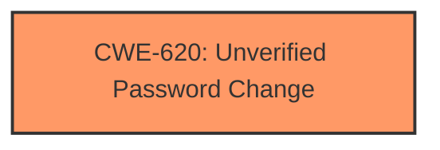

# Analysis Report for CVE-2025-24949

# Vulnerability Analysis Report: CVE-2025-24949

## Description

In JotUrl 2.0, is possible to bypass security requirements during the password change process.

## Vulnerability Description Key Phrases

- **Impact:** bypass security requirements
- **Product:** JotUrl
- **Version:** 2.0
- **Component:** password change process

## Analysis (with Relationship Data)

# Summary
| CWE ID | CWE Name | Confidence | CWE Abstraction Level | CWE Vulnerability Mapping Label | CWE-Vulnerability Mapping Notes |
|---|---|---|---|---|---|
| CWE-620 | Unverified Password Change | 0.9 | Base | Allowed | Primary CWE. The application allows a password change without verifying the user's existing credentials or using an alternative authentication method. |

## Evidence and Confidence

*   **Confidence Score:** 0.9
*   **Evidence Strength:** MEDIUM

## Relationship Analysis
The primary CWE identified is CWE-620 (Unverified Password Change), which is a Base level CWE. The retriever results included several other CWEs related to authentication bypass and improper authentication mechanisms. While these were considered, CWE-620 directly addresses the **root cause** of the vulnerability: the **lack of verification** during the password change process. The hierarchical relationships of other CWEs (e.g., CWE-287, CWE-1390) as parents or children were examined, but CWE-620 remained the most specific and relevant.



## Vulnerability Chain
The vulnerability chain involves a single step:
1.  **Missing Authentication:** The password change process lacks proper authentication or verification (CWE-620). This is the **root cause**.
The impact is the ability to bypass security requirements.

## Summary of Analysis
The initial analysis focused on identifying the **root cause** of the vulnerability, which is the **ability to bypass security requirements** during the password change process. The vulnerability description clearly states that it is possible to "bypass security requirements during the password change process," which directly aligns with CWE-620 (Unverified Password Change). This CWE accurately reflects the weakness where the application **does not verify** the user's identity before allowing a password change.

The Retriever Results also suggested CWE-306 (Missing Authentication for Critical Function), CWE-288 (Authentication Bypass Using an Alternate Path or Channel), and CWE-472 (External Control of Assumed-Immutable Web Parameter), but these were deemed less specific than CWE-620. The graph relationships and abstraction levels were considered to ensure the chosen CWE was the most appropriate and at the correct level of detail. The selection of CWE-620 is based on the direct evidence from the vulnerability description and the CWE's specific focus on password change processes **lacking verification**.

Relevant CWE Information:

# Enhanced Context (25 CWEs)
The following CWEs were identified as potentially relevant to this vulnerability:

## CWE-620: Unverified Password Change
**Abstraction Level**: Base
**Similarity Score**: 0.72
**Source**: dense

**Description**:
When setting a new password for a user, the product does not require knowledge of the original password, or using another form of authentication.

**Mapping Guidance**:
- Usage: Allowed
- Rationale: This CWE entry is at the Base level of abstraction, which is a preferred level of abstraction for mapping to the root causes of vulnerabilities.


## CWE Relationship Analysis

Current CWEs represent these abstraction levels: .


### Vulnerability Chain Analysis

**Chain starting from CWE-1390:**
- 1390 (Weak Authentication) - ROOT


**Chain starting from CWE-288:**
- 288 (Authentication Bypass Using an Alternate Path or Channel) - ROOT


### CWE Relationship Diagram

```mermaid
graph TD
    classDef primary fill:#f96,stroke:#333,stroke-width:2px
    classDef secondary fill:#69f,stroke:#333
    classDef tertiary fill:#9e9,stroke:#333
```


*Report generated on 2025-07-14 13:01:21*
