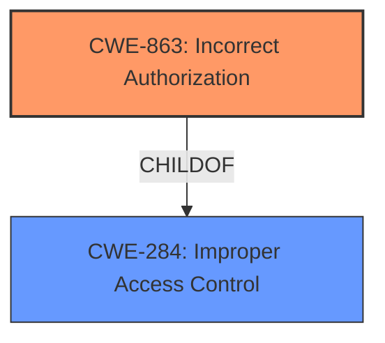

# Analysis Report for CVE-2025-2499

# Vulnerability Analysis Report: CVE-2025-2499

## Description

Client side access control bypass in the permission component in Devolutions Remote Desktop Manager on Windows. An authenticated user can exploit this flaw to bypass certain permission restrictionsspecifically View Password, Edit Asset, and Edit Permissions by performing specific actions. This issue affects Remote Desktop Manager versions from 2025.1.24 through 2025.1.25, and all versions up to 2024.3.29.

## Vulnerability Description Key Phrases

- **Component:** permission component
- **Rootcause:** client side access control bypass
- **Product:** Devolutions Remote Desktop Manager
- **Impact:** bypass certain permission restrictions, View Password, Edit Asset, Edit Permissions
- **Attacker:** authenticated user
- **Version:** 2025.1.24 through 2025.1.25 and all versions up to 2024.3.29

## Analysis (with Relationship Data)

# Summary
| CWE ID | CWE Name | Confidence | CWE Abstraction Level | CWE Vulnerability Mapping Label | CWE-Vulnerability Mapping Notes |
|---|---|---|---|---|---|
| CWE-863 | Incorrect Authorization | 0.9 | Class | Allowed-with-Review | Primary CWE.  The product performs an authorization check, but it does not correctly perform the check. |
| CWE-284 | Improper Access Control | 0.7 | Pillar | Discouraged | Secondary. Used because the client side access control bypass ultimately leads to improper access control. |

## Evidence and Confidence

*   **Confidence Score:** 0.9
*   **Evidence Strength:** HIGH

## Relationship Analysis
The primary CWE is CWE-863 which is a Class level CWE. The vulnerability involves a **client side access control bypass** leading to **incorrect authorization**. CWE-863 is a child of CWE-284 (Improper Access Control), which is a more general category. However, since the description specifically mentions an access control bypass on the client side, which implies the authorization check is present but flawed, CWE-863 is a more precise fit than CWE-284. CWE-284 is used as a secondary CWE to show that client side access control bypass ultimately leads to improper access control.



## Vulnerability Chain
The vulnerability chain starts with the **client side access control bypass**, which leads to **incorrect authorization**, and finally results in the ability to bypass permission restrictions such as View Password, Edit Asset, and Edit Permissions.

## Summary of Analysis
The initial assessment identified CWE-863 as the primary CWE due to the **client side access control bypass**, which implies that the authorization check is present but flawed. The retriever results also listed CWE-863 as a potential candidate, further supporting this assessment. The relationship analysis confirmed that CWE-863 is a more specific fit than its parent CWE-284 (Improper Access Control). The vulnerability chain analysis illustrated how the **client side access control bypass** leads to **incorrect authorization** and ultimately the ability to bypass permission restrictions. The final decision is based on the available evidence, relationship analysis, and vulnerability chain analysis, and that CWE-863 is the most appropriate CWE for this vulnerability.

Relevant CWE Information:

# Enhanced Context (25 CWEs)
The following CWEs were identified as potentially relevant to this vulnerability:

## CWE-863: Incorrect Authorization
**Abstraction Level**: Class
**Similarity Score**: 2407.43
**Source**: sparse

**Description**:
The product performs an authorization check when an actor attempts to access a resource or perform an action, but it does not correctly perform the check.

**Mapping Guidance**:
- Usage: Allowed-with-Review
- Rationale: This CWE entry is a Class and might have Base-level children that would be more appropriate

## CWE-284: Improper Access Control
**Abstraction Level**: Pillar
**Similarity Score**: 0.348
**Source**: sparse

**Description**:
The software does not properly control access to resources.

**Mapping Guidance**:
- Usage: Discouraged
- Rationale: This is a very general CWE that is frequently misused. It is a level-0 Class (i.e., a Pillar). Lower level CWEs should be used whenever possible.

### Additional Analysis:
*   **CWE-863: Incorrect Authorization:** The vulnerability description indicates a **client side access control bypass**, which implies that authorization checks are in place but are not functioning correctly. This aligns well with the description of CWE-863: *“The product performs an authorization check when an actor attempts to access a resource or perform an action, but it does not correctly perform the check."* The "Mapping Discussion" section of the Authentication vs Authorization vs Access Control Guidance also states to use CWEs like 862, 863, 285 for authorization errors.
*   **CWE-284: Improper Access Control:** The description states "**client side access control bypass**". This is a high-level issue, and CWE-284 is a high-level Class (Pillar) useful when the root cause is unclear. The Authentication vs Authorization vs Access Control Guidance also states that CWE-284 should be reserved for general access control issues when it’s unclear whether the issue lies in authn or authz.

The **client side access control bypass** is the ROOTCAUSE.


## CWE Relationship Analysis

Current CWEs represent these abstraction levels: .


### Vulnerability Chain Analysis

**Chain starting from CWE-284:**
- 284 (Improper Access Control) - ROOT


**Chain starting from CWE-863:**
- 863 (Incorrect Authorization) - ROOT


### CWE Relationship Diagram

```mermaid
graph TD
    classDef primary fill:#f96,stroke:#333,stroke-width:2px
    classDef secondary fill:#69f,stroke:#333
    classDef tertiary fill:#9e9,stroke:#333
```


*Report generated on 2025-07-14 13:03:47*
