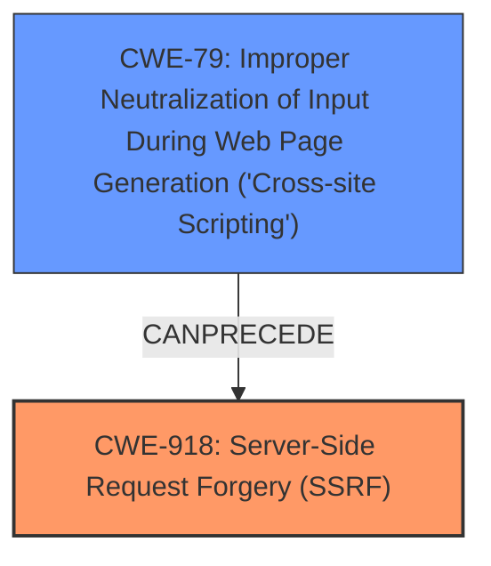

# Enhanced Analysis for CVE-2025-25069

# Summary
| CWE ID | CWE Name | Confidence | CWE Abstraction Level | CWE Vulnerability Mapping Label | CWE-Vulnerability Mapping Notes |
|---|---|---|---|---|---|
| CWE-918 | Server-Side Request Forgery (SSRF) | 0.7 | Base | Allowed | Primary CWE |
| CWE-79 | Improper Neutralization of Input During Web Page Generation ('Cross-site Scripting') | 0.6 | Base | Allowed | Secondary Candidate |

## Evidence and Confidence

*   **Confidence Score:** 0.7
*   **Evidence Strength:** MEDIUM

## Relationship Analysis
The primary relationship impacting the decision is that of root cause versus impact. The vulnerability description indicates that the **cross-protocol scripting** issue can be chained with SSRF. The selected CWEs are at the Base level of abstraction, which is the preferred level.



## Vulnerability Chain
The vulnerability chain starts with a **cross-protocol scripting** vulnerability (CWE-79), where the system doesn't properly handle different protocol requests. This can then be exploited in conjunction with Server-Side Request Forgery (CWE-918), leading to potentially dangerous database operations.

## Summary of Analysis
The analysis is based on the provided vulnerability description and the retriever results. The primary focus is on identifying the root cause and the immediate impact.

The vulnerability description clearly states that Kvrocks doesn't properly detect if Host or POST appears in RESP requests, allowing a valid HTTP request to be sent to Kvrocks as a valid RESP request. This is chained with SSRF, leading to database operations.

Based on this, CWE-918 (Server-Side Request Forgery (SSRF)) is selected as the primary CWE because the vulnerability description indicates that the **cross-protocol scripting** issue can be chained with SSRF.
CWE-79 (Improper Neutralization of Input During Web Page Generation ('Cross-site Scripting')) is selected as a secondary CWE because the **weakness** is **cross-protocol scripting**

The selected CWEs are at the optimal level of specificity (Base) as they directly represent the identified weaknesses.

Other CWEs Considered and Rejected:

*   CWE-113 (Improper Neutralization of CRLF Sequences in HTTP Headers ('HTTP Request/Response Splitting')): While HTTP is involved, the core issue isn't CRLF injection but the mishandling of HTTP requests as RESP requests.
*   CWE-89 (Improper Neutralization of Special Elements used in an SQL Command ('SQL Injection')): This is not directly related as the vulnerability description doesn't explicitly state that SQL commands are involved.
*   CWE-352 (Cross-Site Request Forgery (CSRF)): This is not applicable as the vulnerability doesn't involve forging requests from a user's browser.
*   CWE-287 (Improper Authentication) and CWE-306 (Missing Authentication for Critical Function): While authentication issues could exacerbate the problem, the core vulnerability is the mishandling of different protocol requests.


## CWE Relationship Analysis

Current CWEs represent these abstraction levels: .


### Vulnerability Chain Analysis

**Chain starting from CWE-89:**
- 89 (Improper Neutralization of Special Elements used in an SQL Command ('SQL Injection')) - ROOT


**Chain starting from CWE-79:**
- 79 (Improper Neutralization of Input During Web Page Generation ('Cross-site Scripting')) - ROOT


### CWE Relationship Diagram

```mermaid
graph TD
    classDef primary fill:#f96,stroke:#333,stroke-width:2px
    classDef secondary fill:#69f,stroke:#333
    classDef tertiary fill:#9e9,stroke:#333
```