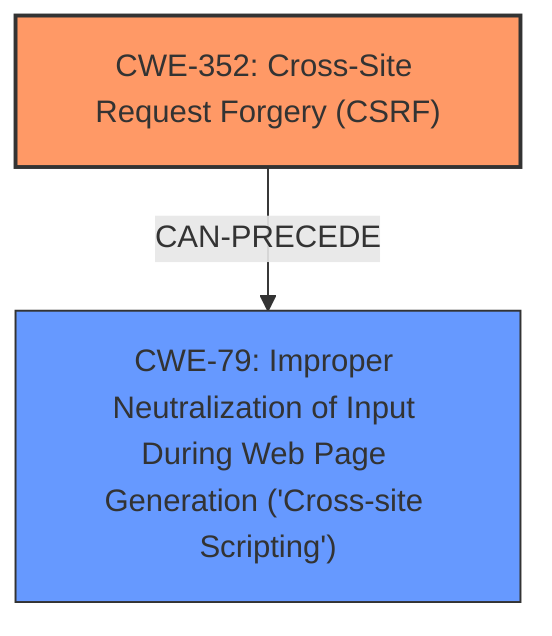

# Raw Analyzer Response for CVE-2025-25138

# Summary

| CWE ID | CWE Name | Confidence | CWE Abstraction Level | CWE Vulnerability Mapping Label | CWE-Vulnerability Mapping Notes |
|---|---|---|---|---|---|
| CWE-352 | Cross-Site Request Forgery (CSRF) | 0.9 | Compound | Allowed | Primary CWE - Root Cause |
| CWE-79 | Improper Neutralization of Input During Web Page Generation ('Cross-site Scripting') | 0.9 | Base | Allowed | Secondary CWE - Resulting Weakness |

## Evidence and Confidence

*   **Confidence Score:** 0.9
*   **Evidence Strength:** HIGH

## Relationship Analysis
The primary relationship is that **Cross-Site Request Forgery (CSRF)**, CWE-352, can lead to **Improper Neutralization of Input During Web Page Generation ('Cross-site Scripting')**, CWE-79. A successful CSRF attack can trick a user into performing actions that introduce malicious script into the web page, resulting in XSS.

## Vulnerability Chain
The vulnerability chain begins with the **Cross-Site Request Forgery (CSRF)**, CWE-352, which allows an attacker to induce a user into performing unwanted actions. This can lead to Stored **XSS** i.e. **Improper Neutralization of Input During Web Page Generation ('Cross-site Scripting')**, CWE-79, if the forged request modifies data that is later displayed without proper sanitization.

## Summary of Analysis
The vulnerability description clearly states that a **Cross-Site Request Forgery (CSRF)** vulnerability allows Stored **XSS**. This indicates that a CSRF attack can be used to inject malicious scripts into the application. The primary weakness is **CWE-352**, as it's the root cause enabling the **XSS** vulnerability. The secondary weakness is **CWE-79**, as it represents the impact of the successful CSRF attack.

The Retriever Results also supports this, with CWE-79 and CWE-352 being the top candidates.

I am confident in this assessment because the vulnerability description explicitly mentions both CSRF and Stored XSS, and the relationship between these two vulnerabilities is well-established. The selection of CWEs is also aligned with the MITRE mapping guidance.

Other CWEs Considered but Not Used:

*   CWE-89: Improper Neutralization of Special Elements used in an SQL Command ('SQL Injection') - Not applicable as the vulnerability description mentions XSS, not SQL injection.
*   CWE-80: Improper Neutralization of Script-Related HTML Tags in a Web Page (Basic XSS) - While related to XSS, CWE-79 is a more general and appropriate base-level classification.
*   CWE-116: Improper Encoding or Escaping of Output - Could be related to XSS, but CWE-79 is more direct.
*   CWE-918: Server-Side Request Forgery (SSRF) - Not applicable as the vulnerability description does not mention SSRF.
*   CWE-601: URL Redirection to Untrusted Site ('Open Redirect') - Not applicable as the vulnerability description does not mention URL redirection.
*   CWE-425: Direct Request ('Forced Browsing') - Not directly related to CSRF leading to XSS.
*   CWE-472: External Control of Assumed-Immutable Web Parameter - Not directly related to CSRF leading to XSS.
*   CWE-113: Improper Neutralization of CRLF Sequences in HTTP Headers ('HTTP Request/Response Splitting') - Not applicable as the vulnerability description does not mention HTTP request/response splitting.
*   CWE-346: Origin Validation Error - Could be related to CSRF, but CWE-352 is the more specific CWE for CSRF.
*   CWE-790: Improper Filtering of Special Elements - Too general; CWE-79 is more specific to XSS.
*   CWE-184: Incomplete List of Disallowed Inputs - Not directly applicable.