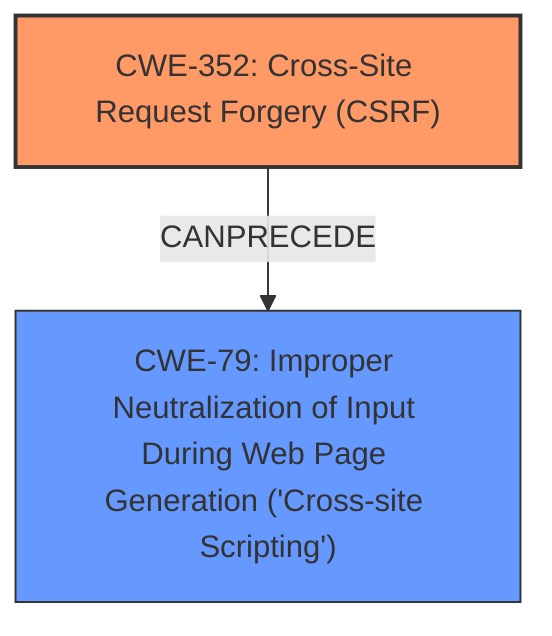

# Raw Analyzer Response for CVE-2025-25153

# Summary
| CWE ID | CWE Name | Confidence | CWE Abstraction Level | CWE Vulnerability Mapping Label | CWE-Vulnerability Mapping Notes |
|---|---|---|---|---|---|
| CWE-352 | Cross-Site Request Forgery (CSRF) | 0.9 | Compound | Primary | Allowed |
| CWE-79 | Improper Neutralization of Input During Web Page Generation ('Cross-site Scripting') | 0.8 | Base | Secondary | Allowed |

## Evidence and Confidence

*   **Confidence Score:** 0.85
*   **Evidence Strength:** HIGH

## Relationship Analysis
The primary weakness is identified as CWE-352 [Cross-Site Request Forgery (CSRF)]. This is a compound weakness, meaning it's composed of multiple underlying issues. The exploitation of CWE-352 can lead to other vulnerabilities, such as CWE-79 [Improper Neutralization of Input During Web Page Generation ('Cross-site Scripting')], also known as Stored XSS.

## Vulnerability Chain
The vulnerability chain starts with **CWE-352** [Cross-Site Request Forgery (CSRF)], where the application **does not sufficiently verify** the origin of the request. This allows an attacker to trick a user into performing actions they did not intend to, leading to **Stored XSS**, which is **CWE-79** [Improper Neutralization of Input During Web Page Generation ('Cross-site Scripting')]. The chain shows the progression from the initial **lack of CSRF protection** to the final impact of **Stored XSS** due to **improper neutralization of input**.

## Summary of Analysis
The initial assessment identified **CWE-352** [Cross-Site Request Forgery (CSRF)] as the primary weakness, based on the vulnerability description and the CVE reference link content summary, which both explicitly mention **CSRF**. The description also mentions **Stored XSS**, which is addressed by **CWE-79** [Improper Neutralization of Input During Web Page Generation ('Cross-site Scripting')]. The vulnerability chain confirms that the lack of CSRF protection allows for Stored XSS.

The retriever results also list **CWE-79** [Improper Neutralization of Input During Web Page Generation ('Cross-site Scripting')] as a highly relevant CWE, supporting its inclusion as a secondary weakness.

The final selection is based on the provided evidence and confirms that **CWE-352** [Cross-Site Request Forgery (CSRF)] is the root cause, while **CWE-79** [Improper Neutralization of Input During Web Page Generation ('Cross-site Scripting')] is the resulting vulnerability.

# Relevant CWE Information:

# Enhanced Context (25 CWEs)
The following CWEs were identified as potentially relevant to this vulnerability:

## CWE-352: Cross-Site Request Forgery (CSRF)
**Abstraction Level**: Compound
**Similarity Score**: 0.77
**Source**: dense

**Description**:
The web application does not, or can not, sufficiently verify whether a well-formed, valid, consistent request was intentionally provided by the user who submitted the request.

**Mapping Guidance**:
- Usage: Allowed
- Rationale: This is a well-known Composite of multiple weaknesses that must all occur simultaneously, although it is attack-oriented in nature.

**Justification:** The vulnerability description and CVE reference link content summary explicitly mention "Cross-Site Request Forgery (CSRF)".

## CWE-79: Improper Neutralization of Input During Web Page Generation ('Cross-site Scripting')
**Abstraction Level**: Base
**Similarity Score**: 0.75
**Source**: dense

**Description**:
The product does not neutralize or incorrectly neutralizes user-controllable input before it is placed in output that is used as a web page that is served to other users.

**Mapping Guidance**:
- Usage: Allowed
- Rationale: This CWE entry is at the Base level of abstraction, which is a preferred level of abstraction for mapping to the root causes of vulnerabilities.

**Justification:** The vulnerability description explicitly mentions "Stored XSS".

## CWE-80: Improper Neutralization of Script-Related HTML Tags in a Web Page (Basic XSS)
**Abstraction Level**: Variant
**Similarity Score**: 0.74
**Source**: dense

**Description**:
The product receives input from an upstream component, but it does not neutralize or incorrectly neutralizes special characters such as "<", ">", and "&" that could be interpreted as web-scripting elements when they are sent to a downstream component that processes web pages.

**Mapping Guidance**:
- Usage: Allowed
- Rationale: This CWE entry is at the Variant level of abstraction, which is a preferred level of abstraction for mapping to the root causes of vulnerabilities.

**Justification:** While related to XSS, CWE-79 is a better fit because the description doesn't specify the neutralization of specific HTML tags.

## CWE-425: Direct Request ('Forced Browsing')
**Abstraction Level**: Base
**Similarity Score**: 0.74
**Source**: dense

**Description**:
The web application does not adequately enforce appropriate authorization on all restricted URLs, scripts, or files.

**Mapping Guidance**:
- Usage: Allowed
- Rationale: This CWE entry is at the Base level of abstraction, which is a preferred level of abstraction for mapping to the root causes of vulnerabilities.

**Justification:** The reference mentions "Broken Access Control (OWASP Top 10 - A1)". However, the primary issue is CSRF, which enables the unauthorized action.

## CWE-116: Improper Encoding or Escaping of Output
**Abstraction Level**: Class
**Similarity Score**: 0.73
**Source**: dense

**Description**:
The product prepares a structured message for communication with another component, but encoding or escaping of the data is either missing or done incorrectly. As a result, the intended structure of the message is not preserved.

**Mapping Guidance**:
- Usage: Allowed-with-Review
- Rationale: This CWE entry is a Class and might have Base-level children that would be more appropriate

**Justification:** This is a potential contributing factor to XSS, but CWE-79 is more specific to the XSS vulnerability.

## CWE-434: Unrestricted Upload of File with Dangerous Type
**Abstraction Level**: Base
**Similarity Score**: 0.72
**Source**: dense

**Description**:
The product allows the upload or transfer of dangerous file types that are automatically processed within its environment.

**Mapping Guidance**:
- Usage: Allowed
- Rationale: This CWE entry is at the Base level of abstraction, which is a preferred level of abstraction for mapping to the root causes of vulnerabilities.

**Justification:** Not directly related to the described vulnerability.

## CWE-1336: Improper Neutralization of Special Elements Used in a Template Engine
**Abstraction Level**: Base
**Similarity Score**: 0.72
**Source**: dense

**Description**:
The product uses a template engine to insert or process externally-influenced input, but it does not neutralize or incorrectly neutralizes special elements or syntax that can be interpreted as template expressions or other code directives when processed by the engine.

**Mapping Guidance**:
- Usage: Allowed
- Rationale: This CWE entry is at the Base level of abstraction, which is a preferred level of abstraction for mapping to the root causes of vulnerabilities.

**Justification:** While possible, the vulnerability description doesn't mention anything about a template engine.

## CWE-472: External Control of Assumed-Immutable Web Parameter
**Abstraction Level**: Base
**Similarity Score**: 0.72
**Source**: dense

**Description**:
The web application does not sufficiently verify inputs that are assumed to be immutable but are actually externally controllable, such as hidden form fields.

**Mapping Guidance**:
- Usage: Allowed
- Rationale: This CWE entry is at the Base level of abstraction, which is a preferred level of abstraction for mapping to the root causes of vulnerabilities.

**Justification:** Not directly related to the described vulnerability.

## CWE-639: Authorization Bypass Through User-Controlled Key
**Abstraction Level**: Base
**Similarity Score**: 0.71
**Source**: dense

**Description**:
The system's authorization functionality does not prevent one user from gaining access to another user's data or record by modifying the key value identifying the data.

**Mapping Guidance**:
- Usage: Allowed
- Rationale: This CWE entry is at the Base level of abstraction, which is a preferred level of abstraction for mapping to the root causes of vulnerabilities.

**Justification:** Authorization is broken due to CSRF, but CWE-352 is more direct.

## CWE-918: Server-Side Request Forgery (SSRF)
**