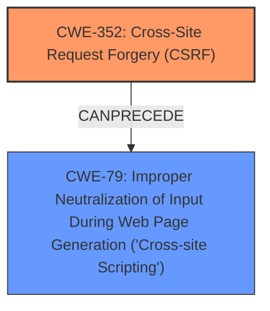

# Analysis for CVE-2025-25160

# Summary
| CWE ID | CWE Name | Confidence | CWE Abstraction Level | CWE Vulnerability Mapping Label | CWE-Vulnerability Mapping Notes |
|---|---|---|---|---|---|
| CWE-352 | Cross-Site Request Forgery (CSRF) | 0.9 | Compound | Primary | Allowed |
| CWE-79 | Improper Neutralization of Input During Web Page Generation ('Cross-site Scripting') | 0.7 | Base | Secondary | Allowed |

## Evidence and Confidence

*   **Confidence Score:** 0.8
*   **Evidence Strength:** MEDIUM

## Relationship Analysis
The primary weakness is identified as CWE-352 (CSRF). CWE-79 (XSS) is listed as a secondary weakness because the CSRF vulnerability allows for Stored XSS. There isn't a direct parent-child relationship between CWE-352 and CWE-79, but they can occur together in a vulnerability chain. The relationship analysis suggests that an attacker leverages CSRF (CWE-352) to inject malicious scripts, leading to XSS (CWE-79).

## Vulnerability Chain
The vulnerability chain starts with CWE-352, where the application fails to adequately verify that requests are intentionally made by the user. This allows an attacker to forge requests on behalf of a victim user, leading to the injection of malicious scripts. This injected script is then executed in the victim's browser due to **improper neutralization of input**, resulting in CWE-79.

CWE-352 (Root Cause) -> CWE-79 (Impact)

## Summary of Analysis
Based on the provided evidence, the primary vulnerability is CWE-352, Cross-Site Request Forgery. The description explicitly mentions CSRF as the root cause. The content also states the presence of Stored XSS, which is a consequence of the CSRF vulnerability. Therefore, CWE-79 is a secondary vulnerability.

The retriever results also show CWE-79 and CWE-352 as top candidates. The graph relationships also support the possibility of CSRF leading to XSS. The selected CWEs are at the optimal level of specificity, with CWE-352 being a Compound weakness and CWE-79 being a Base weakness.

Relevant CWE Information:

# Enhanced Context (25 CWEs)
The following CWEs were identified as potentially relevant to this vulnerability:

## CWE-352: Cross-Site Request Forgery (CSRF)
**Abstraction Level**: Compound
**Similarity Score**: 0.75
**Source**: dense

**Description**:
The web application does not, or can not, sufficiently verify whether a well-formed, valid, consistent request was intentionally provided by the user who submitted the request.

**Mapping Guidance**:
- Usage: Allowed
- Rationale: This is a well-known Composite of multiple weaknesses that must all occur simultaneously, although it is attack-oriented in nature.

## CWE-79: Improper Neutralization of Input During Web Page Generation ('Cross-site Scripting')
**Abstraction Level**: Base
**Similarity Score**: 0.71
**Source**: dense

**Description**:
The product does not neutralize or incorrectly neutralizes user-controllable input before it is placed in output that is used as a web page that is served to other users.

**Mapping Guidance**:
- Usage: Allowed
- Rationale: This CWE entry is at the Base level of abstraction, which is a preferred level of abstraction for mapping to the root causes of vulnerabilities.

## CWE-352: Cross-Site Request Forgery (CSRF)
**Abstraction Level**: Compound
**Similarity Score**: 860.17
**Source**: sparse

**Description**:
The web application does not, or can not, sufficiently verify whether a well-formed, valid, consistent request was intentionally provided by the user who submitted the request.

**Mapping Guidance**:
- Usage: Allowed
- Rationale: This is a well-known Composite of multiple weaknesses that must all occur simultaneously, although it is attack-oriented in nature.

## CWE-79: Improper Neutralization of Input During Web Page Generation ('Cross-site Scripting')
**Abstraction Level**: Base
**Similarity Score**: 869.58
**Source**: sparse

**Description**:
The product does not neutralize or incorrectly neutralizes user-controllable input before it is placed in output that is used as a web page that is served to other users.

**Mapping Guidance**:
- Usage: Allowed
- Rationale: This CWE entry is at the Base level of abstraction, which is a preferred level of abstraction for mapping to the root causes of vulnerabilities.

### Final Answer:
CWE-352
CWE-79