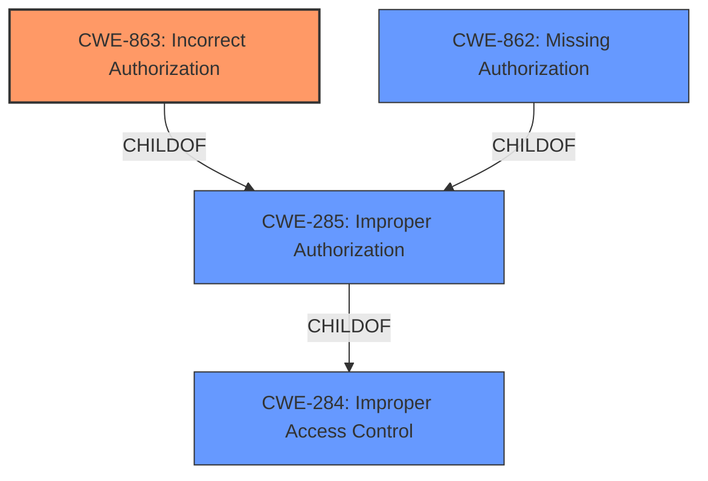

# Raw Analyzer Response for CVE-2025-25196

# Summary
| CWE ID | CWE Name | Confidence | CWE Abstraction Level | CWE Vulnerability Mapping Label | CWE-Vulnerability Mapping Notes |
|---|---|---|---|---|---|
| CWE-863 | Incorrect Authorization | 1.0 | Class | Primary | Allowed-with-Review |

## Evidence and Confidence

*   **Confidence Score:** 1.0
*   **Evidence Strength:** HIGH

## Relationship Analysis
The primary CWE selected is CWE-863, which is a Class-level CWE. Several other CWEs were considered, including its parent CWEs. CWE-862 (Missing Authorization) and CWE-285 (Improper Authorization) are closely related, but CWE-863 was chosen because the vulnerability description indicates that authorization checks are performed, but they are done incorrectly, leading to the **authorization bypass**.

## Vulnerability Chain
The vulnerability chain begins with the **incorrect authorization** logic (CWE-863), which leads to the impact of an **authorization bypass**.

## Summary of Analysis
The analysis indicates an **authorization bypass** vulnerability in OpenFGA versions prior to v1.8.5. The core issue lies in the **incorrect authorization** logic within the Check API and ListObjects calls when specific conditions related to public access and userset assignments are met. This allows unauthorized access.

The primary CWE selected is CWE-863 (Incorrect Authorization). This is because the vulnerability occurs due to authorization checks being performed incorrectly, leading to an **authorization bypass**. The vulnerability description clearly states that the **authorization bypass** occurs when certain conditions are met in the Check API and ListObjects calls, indicating that authorization checks are present but flawed.

The selection of CWE-863 is based on the following evidence:
- The vulnerability description explicitly mentions "**authorization bypass**" as the core **weakness**.
- The description details specific conditions related to public access and userset assignments that trigger the **authorization bypass**, implying that there is an attempt to perform authorization, but it is flawed.
- The "CVE Reference Links Content Summary" confirms that the root cause is an **authorization bypass** issue in the Check and ListObjects calls.

The CWE guidance provided also supports this selection, as CWE-863 is recommended when "Role check is present but flawed."

CWE-862 (Missing Authorization) was considered but not selected because the vulnerability description suggests that authorization checks are present but flawed, rather than completely missing. Similarly, CWE-285 (Improper Authorization) is a more general category and less specific than CWE-863.
CWE-284 (Improper Access Control) was not selected, as it's a high-level category and a more specific CWE could be identified.
The final decision is strongly based on the provided evidence and the CWE specifications.