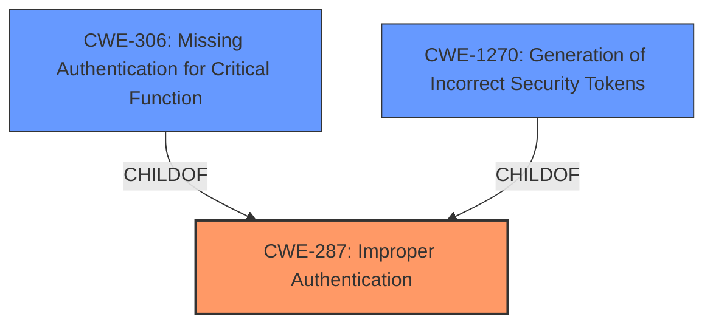

# Raw Analyzer Response for CVE-2025-25202

# Summary

| CWE ID    | CWE Name                                                                         | Confidence | CWE Abstraction Level | CWE Vulnerability Mapping Label | CWE-Vulnerability Mapping Notes |
| --------- | -------------------------------------------------------------------------------- | ---------- | --------------------- | ------------------------------- | ------------------------------- |
| CWE-287   | Improper Authentication                                                           | 0.8        | Class                 | Primary                         | Discouraged                     |
| CWE-1270  | Generation of Incorrect Security Tokens                                           | 0.7        | Base                  | Secondary                       | Allowed                         |
| CWE-306   | Missing Authentication for Critical Function                                      | 0.6        | Base                  | Secondary                       | Allowed                         |

## Evidence and Confidence

*   **Confidence Score:** 0.7
*   **Evidence Strength:** MEDIUM

## Relationship Analysis

The primary CWE selected is CWE-287 Improper Authentication, a Class-level CWE. While it's generally discouraged to use Class-level CWEs, in this case, the root cause is related to authentication issues. CWE-306 and CWE-1270 are related, however, the high-level issue is that of Authentication bypassing, so a class level is appropriate here. The generated code **allows revoked tokens being allowed to verify as valid** thus bypassing authentication.

## Vulnerability Chain

The vulnerability chain starts with the **revoked tokens being allowed to verify as valid** due to the flawed token revocation checking logic. This leads to an improper authentication scenario where revoked tokens are incorrectly considered valid. The impact is that magic link, password reset, and confirmation tokens can be reused until they expire, granting unauthorized access.

## Summary of Analysis

The initial assessment pointed towards CWE-287 Improper Authentication as the primary weakness, supported by the evidence indicating **revoked tokens being allowed to verify as valid**. The retriever results also suggest considering CWE-287, but the retriever also suggests CWE-306 and CWE-1270 as well. The primary CWE is that of authentication, so CWE-287 is the best option even if it is at the Class level.

Relevant CWE Information:

*   **Vulnerability Description Key Phrases:** "**rootcause:** **revoked tokens being allowed to verify as valid**"
*   **CVE Reference Links Content Summary:** "The flaw stems from an incorrect implementation in the `mix ash_authentication.install` generated code, specifically within the `:revoked?` action. Prior to version 4.4.9, the installer generated an action that did not correctly check for token revocation, allowing revoked tokens to be reused."
*   **Mitigation:** "Upgrade to version 4.4.9 or later of `ash_authentication`."