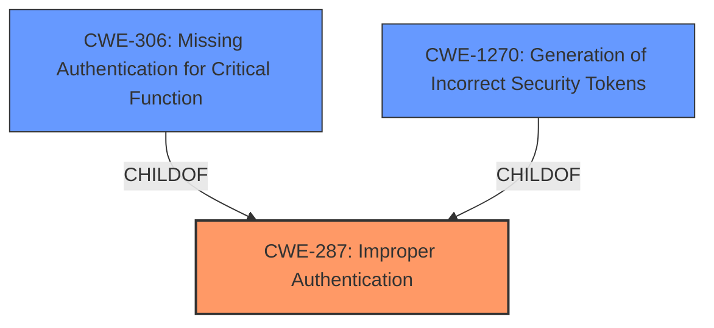

# Analysis Report for CVE-2025-25202

# Vulnerability Analysis Report: CVE-2025-25202

## Description

Ash Authentication is an authentication framework for Elixir applications. Applications which have been bootstrapped by the igniter installer present since AshAuthentication v4.1.0 and who have used the magic link strategy _or_ are manually revoking tokens are affected by **revoked tokens being allowed to verify as valid**. Unless one hase implemented any kind of custom token revocation feature in your application, then one will not be affected. The impact here for users using builtin functionality is that magic link tokens are reusable until they expire. With that said, magic link tokens are only valid for 10 minutes, so the surface area for abuse is extremely low here. The flaw is patched in version 4.4.9. Additionally a compile time warning is shown to users with remediation instructions if they upgrade. 4.4.9 ships with an upgrader, so those who use `mix igniter.upgrade ash_authentication` will have the necessary patch applied. Otherwise, one may run the upgrader manually as described in the error message. As a workaround, delete the generated `revoked?` generic action in the token resource. This will cause it to use the one internal to Ash Authentication which has always been correct. Alternatively, manually make the changes that are included in the patch.

## Vulnerability Description Key Phrases

- **Rootcause:** revoked tokens being allowed to verify as valid
- **Product:** Ash Authentication
- **Impact:** reusable magic link tokens, token revocation
- **Version:** v4.1.0 to 4.4.8

## Analysis (with Relationship Data)

# Summary

| CWE ID    | CWE Name                                                                         | Confidence | CWE Abstraction Level | CWE Vulnerability Mapping Label | CWE-Vulnerability Mapping Notes |
| --------- | -------------------------------------------------------------------------------- | ---------- | --------------------- | ------------------------------- | ------------------------------- |
| CWE-287   | Improper Authentication                                                           | 0.8        | Class                 | Primary                         | Discouraged                     |
| CWE-1270  | Generation of Incorrect Security Tokens                                           | 0.7        | Base                  | Secondary                       | Allowed                         |
| CWE-306   | Missing Authentication for Critical Function                                      | 0.6        | Base                  | Secondary                       | Allowed                         |

## Evidence and Confidence

*   **Confidence Score:** 0.7
*   **Evidence Strength:** MEDIUM

## Relationship Analysis

The primary CWE selected is CWE-287 Improper Authentication, a Class-level CWE. While it's generally discouraged to use Class-level CWEs, in this case, the root cause is related to authentication issues. CWE-306 and CWE-1270 are related, however, the high-level issue is that of Authentication bypassing, so a class level is appropriate here. The generated code **allows revoked tokens being allowed to verify as valid** thus bypassing authentication.



## Vulnerability Chain

The vulnerability chain starts with the **revoked tokens being allowed to verify as valid** due to the flawed token revocation checking logic. This leads to an improper authentication scenario where revoked tokens are incorrectly considered valid. The impact is that magic link, password reset, and confirmation tokens can be reused until they expire, granting unauthorized access.

## Summary of Analysis

The initial assessment pointed towards CWE-287 Improper Authentication as the primary weakness, supported by the evidence indicating **revoked tokens being allowed to verify as valid**. The retriever results also suggest considering CWE-287, but the retriever also suggests CWE-306 and CWE-1270 as well. The primary CWE is that of authentication, so CWE-287 is the best option even if it is at the Class level.

Relevant CWE Information:

*   **Vulnerability Description Key Phrases:** "**rootcause:** **revoked tokens being allowed to verify as valid**"
*   **CVE Reference Links Content Summary:** "The flaw stems from an incorrect implementation in the `mix ash_authentication.install` generated code, specifically within the `:revoked?` action. Prior to version 4.4.9, the installer generated an action that did not correctly check for token revocation, allowing revoked tokens to be reused."
*   **Mitigation:** "Upgrade to version 4.4.9 or later of `ash_authentication`."


## CWE Relationship Analysis

Current CWEs represent these abstraction levels: .


### Vulnerability Chain Analysis

**Chain starting from CWE-306:**
- 306 (Missing Authentication for Critical Function) - ROOT


**Chain starting from CWE-287:**
- 287 (Improper Authentication) - ROOT


### CWE Relationship Diagram

```mermaid
graph TD
    classDef primary fill:#f96,stroke:#333,stroke-width:2px
    classDef secondary fill:#69f,stroke:#333
    classDef tertiary fill:#9e9,stroke:#333
```


*Report generated on 2025-07-14 13:19:44*
