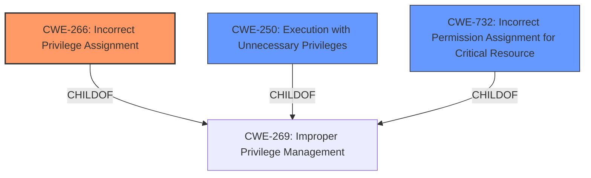

# Analysis for CVE-2025-25225

# Summary
| CWE ID | CWE Name | Confidence | CWE Abstraction Level | CWE Vulnerability Mapping Label | CWE-Vulnerability Mapping Notes |
|---|---|---|---|---|---|
| CWE-266 | Incorrect Privilege Assignment | 0.9 | Base | Primary CWE | Allowed |
| CWE-250 | Execution with Unnecessary Privileges | 0.7 | Base | Secondary | Allowed |
| CWE-732 | Incorrect Permission Assignment for Critical Resource | 0.6 | Class | Secondary | Allowed-with-Review |

## Evidence and Confidence

*   **Confidence Score:** 0.8
*   **Evidence Strength:** MEDIUM

## Relationship Analysis
The primary CWE is CWE-266 which is a Base level CWE. This has parent CWEs that are more abstract. CWE-250 and CWE-732 are also related to privilege management.

## Vulnerability Chain
The vulnerability chain starts with the **incorrect privilege assignment** (CWE-266). This leads to a state where an authenticated administrator can **escalate their privileges to Super Admin Permissions**.

## Summary of Analysis
The vulnerability description indicates a **privilege escalation vulnerability** where an authenticated administrator can escalate their privileges to Super Admin Permissions. The key phrase is "**privilege escalation vulnerability**" and "**escalate their privileges to Super Admin Permissions**". This suggests a problem with how privileges are managed and assigned.

Based on the provided information and the CWE Classification Guidance, the following CWEs are considered:

*   **CWE-266: Incorrect Privilege Assignment** - This is the most likely root cause, as the vulnerability description explicitly states that administrators can escalate their privileges to Super Admin Permissions. This implies that the administrator role was incorrectly assigned higher privileges than intended.
*   **CWE-250: Execution with Unnecessary Privileges** - This could be a contributing factor if the administrator account is running with higher privileges than necessary, which allows the escalation to Super Admin Permissions.
*   **CWE-732: Incorrect Permission Assignment for Critical Resource** - This could be applicable if the administrator account is granted incorrect permissions to access or modify critical resources, which allows the privilege escalation.
*   **CWE-269: Improper Privilege Management** - This is a more general CWE and is discouraged for use when more specific CWEs are available.

The mapping guidance explicitly states to avoid using CWE-269 and instead use CWE-266, CWE-250, or CWE-863 depending on the root cause.

Given the information, **CWE-266 (Incorrect Privilege Assignment)** seems to be the most appropriate primary CWE. CWE-250 and CWE-732 are also considered as secondary candidates.

# Relevant CWE Information:

## CWE-266: Incorrect Privilege Assignment
**Abstraction Level**: Base
**Similarity Score**: 1246.67
**Source**: sparse

**Description**:
A product incorrectly assigns a privilege to a particular actor, creating an unintended sphere of control for that actor.

**Mapping Guidance**:
- Usage: Allowed
- Rationale: This CWE entry is at the Base level of abstraction, which is a preferred level of abstraction for mapping to the root causes of vulnerabilities.

**Relationships**:
- PARENTOF -> CWE-9
- PARENTOF -> CWE-556
- PARENTOF -> CWE-520
- PARENTOF -> CWE-1022
- CANALSOBE -> CWE-286

**Justification:** The vulnerability description indicates that an authenticated administrator can escalate their privileges to Super Admin Permissions. This suggests that the administrator role was incorrectly assigned higher privileges than intended, which aligns with the description of CWE-266.

## CWE-250: Execution with Unnecessary Privileges
**Abstraction Level**: Base
**Similarity Score**: 0.175
**Source**: sparse

**Description**:
The product performs an operation at a privilege level that is higher than the minimum level required, which creates new weaknesses or amplifies the consequences of other weaknesses.

**Mapping Guidance**:
- Usage: Allowed
- Rationale: This CWE entry is at the Base level of abstraction, which is a preferred level of abstraction for mapping to the root causes of vulnerabilities.

**Relationships**:
- CHILDOF -> CWE-657
- CHILDOF -> CWE-269
- PARENTOF -> CWE-250
- PARENTOF -> CWE-250

**Justification:** The administrator account is running with higher privileges than necessary, which allows the escalation to Super Admin Permissions

## CWE-732: Incorrect Permission Assignment for Critical Resource
**Abstraction Level**: Class
**Similarity Score**: 0.177
**Source**: sparse

**Description**:
The product performs an authorization check when an actor attempts to access a resource or perform an action, but it does not correctly perform the check.

**Mapping Guidance**:
- Usage: Allowed-with-Review
- Rationale: This CWE entry is a Class and might have Base-level children that would be more appropriate

**Justification:** The administrator account is granted incorrect permissions to access or modify critical resources, which allows the privilege escalation.

## Other CWEs Considered and Rejected:

*   CWE-269: Improper Privilege Management - This is a more general CWE and is discouraged for use when more specific CWEs are available.
*   CWE-284: Improper Access Control - Too generic.
*   CWE-862: Missing Authorization - Not applicable as the issue is with incorrect privilege assignment, not missing authorization.
*   CWE-285: Improper Authorization - Not applicable as the issue is with incorrect privilege assignment, not improper authorization.