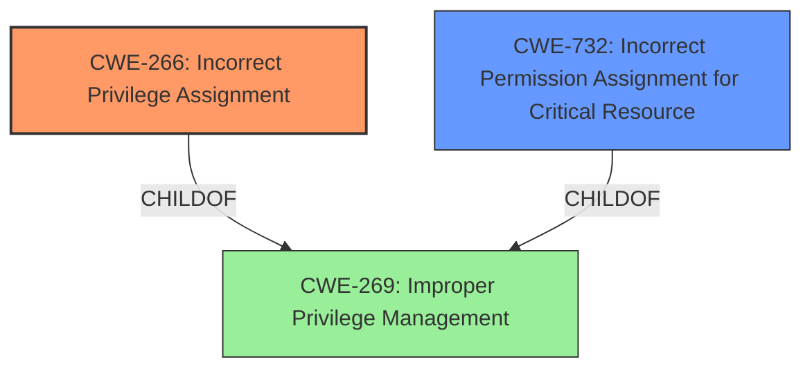

# Analysis Report for CVE-2025-25230

# Vulnerability Analysis Report: CVE-2025-25230

## Description

Omnissa Horizon Client for Windows contains an LPE Vulnerability. A malicious actor with local access where Horizon Client for Windows is installed may be able to elevate privileges.

## Vulnerability Description Key Phrases

- **Weakness:** Local Privilege Escalation
- **Product:** Omnissa Horizon Client for Windows
- **Impact:** Privilege Escalation, elevate privileges
- **Attacker:** malicious actor with local access

## Analysis (with Relationship Data)

# Summary
| CWE ID | CWE Name | Confidence | CWE Abstraction Level | CWE Vulnerability Mapping Label | CWE-Vulnerability Mapping Notes |
|---|---|---|---|---|---|
| CWE-266 | Incorrect Privilege Assignment | 0.8 | Base | Allowed | Primary CWE |
| CWE-732 | Incorrect Permission Assignment for Critical Resource | 0.5 | Class | Allowed-with-Review | Secondary Candidate |

## Evidence and Confidence

*   **Confidence Score:** 0.7
*   **Evidence Strength:** MEDIUM

## Relationship Analysis
The primary relationship considered was the parent-child relationship between CWE-269 (Improper Privilege Management) and CWE-266 (Incorrect Privilege Assignment), as well as CWE-732 (Incorrect Permission Assignment for Critical Resource). The choice of CWE-266 as the primary CWE reflects the specific assignment of incorrect privileges as the root cause, rather than a general management issue.


## Vulnerability Chain
The vulnerability chain consists of the **incorrect privilege assignment** leading to the impact of local privilege escalation.

## Summary of Analysis
The initial assessment focused on identifying the root cause of the local privilege escalation vulnerability in Omnissa Horizon Client for Windows. The vulnerability description clearly indicates that a malicious actor with local access can elevate privileges.

The primary CWE selected is CWE-266 (Incorrect Privilege Assignment) because the vulnerability description implies that the root cause lies in how privileges are assigned within the application. The description states a "malicious actor with local access where Horizon Client for Windows is installed may be able to elevate privileges." This suggests an issue where the actor is granted more privileges than intended.

CWE-732 (Incorrect Permission Assignment for Critical Resource) was considered as a secondary candidate because it addresses the permissions assigned to critical resources. However, the description focuses more on privilege escalation in general, so permissions are less applicable.

The evidence for CWE-266 lies in the vulnerability description key phrases: "Local Privilege Escalation" and "elevate privileges," which are consistent with the concept of incorrect privilege assignment. Also, the "attacker: malicious actor with local access" suggests that privileges were misconfigured.

Relevant CWE Information:

# Enhanced Context (25 CWEs)
The following CWEs were identified as potentially relevant to this vulnerability:

## CWE-266: Incorrect Privilege Assignment
**Abstraction Level**: Base
**Similarity Score**: 0.78
**Source**: dense

**Description**:
A product incorrectly assigns a privilege to a particular actor, creating an unintended sphere of control for that actor.

**Mapping Guidance**:
- Usage: Allowed
- Rationale: This CWE entry is at the Base level of abstraction, which is a preferred level of abstraction for mapping to the root causes of vulnerabilities.

**CWE-266** is the best fit because it involves the assignment of incorrect privileges, as the vulnerability description implies the actor is gaining more privileges than intended.

## CWE-266: Incorrect Privilege Assignment
**Abstraction Level**: Base
**Similarity Score**: 1266.86
**Source**: sparse

**Description**:
A product incorrectly assigns a privilege to a particular actor, creating an unintended sphere of control for that actor.

**Mapping Guidance**:
- Usage: Allowed
- Rationale: This CWE entry is at the Base level of abstraction, which is a preferred level of abstraction for mapping to the root causes of vulnerabilities.

**CWE-266** is the best fit because it involves the assignment of incorrect privileges, as the vulnerability description implies the actor is gaining more privileges than intended.

The other CWEs considered were rejected because they didn't match the root cause as closely. For example, CWE-269 (Improper Privilege Management) is too broad. CWE-732 (Incorrect Permission Assignment for Critical Resource) focuses on permissions, not privileges.

The choice of CWE-266 is at the optimal level of specificity because it directly addresses the **incorrect privilege assignment**, which is the root cause of the privilege escalation.

| CWE ID | CWE Name | Confidence | CWE Abstraction Level | CWE Vulnerability Mapping Label | CWE-Vulnerability Mapping Notes |
|---|---|---|---|---|---|
| CWE-266 | Incorrect Privilege Assignment | 0.8 | Base | Allowed | Primary CWE |
| CWE-732 | Incorrect Permission Assignment for Critical Resource | 0.5 | Class | Allowed-with-Review | Secondary Candidate |


## CWE Relationship Analysis

Current CWEs represent these abstraction levels: .


### Vulnerability Chain Analysis

**Chain starting from CWE-266:**
- 266 (Incorrect Privilege Assignment) - ROOT


**Chain starting from CWE-269:**
- 269 (Improper Privilege Management) - ROOT


### CWE Relationship Diagram

```mermaid
graph TD
    classDef primary fill:#f96,stroke:#333,stroke-width:2px
    classDef secondary fill:#69f,stroke:#333
    classDef tertiary fill:#9e9,stroke:#333
```


*Report generated on 2025-07-14 13:21:06*
