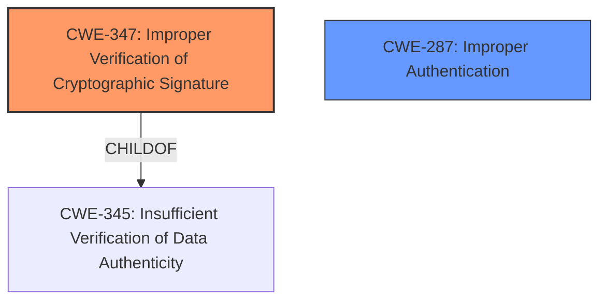

# Raw Analyzer Response for CVE-2025-25291

# Summary
| CWE ID | CWE Name | Confidence | CWE Abstraction Level | CWE Vulnerability Mapping Label | CWE-Vulnerability Mapping Notes |
|---|---|---|---|---|---|
| CWE-347 | Improper Verification of Cryptographic Signature | 0.9 | Base | Allowed | Primary CWE |
| CWE-287 | Improper Authentication | 0.6 | Class | Discouraged | Secondary Candidate |

## Evidence and Confidence

*   **Confidence Score:** 0.8
*   **Evidence Strength:** MEDIUM

## Relationship Analysis
The primary relationship influencing the decision is that CWE-347 is a **Base** level CWE, representing a specific type of cryptographic failure, and it is **ChildOf** CWE-345, which is a broader **Class** covering insufficient verification of data authenticity. While authentication bypass is the impact, the root cause stems from improper handling of cryptographic signatures due to parsing differences, making CWE-347 the more direct and appropriate classification.



## Vulnerability Chain
The vulnerability chain starts with a **parser differential** leading to an incorrect XML document structure. This **incorrect document structure** then leads to **improper verification of the cryptographic signature (CWE-347)**. Finally, the **improper signature verification** leads to **authentication bypass**.

## Summary of Analysis
The primary CWE is CWE-347, Improper Verification of Cryptographic Signature, because the root cause of the vulnerability is the **parser differential** causing the signature verification to fail. This is supported by the vulnerability description which states the issue is due to ReXML and Nokogiri parsing XML differently. This leads to signature wrapping attack, which results in the authentication bypass. CWE-287, Improper Authentication, was considered but deemed less specific as it describes the impact rather than the root cause. The classification is based on the evidence provided in the vulnerability description, and the relationships between CWEs further support the choice of CWE-347 as the primary weakness. The selected CWE is at the optimal level of specificity because it directly addresses the **root cause** of the vulnerability, which is the improper verification of the cryptographic signature.

Relevant CWE Information:

# Enhanced Context (25 CWEs)
The following CWEs were identified as potentially relevant to this vulnerability:

## Vulnerability Description
ruby-saml provides security assertion markup language (SAML) single sign-on (SSO) for Ruby. An authentication bypass vulnerability was found in ruby-saml prior to versions 1.12.4 and 1.18.0 due to a **parser differential**. ReXML and Nokogiri parse XML differently the parsers can generate entirely different document structures from the same XML input. That allows an attacker to be able to execute a Signature Wrapping attack. This issue may lead to authentication bypass. Versions 1.12.4 and 1.18.0 fix the issue.

### Vulnerability Description Key Phrases
- **rootcause:** **parser differential**
- **impact:** authentication bypass
- **vector:** Signature Wrapping attack
- **attacker:** attacker
- **product:** ruby-saml
- **version:** prior to versions 1.12.4 and 1.18.0

## CVE Reference Links Content Summary
```text
UNRELATED
```

## Retriever Results

### Top Combined Results

| Rank | CWE ID | Name | Abstraction | Usage  | Retrievers | Individual Scores |
|------|--------|------|-------------|-------|------------|-------------------|
| 1 | 347 | Improper Verification of Cryptographic Signature | Base | Allowed | sparse | 0.528 |
| 2 | 1333 | Inefficient Regular Expression Complexity | Base | Allowed | sparse | 0.468 |
| 3 | 1390 | Weak Authentication | Class | Allowed-with-Review | sparse | 0.459 |
| 4 | 611 | Improper Restriction of XML External Entity Reference | Base | Allowed | sparse | 0.455 |
| 5 | 328 | Use of Weak Hash | Base | Allowed | sparse | 0.443 |
| 6 | 138 | Improper Neutralization of Special Elements | Class | Discouraged | sparse | 0.433 |
| 7 | 287 | Improper Authentication | Class | Discouraged | sparse | 0.428 |
| 8 | 502 | Deserialization of Untrusted Data | Base | Allowed | sparse | 0.421 |
| 9 | 112 | Missing XML Validation | Base | Allowed | dense | 0.463 |
| 10 | 178 | Improper Handling of Case Sensitivity | Base | Allowed | graph | 0.002 |


---

## CWE Classification Guidance

The following guidance has been automatically included because relevant keywords were detected in the vulnerability description:

### Authentication vs Authorization vs Access Control Guidance

## ===Guidance===

### Level Set – Authentication vs Authorization vs Access Control

**Authentication**:
Determines *who* the actor is (identity validation). This is typically the *first step* in access control.

* Example phrases: "user must log in", "lack of login check", "bypasses login"
* CWE relevance: authentication is usually mapped to CWE-306 or its children.

  * **CWE-306**: *Missing Authentication for Critical Function* – used when no identity validation is enforced for sensitive functionality (e.g., password reset, user deletion).

**Authorization**:
Determines *what* an authenticated actor is allowed to do. It decides access *after* identity is verified.

* Example phrases: "unauthorized access", "regular user can access admin panel", "role checks are missing"
* CWE relevance: use CWEs like 862, 863, 285 for authorization errors:

  * **CWE-862**: *Missing Authorization* – the application doesn't check whether the user is authorized at all.
  * **CWE-863**: *Incorrect Authorization* – the application checks authorization, but does it incorrectly (e.g., flawed logic).
  * **CWE-285**: *Improper Authorization* – general category for any flawed authorization logic or design.

**Access Control**:
A broader term that includes both authentication and authorization. Governs how resources are protected and who can access them under what conditions.

* CWE relevance:

  * **CWE-284**: *Improper Access Control* – top-level category used when access control failure exists but root cause is unclear.
  * This should be avoided **if** a more specific child CWE like 285, 862, 863, or 306 is appropriate.

---

## Mapping Discussion – Common Misclassification Patterns

### 1. **CWE-306 vs CWE-862**:

* **306** is about lack of **authentication** (e.g., *no login required at all*).
* **862** is about lack of **authorization** *after* authentication (e.g., *admin check missing*).
* ✅ Example CWE-306: *“An unauthenticated attacker can invoke the password reset API.”*
* ✅ Example CWE-862: *“An authenticated user without admin privileges can delete any user account.”*

### 2. **CWE-285 vs CWE-284**:

* **285** is specific to authorization flaws – it's a better choice than 284 **if** the issue involves *improper or missing role checks*.
* **284** should be reserved for general access control issues when it’s unclear whether the issue lies in authn or authz.

---

## Technical Impact vs Root Cause Clarification

**Phrase like "unauthorized access" is not enough.**

* If you **cannot determine whether identity was checked**, assume it’s **authorization** and consider 862 or 863.
* If you **know no login happened**, lean toward **authentication** → CWE-306.
* If the **access control policy is unclear or inconsistently enforced**, but it's not due to missing checks, consider **CWE-284**.

---

## Good Mapping Examples

* ✅ **CWE-306**: “The endpoint `/admin/deleteUser` does not require any authentication.”
* ✅ **CWE-862**: “Any logged-in user can change any other user's email without being an admin.”
* ✅ **CWE-86