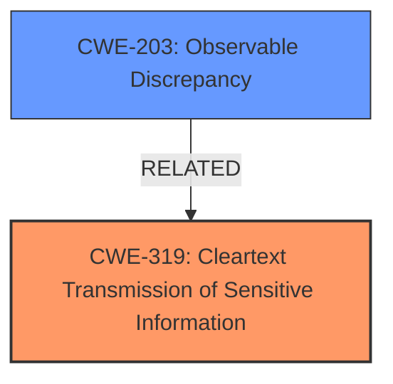

# Enhanced Analysis for CVE-2025-25333

# Summary
| CWE ID | CWE Name | Confidence | CWE Abstraction Level | CWE Vulnerability Mapping Label | CWE-Vulnerability Mapping Notes |
|---|---|---|---|---|---|
| CWE-319 | Cleartext Transmission of Sensitive Information | 0.7 | Base | Allowed | Primary CWE |
| CWE-203 | Observable Discrepancy | 0.5 | Base | Allowed | Secondary Candidate |

## Evidence and Confidence

*   **Confidence Score:** 0.6
*   **Evidence Strength:** LOW

## Relationship Analysis
The primary relationship considered was that CWE-319, Cleartext Transmission of Sensitive Information, is a Base level CWE, which is preferred for root cause analysis. CWE-203 Observable Discrepancy can manifest if the cleartext transmission leads to observable differences based on the data transmitted. I considered CWE-319's relationship to cryptographic weaknesses but there was no evidence to suggest that cryptography was used.



## Vulnerability Chain
The vulnerability chain starts with the attacker supplying a crafted link. This leads to the **Cleartext Transmission of Sensitive Information (CWE-319)**, which ultimately allows the attacker to access sensitive user information. The **Observable Discrepancy (CWE-203)** could be a side effect if different responses are observed based on the data transmitted.

## Summary of Analysis
The initial assessment focused on the fact that supplying a crafted link allowed attackers to access sensitive user information. The key weakness appears to be the **Cleartext Transmission of Sensitive Information (CWE-319)** as the root cause. The vulnerability description lacks specific details about the exact mechanism of the attack, but the phrase "supplying a crafted link" suggests a potential manipulation of the data being transmitted.

I am choosing **CWE-319 Cleartext Transmission of Sensitive Information** as the Primary CWE due to the fact that the attacker could access sensitive user information by supplying a crafted link. This directly suggests that the information was transmitted in cleartext and not encrypted.

I considered other CWEs from the Retriever Results, specifically access control and authorization issues, but the description doesn't provide enough information to definitively say that access control or authorization was **improper**, only that access to sensitive information was possible.

I am also including **CWE-203 Observable Discrepancy** as a secondary issue. This is because the crafted link could lead to different responses based on the data transmitted, thereby revealing information about the system. This classification relies more on inference than direct evidence.

The evidence is weak because there is no "CVE Reference Links Content Summary" section. My confidence is not high because the description is very brief and lacks specific technical details.


## CWE Relationship Analysis

Current CWEs represent these abstraction levels: .


### Vulnerability Chain Analysis

**Chain starting from CWE-319:**
- 319 (Cleartext Transmission of Sensitive Information) - ROOT


**Chain starting from CWE-203:**
- 203 (Observable Discrepancy) - ROOT


### CWE Relationship Diagram

```mermaid
graph TD
    classDef primary fill:#f96,stroke:#333,stroke-width:2px
    classDef secondary fill:#69f,stroke:#333
    classDef tertiary fill:#9e9,stroke:#333
```