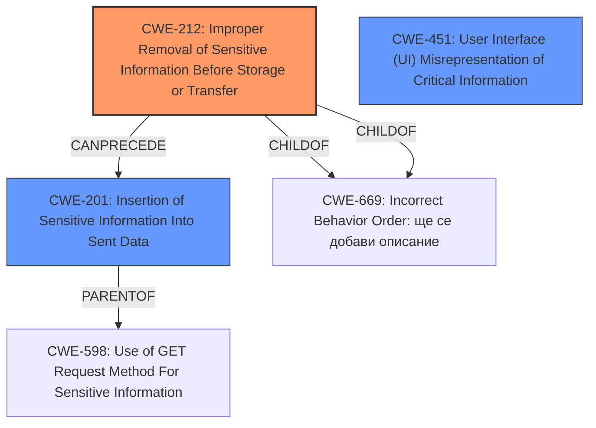

# Enhanced Analysis for CVE-2025-25370

# Summary
| CWE ID | CWE Name | Confidence | CWE Abstraction Level | CWE Vulnerability Mapping Label | CWE-Vulnerability Mapping Notes |
|---|---|---|---|---|---|
| CWE-212 | Improper Removal of Sensitive Information Before Storage or Transfer | 0.8 | Base | Allowed | Primary CWE |
| CWE-201 | Insertion of Sensitive Information Into Sent Data | 0.7 | Base | Allowed | Secondary Candidate |
| CWE-451 | User Interface (UI) Misrepresentation of Critical Information | 0.6 | Class | Allowed-with-Review | Secondary Candidate |

## Evidence and Confidence

*   **Confidence Score:** 0.8
*   **Evidence Strength:** MEDIUM

## Relationship Analysis
The primary CWE, CWE-212, focuses on the **improper removal of sensitive information** before storage or transfer, which aligns with the vulnerability's core issue of exposing notification content on the lock screen. CWE-201, a parent of CWE-212, addresses the broader issue of **inserting sensitive information** into sent data, which is relevant because the notification content itself is sensitive information being displayed inappropriately. CWE-451, while a Class-level CWE, relates to the **misrepresentation of critical information** in the UI, which is relevant because the lock screen's function of protecting privacy is being undermined. The relationship of CWE-212 being a specific type of CWE-201 helped refine the selection.



## Vulnerability Chain
The vulnerability chain starts with the **failure to properly remove sensitive notification data (CWE-212)** before it's displayed on the lock screen. This leads to the **insertion of sensitive information (CWE-201)** into the displayed data. The impact is a **UI misrepresentation (CWE-451)**, where the user is led to believe their information is private when it's not.

## Summary of Analysis
The analysis heavily relies on the "CVE Reference Links Content Summary," which provides crucial details about the root cause and impact of the vulnerability. The vulnerability involves notification content being displayed on the lock screen, bypassing privacy settings. This directly aligns with CWE-212 (**Improper Removal of Sensitive Information Before Storage or Transfer**), as the system **fails to remove** sensitive data from notifications before displaying them on the lock screen. The relationship between CWE-212 and CWE-201 (**Insertion of Sensitive Information Into Sent Data**) reinforces the selection, as the **failure to remove information** directly leads to it being **inserted** into the displayed notification. CWE-451 (**User Interface (UI) Misrepresentation of Critical Information**) is considered because the lock screen is intended to protect privacy, and this vulnerability misrepresents the security of the device. However, it is not as direct a fit as CWE-212. The choice of CWE-212 is at the optimal level of specificity, as it directly addresses the **root cause** of the vulnerability.

Relevant CWE Information:

# Enhanced Context (25 CWEs)
The following CWEs were identified as potentially relevant to this vulnerability:

## CWE-451: User Interface (UI) Misrepresentation of Critical Information
**Abstraction Level**: Class
**Similarity Score**: 0.74
**Source**: dense

**Description**:
The user interface (UI) does not properly represent critical information to the user, allowing the information - or its source - to be obscured or spoofed. This is often a component in phishing attacks.

**Mapping Guidance**:
- Usage: Allowed-with-Review
- Rationale: This CWE entry is a Class and might have Base-level children that would be more appropriate

## CWE-201: Insertion of Sensitive Information Into Sent Data
**Abstraction Level**: Base
**Similarity Score**: 577.99
**Source**: sparse

**Description**:
The code transmits data to another actor, but a portion of the data includes sensitive information that should not be accessible to that actor.

**Mapping Guidance**:
- Usage: Allowed
- Rationale: This CWE entry is at the Base level of abstraction, which is a preferred level of abstraction for mapping to the root causes of vulnerabilities.

## CWE-212: Improper Removal of Sensitive Information Before Storage or Transfer
**Abstraction Level**: base
**Similarity Score**: 2.21
**Source**: graph

**Description**:
CWE-212: Improper Removal of Sensitive Information Before Storage or Transfer

**Mapping Guidance**:
- Usage: Allowed
- Rationale: This CWE entry is at the Base level of abstraction, which is a preferred level of abstraction for mapping to the root causes of vulnerabilities.

**Relationships**:
- PARENTOF -> CWE-226
- PARENTOF -> CWE-1258
- CANPRECEDE -> CWE-201
- CHILDOF -> CWE-669
- CHILDOF -> CWE-669

## Other CWEs Considered But Not Used

*   **CWE-22 Improper Limitation of a Pathname to a Restricted Directory ('Path Traversal')**: This is not relevant as the vulnerability does not involve path manipulation.
*   **CWE-73 External Control of File Name or Path**: This is not relevant as the vulnerability does not involve external control of file paths.
*   **CWE-98 Improper Control of Filename for Include/Require Statement in PHP Program ('PHP Remote File Inclusion')**: This is not relevant as the vulnerability is not related to PHP file inclusion.
*   **CWE-434 Unrestricted Upload of File with Dangerous Type**: This is not relevant as the vulnerability does not involve file uploads.
*   **CWE-59 Improper Link Resolution Before File Access ('Link Following')**: This is not relevant as the vulnerability does not involve link resolution.
*   **CWE-41 Improper Resolution of Path Equivalence**: This is not relevant as the vulnerability does not involve path equivalence issues.
*   **CWE-226 Sensitive Information in Resource Not Removed Before Reuse**: This is related, but less specific than CWE-212.
*   **CWE-202 Exposure of Sensitive Information Through Data Queries**: This is not relevant as the vulnerability does not involve data queries.
*   **CWE-927 Use of Implicit Intent for Sensitive Communication**: This is specific to Android and implicit intents, which are not mentioned in the description.
*   **CWE-863 Incorrect Authorization and CWE-285 Improper Authorization**: While authorization might be a factor, the root cause is the **improper removal of sensitive information**, making CWE-212 a more precise fit.
*   **CWE-312 Cleartext Storage of Sensitive Information**: The vulnerability is about displaying sensitive information, not storing it in cleartext.
*   **CWE-345 Insufficient Verification of Data Authenticity**: This is not relevant as the vulnerability does not involve data authenticity.
*   **CWE-356 Product UI does not Warn User of Unsafe Actions**: This is not relevant as the vulnerability does not involve unsafe actions.
*   **CWE-459 Incomplete Cleanup**: This is not relevant as the vulnerability is not about incomplete cleanup of resources.
*   **CWE-941 Incorrectly Specified Destination in a Communication Channel**: This is not relevant as the vulnerability does not involve communication channels.
*   **CWE-1021 Improper Restriction of Rendered UI Layers or Frames**: This is not relevant as the vulnerability does not involve UI layers or frames.
*   **CWE-203 Observable Discrepancy**: This is too broad and not the primary issue.


## CWE Relationship Analysis

Current CWEs represent these abstraction levels: .


### Vulnerability Chain Analysis

**Chain starting from CWE-226:**
- 226 (Sensitive Information in Resource Not Removed Before Reuse) - ROOT


**Chain starting from CWE-345:**
- 345 (Insufficient Verification of Data Authenticity) - ROOT


### CWE Relationship Diagram

```mermaid
graph TD
    classDef primary fill:#f96,stroke:#333,stroke-width:2px
    classDef secondary fill:#69f,stroke:#333
    classDef tertiary fill:#9e9,stroke:#333
```