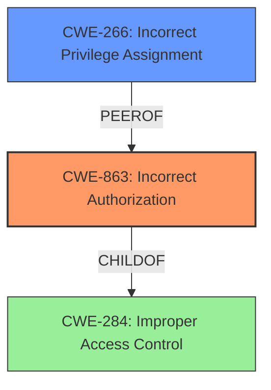

# Analysis for CVE-2025-25598

# Summary
| CWE ID | CWE Name | Confidence | CWE Abstraction Level | CWE Vulnerability Mapping Label | CWE-Vulnerability Mapping Notes |
|---|---|---|---|---|---|
| CWE-863 | Incorrect Authorization | 0.8 | Class | Primary | Allowed-with-Review |
| CWE-266 | Incorrect Privilege Assignment | 0.6 | Base | Secondary | Allowed |

## Evidence and Confidence

*   **Confidence Score:** 0.7
*   **Evidence Strength:** MEDIUM

## Relationship Analysis
The primary CWE is CWE-863, which is a Class-level CWE. CWE-863 has a parent CWE of CWE-284 (Improper Access Control), which is a Pillar. CWE-266 (Incorrect Privilege Assignment) is a potential related issue, and is a Base level CWE. While the description mentions "incorrect access control", the specific mention of privilege escalation points toward authorization issues as the root cause of the vulnerability, hence preferring CWE-863.

## Vulnerability Chain
The vulnerability chain starts with **incorrect access control**, specifically within the scheduled tasks console. This allows an attacker to place a crafted executable into a scheduled task, ultimately leading to privilege escalation.

## Summary of Analysis
The initial assessment pointed to access control issues leading to privilege escalation. The retriever results suggested CWE-306 (Missing Authentication for Critical Function), CWE-732 (Incorrect Permission Assignment for Critical Resource), CWE-284 (Improper Access Control), and CWE-863 (Incorrect Authorization), among others.

The vulnerability description mentions **"incorrect access control"** in the scheduled tasks console, which is the **rootcause**. The impact is that attackers can "escalate privileges" by placing a crafted executable into a scheduled task.

Given the guidance and the vulnerability description, the best fit is CWE-863 (Incorrect Authorization). The system performs an authorization check (since scheduled tasks are involved), but it does not correctly perform the check, allowing attackers to escalate privileges. This is supported by the vulnerability description mentioning "**incorrect access control**", implying that some form of access control is present but flawed.

CWE-266 (Incorrect Privilege Assignment) is a secondary candidate. This is because the **incorrect access control** could lead to a misassignment of privileges, enabling the escalation.

CWE-306 (Missing Authentication for Critical Function) is not the best fit because the description doesn't explicitly state that authentication is missing. It is more about the **incorrect access control** during authorization.

CWE-284 (Improper Access Control) is too generic. Since we can pinpoint the issue to authorization, CWE-863 is more appropriate.

The decision is based on the provided evidence and the relationships between the CWEs. CWE-863 is at the optimal level of specificity, representing the **incorrect authorization** that leads to privilege escalation.

Relevant CWE Information:

# Enhanced Context (25 CWEs)
The following CWEs were identified as potentially relevant to this vulnerability:

## CWE-266: Incorrect Privilege Assignment
**Abstraction Level**: Base
**Similarity Score**: 0.74
**Source**: dense

**Description**:
A product incorrectly assigns a privilege to a particular actor, creating an unintended sphere of control for that actor.

**Mapping Guidance**:
- Usage: Allowed
- Rationale: This CWE entry is at the Base level of abstraction, which is a preferred level of abstraction for mapping to the root causes of vulnerabilities.

## CWE-863: Incorrect Authorization
**Abstraction Level**: Class
**Similarity Score**: 2150.36
**Source**: sparse

**Description**:
The product performs an authorization check when an actor attempts to access a resource or perform an action, but it does not correctly perform the check.

**Mapping Guidance**:
- Usage: Allowed-with-Review
- Rationale: This CWE entry is a Class and might have Base-level children that would be more appropriate