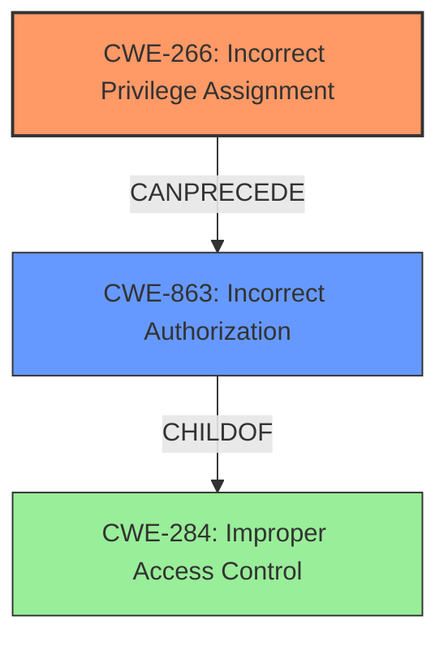

# Enhanced Analysis for CVE-2025-25617

# Summary
| CWE ID  | CWE Name                                                     | Confidence | CWE Abstraction Level | CWE Vulnerability Mapping Label | CWE-Vulnerability Mapping Notes |
| :-------- | :----------------------------------------------------------- | :--------- | :-------------------- | :------------------------------ | :------------------------------ |
| CWE-266 | Incorrect Privilege Assignment                               | 0.9        | Base                  | Primary                         | Allowed                         |
| CWE-863 | Incorrect Authorization                                      | 0.6        | Class                 | Secondary                       | Allowed-with-Review             |

## Evidence and Confidence

*   **Confidence Score:** 0.8
*   **Evidence Strength:** MEDIUM

## Relationship Analysis
The primary relationship influencing the decision is that CWE-266 [Incorrect Privilege Assignment] can be a cause of CWE-863 [Incorrect Authorization]. The vulnerability description points to **incorrect access control** leading to privilege escalation, which aligns with the concept of a user being assigned incorrect privileges (CWE-266) and consequently bypassing authorization checks (CWE-863). CWE-266 is a Base level CWE, while CWE-863 is a Class level CWE. Therefore, CWE-266 is more specific and appropriate for the root cause.



## Vulnerability Chain
The vulnerability chain starts with the **incorrect access control** (which is manifested as **incorrect privilege assignment**), leading to privilege escalation.
1.  **Root Cause:** CWE-266 [Incorrect Privilege Assignment] - Teachers are incorrectly assigned privileges that allow them to create syllabi.
2.  **Weakness:** CWE-863 [Incorrect Authorization] - The system **incorrectly authorizes** teachers to create syllabi due to the **incorrect privilege assignment**.
3.  **Impact:** Privilege Escalation - Teachers, who should not have the ability to create syllabi, can now perform this action.

## Summary of Analysis
The initial analysis considered several CWEs based on the retriever results, but the key phrase "**Incorrect Access Control**" leading to "Privilege Escalation" in the vulnerability description and the Authentication vs Authorization vs Access Control Guidance, Privileges vs Permissions Guidance, and Complete CWE Specifications led to the selection of CWE-266 [Incorrect Privilege Assignment] as the primary root cause.

The retriever results suggested CWE-732 [Incorrect Permission Assignment for Critical Resource], CWE-284 [Improper Access Control], and CWE-863 [Incorrect Authorization], among others. However, the vulnerability description specifically mentions "**Incorrect Access Control**" leading to "Privilege Escalation," which indicates an issue with privilege assignment rather than just general access control or permission issues. The "Privileges vs Permissions Guidance" helped to differentiate between privileges and permissions, reinforcing the idea that the issue is with the actor's identity level or capabilities (privileges) rather than what actions are allowed on specific resources (permissions).

CWE-863 [Incorrect Authorization] was considered as a secondary CWE because the **incorrect privilege assignment** ultimately leads to an authorization bypass or failure. The system is **incorrectly authorizing** teachers to perform actions they should not be allowed to perform.

The graph relationships helped to visualize the relationship between CWE-266 [Incorrect Privilege Assignment] and CWE-863 [Incorrect Authorization], showing that **incorrect privilege assignment** can lead to **incorrect authorization**.

The selected CWEs are at the optimal level of specificity because CWE-266 [Incorrect Privilege Assignment] is a Base level CWE that directly addresses the root cause of the vulnerability, while CWE-863 [Incorrect Authorization] is a Class level CWE that describes the resulting authorization failure.

Relevant CWE Information:


## CWE Relationship Analysis

Current CWEs represent these abstraction levels: .


### Vulnerability Chain Analysis

**Chain starting from CWE-284:**
- 284 (Improper Access Control) - ROOT


**Chain starting from CWE-266:**
- 266 (Incorrect Privilege Assignment) - ROOT


### CWE Relationship Diagram

```mermaid
graph TD
    classDef primary fill:#f96,stroke:#333,stroke-width:2px
    classDef secondary fill:#69f,stroke:#333
    classDef tertiary fill:#9e9,stroke:#333
```