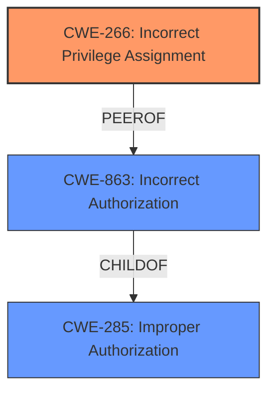

# Analysis Report for CVE-2025-25618

# Vulnerability Analysis Report: CVE-2025-25618

## Description

**Incorrect Access Control** in Unifiedtransform 2.0 leads to Privilege Escalation allowing the change of Section Name and Room Number by Teachers.

## Vulnerability Description Key Phrases

- **Rootcause:** Incorrect Access Control
- **Impact:** Privilege Escalation
- **Attacker:** Teachers
- **Product:** Unifiedtransform
- **Version:** 2.0

## Analysis (with Relationship Data)

# Summary
| CWE ID | CWE Name | Confidence | CWE Abstraction Level | CWE Vulnerability Mapping Label | CWE-Vulnerability Mapping Notes |
|---|---|---|---|---|---|
| CWE-266 | Incorrect Privilege Assignment | 0.9 | Base | Primary CWE | Allowed |
| CWE-863 | Incorrect Authorization | 0.7 | Class | Secondary Candidate | Allowed-with-Review |
| CWE-285 | Improper Authorization | 0.6 | Class | Secondary Candidate | Discouraged |

## Evidence and Confidence

*   **Confidence Score:** 0.8
*   **Evidence Strength:** HIGH

## Relationship Analysis
The primary relationship that influenced the CWE selection was the parent-child relationship between CWE-285 (Improper Authorization), CWE-863 (Incorrect Authorization), and CWE-266 (Incorrect Privilege Assignment). Although the initial description suggests authorization issues, the root cause points towards an incorrect assignment of privileges to the "Teacher" role, allowing them to modify data that should be restricted to administrators. CWE-266 is a base level CWE, making it more specific than the class level CWE-285 and CWE-863.



## Vulnerability Chain
The vulnerability chain starts with **Incorrect Access Control** which leads to **Incorrect Privilege Assignment** for Teachers, ultimately resulting in Privilege Escalation where Teachers can modify Section Name and Room Number.

## Summary of Analysis
The initial assessment considered authorization-related CWEs like CWE-863 and CWE-285 due to the mention of "Incorrect Access Control." However, further analysis of the vulnerability description and provided evidence pointed to the root cause being the **incorrect assignment of privileges**. The "Teachers" role was incorrectly granted the ability to modify section names and room numbers, which should have been restricted to administrators. This led to the selection of CWE-266 as the primary CWE.

The vulnerability description states: "**Incorrect Access Control** in Unifiedtransform 2.0 leads to Privilege Escalation allowing the change of Section Name and Room Number by Teachers." The CVE Reference Links Content Summary section says: "*   **Root cause of vulnerability:** Incorrect Access Control", "*   **Weaknesses/vulnerabilities present:** Teachers can modify section names and room numbers without proper authorization.".

CWE-266 (Incorrect Privilege Assignment) is the most specific and accurate representation of the root cause. The other CWEs considered (CWE-863 and CWE-285) represent higher-level authorization failures but do not capture the specific issue of privilege misconfiguration.

The selected CWE is at the optimal level of specificity because it precisely describes the **incorrect assignment of privileges**, which is the root cause of the vulnerability. This is a base level CWE which is preferred.

Relevant CWE Information:

# Enhanced Context (25 CWEs)
The following CWEs were identified as potentially relevant to this vulnerability:

## CWE-266: Incorrect Privilege Assignment
**Abstraction Level**: Base
**Similarity Score**: 0.76
**Source**: dense

**Description**:
A product incorrectly assigns a privilege to a particular actor, creating an unintended sphere of control for that actor.

**Mapping Guidance**:
- Usage: Allowed
- Rationale: This CWE entry is at the Base level of abstraction, which is a preferred level of abstraction for mapping to the root causes of vulnerabilities.

## CWE-863: Incorrect Authorization
**Abstraction Level**: Class
**Similarity Score**: 2423.21
**Source**: sparse

**Description**:
The product performs an authorization check when an actor attempts to access a resource or perform an action, but it does not correctly perform the check.

**Mapping Guidance**:
- Usage: Allowed-with-Review
- Rationale: This CWE entry is a Class and might have Base-level children that would be more appropriate

## CWE-285: Improper Authorization
**Abstraction Level**: Class
**Similarity Score**: 2359.28
**Source**: sparse

**Description**:
The product does not perform or incorrectly performs an authorization check when an actor attempts to access a resource or perform an action.

**Mapping Guidance**:
- Usage: Discouraged
- Rationale: CWE-285 is high-level and lower-level CWEs can frequently be used instead. It is a level-1 Class (i.e., a child of a Pillar).

### Technical Explanation for CWE-266: Incorrect Privilege Assignment
*   **How the vulnerability's details match the CWE's characteristics:** The vulnerability involves teachers being able to modify section names and room numbers, which they should not be able to do. This aligns with CWE-266 because the system is incorrectly assigning privileges to teachers that allow them to perform actions beyond their intended scope.
*   **The security implications and potential impact:** The security implication is privilege escalation, where teachers gain unauthorized control over administrative functions. This can lead to mismanagement, confusion, and disruption of academic operations.
*   **Any parent-child relationships or chain patterns that influenced your mapping:** CWE-266 is a peer of CWE-863 (Incorrect Authorization), and both are children of CWE-285 (Improper Authorization). The decision to choose CWE-266 was based on it being the most specific root cause.
*   **Whether the weakness is primary or secondary in the vulnerability:** CWE-266 is the primary weakness because it represents the root cause of the vulnerability.
*   **How the official MITRE mapping guidance influenced your decision:** The MITRE mapping guidance for CWE-266 states that it is a Base level of abstraction, which is preferred.

### Technical Explanation for CWE-863: Incorrect Authorization
*   **How the vulnerability's details match the CWE's characteristics:** While the root cause is privilege assignment, an authorization check might be present, but it's flawed because it allows teachers to modify restricted data. This makes CWE-863 a secondary consideration.
*   **The security implications and potential impact:** The potential impact is unauthorized access and modification of sensitive data, leading to mismanagement and disruption of academic operations.
*   **Any parent-child relationships or chain patterns that influenced your mapping:** CWE-863 is a child of CWE-285 (Improper Authorization).
*   **Whether the weakness is primary or secondary in the vulnerability:** CWE-863 is a secondary weakness because it is a consequence of the incorrect privilege assignment.
*   **How the official MITRE mapping guidance influenced your decision:** The MITRE mapping guidance for CWE-863 states that it is a Class and might have Base-level children that would be more appropriate, which further supports the selection of CWE-266 as the primary CWE.

### Technical Explanation for CWE-285: Improper Authorization
*   **How the vulnerability's details match the CWE's characteristics:** CWE-285 is a general category for flawed authorization logic. The vulnerability involves improper authorization, but the root cause is more specifically an incorrect privilege assignment.
*   **The security implications and potential impact:** The potential impact is unauthorized access and modification of sensitive data.
*   **Any parent-child relationships or chain patterns that influenced your mapping:** CWE-285 is a parent of CWE-863.
*   **Whether the weakness is primary or secondary in the vulnerability:** CWE-285 is a secondary consideration because it represents a higher-level category of the weakness.
*   **How the official MITRE mapping guidance influenced your decision:** The MITRE mapping guidance for CWE-285 states that it is high-level and lower-level CWEs can frequently be used instead, which supports the selection of CWE-266 as the primary CWE.

### CWEs Considered But Not Used:
*   CWE-306 (Missing Authentication for Critical Function): This was not selected because the vulnerability description focuses on authorization issues after authentication (login) has occurred.
*   CWE-862 (Missing Authorization): This was not selected because, while authorization is a factor, the root cause is specifically related to the incorrect assignment of privileges rather than a complete lack of authorization checks.
*   CWE-284 (Improper Access Control): This was not selected because it is a high-level CWE, and the root cause can be pinpointed to privilege misconfiguration.
*   CWE-732 (Incorrect Permission Assignment for Critical Resource): This was not selected because it focuses on incorrect permission assignment at the resource level, while the vulnerability is about incorrect privilege assignment at the user/role level.


## CWE Relationship Analysis

Current CWEs represent these abstraction levels: .


### Vulnerability Chain Analysis

**Chain starting from CWE-863:**
- 863 (Incorrect Authorization) - ROOT


**Chain starting from CWE-732:**
- 732 (Incorrect Permission Assignment for Critical Resource) - ROOT


### CWE Relationship Diagram

```mermaid
graph TD
    classDef primary fill:#f96,stroke:#333,stroke-width:2px
    classDef secondary fill:#69f,stroke:#333
    classDef tertiary fill:#9e9,stroke:#333
```


*Report generated on 2025-07-14 13:36:49*
