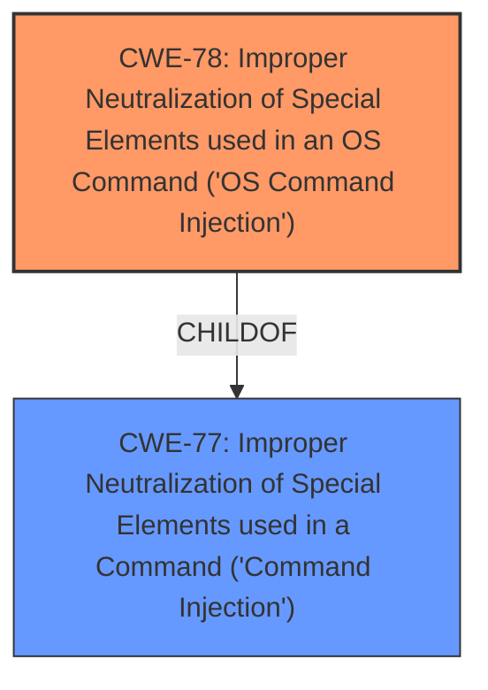

# Raw Analyzer Response for CVE-2025-25632

# Summary
| CWE ID | CWE Name | Confidence | CWE Abstraction Level | CWE Vulnerability Mapping Label | CWE-Vulnerability Mapping Notes |
|---|---|---|---|---|---|
| CWE-78 | Improper Neutralization of Special Elements used in an OS Command ('OS Command Injection') | 1.0 | Base | Allowed | Primary CWE. The vulnerability is a direct instance of OS Command Injection due to the lack of proper neutralization of special elements in the command. |

## Evidence and Confidence

*   **Confidence Score:** 1.0
*   **Evidence Strength:** HIGH

## Relationship Analysis
The primary relationship considered was the ChildOf relationship between CWE-78 and CWE-77. While CWE-77 is a more general "Command Injection", CWE-78 is specifically "OS Command Injection", making it a more precise classification given the context of the vulnerability description. The abstraction levels were also considered, with CWE-78 being a Base level, which is preferred.

## Vulnerability Chain
The vulnerability chain is straightforward:
1.  **Root Cause:** **Improper Neutralization** of special elements in the OS command (CWE-78).
2.  **Impact:** **Command Injection**, leading to potential unauthorized system access or modification.

## Summary of Analysis
The initial analysis identified the **weakness** as **Command Injection** which strongly suggests CWE-78, "Improper Neutralization of Special Elements used in an OS Command ('OS Command Injection')". The vulnerability description states that Tenda AC15 is vulnerable to **Command Injection** via the handler function in /goform/telnet. This directly supports the classification as CWE-78. The Retriever Results also list CWE-78 as a strong candidate. The confidence is high (1.0) because the description explicitly mentions **Command Injection**. The selected CWE is at the optimal level of specificity because it directly describes the **root cause** of the vulnerability.

Relevant CWE Information:

# Enhanced Context (25 CWEs)
The following CWEs were identified as potentially relevant to this vulnerability:

## CWE-78: Improper Neutralization of Special Elements used in an OS Command ('OS Command Injection')
**Abstraction Level**: Base
**Similarity Score**: 0.72
**Source**: dense

**Description**:
The product constructs all or part of an OS command using externally-influenced input from an upstream component, but it does not neutralize or incorrectly neutralizes special elements that could modify the intended OS command when it is sent to a downstream component.

**Mapping Guidance**:
- Usage: Allowed
- Rationale: This CWE entry is at the Base level of abstraction, which is a preferred level of abstraction for mapping to the root causes of vulnerabilities.
## CWE-77: Improper Neutralization of Special Elements used in a Command ('Command Injection')
**Abstraction Level**: Class
**Similarity Score**: 0.68
**Source**: dense

**Description**:
The product constructs all or part of a command using externally-influenced input from an upstream component, but it does not neutralize or incorrectly neutralizes special elements that could modify the intended command when it is sent to a downstream component.

**Mapping Guidance**:
- Usage: Allowed-with-Review
- Rationale: CWE-77 is often misused when OS command injection (CWE-78) was intended instead [REF-1287].

### Rejected Candidates:

*   **CWE-77:** While related, CWE-77 is a more general "Command Injection." The vulnerability description clearly indicates that it's an OS command being injected, making CWE-78 a more specific and appropriate choice. The rationale for CWE-77 even suggests considering CWE-78 instead.
*   **CWE-88:** "Improper Neutralization of Argument Delimiters in a Command ('Argument Injection')" was considered but rejected because the description doesn't mention argument delimiters specifically.
*   **CWE-138:** "Improper Neutralization of Special Elements" is a class level CWE, so it is less specific than CWE-78.