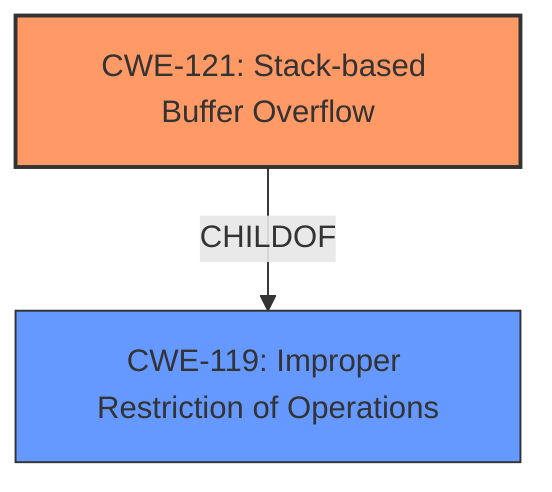

# Analysis for CVE-2025-25664

# Summary

| CWE ID | CWE Name | Confidence | CWE Abstraction Level | CWE Vulnerability Mapping Label | CWE-Vulnerability Mapping Notes |
|---|---|---|---|---|---|
| CWE-121 | Stack-based Buffer Overflow | 1.0 | Variant | Allowed | Primary CWE |

## Evidence and Confidence

*   **Confidence Score:** 1.0
*   **Evidence Strength:** HIGH

## Relationship Analysis

The primary relationship that influenced my decision was the direct match of the vulnerability description to the definition of CWE-121. CWE-121 is a variant of the more general CWE-119 (Improper Restriction of Operations Within the Bounds of a Memory Buffer), which describes the broader class of buffer overflows. Since the vulnerability explicitly states a "stack overflow," using the more specific variant CWE-121 is appropriate.

## Vulnerability Chain

The vulnerability chain is straightforward:

1.  **Root Cause:** A **stack overflow** vulnerability exists due to **improper** handling of the `shareSpeed` parameter within the `sub_49E098` function.
2.  **Impact:** This could lead to arbitrary code execution or denial of service.

The vulnerability chain starts with CWE-121 and can lead to other issues like CWE-825 (Copying data structure without sufficient checking).

## Summary of Analysis

The vulnerability description clearly states a "**stack overflow**" in the `sub_49E098` function due to the `shareSpeed` parameter. The description directly mentions the **weakness**.

The **Retriever Results** also lists CWE-121 as the top match with a score of 1.0.

Given the clear description and the Retriever Results, I am confident that CWE-121 is the correct mapping. The description clearly indicates a stack-based buffer overflow, and CWE-121 is the most specific CWE that describes this vulnerability.

Relevant CWE Information:

# Enhanced Context (25 CWEs)
The following CWEs were identified as potentially relevant to this vulnerability:

## CWE-121: Stack-based Buffer Overflow
**Abstraction Level**: Variant
**Similarity Score**: 0.72
**Source**: dense

**Description**:
A stack-based buffer overflow condition is a condition where the buffer being overwritten is allocated on the stack (i.e., is a local variable or, rarely, a parameter to a function).

**Mapping Guidance**:
- Usage: Allowed
- Rationale: This CWE entry is at the Variant level of abstraction, which is a preferred level of abstraction for mapping to the root causes of vulnerabilities.

## CWE-190: Integer Overflow or Wraparound
**Abstraction Level**: Base
**Similarity Score**: 433.77
**Source**: sparse

**Description**:
The product performs a calculation that can
         produce an integer overflow or wraparound when the logic
         assumes that the resulting value will always be larger than
         the original value. This occurs when an integer value is
         incremented to a value that is too large to store in the
         associated representation. When this occurs, the value may
         become a very small or negative number.

**Mapping Guidance**:
- Usage: Allowed
- Rationale: This CWE entry is at the Base level of abstraction, which is a preferred level of abstraction for mapping to the root causes of vulnerabilities.

## CWE-120: Buffer Copy without Checking Size of Input ('Classic Buffer Overflow')
**Abstraction Level**: Base
**Similarity Score**: 384.30
**Source**: sparse

**Description**:
The product copies an input buffer to an output buffer without verifying that the size of the input buffer is less than the size of the output buffer, leading to a buffer overflow.

**Mapping Guidance**:
- Usage: Allowed-with-Review
- Rationale: There are some indications that this CWE ID might be misused and selected simply because it mentions "buffer overflow" - an increasingly vague term. This CWE entry is only appropriate for "Buffer Copy" operations (not buffer reads), in which where there is no "Checking [the] Size of Input", and (by implication of the copy) writing past the end of the buffer.

## CWE-122: Heap-based Buffer Overflow
**Abstraction Level**: Variant
**Similarity Score**: 393.26
**Source**: sparse

**Description**:
A heap overflow condition is a buffer overflow, where the buffer that can be overwritten is allocated in the heap portion of memory, generally meaning that the buffer was allocated using a routine such as malloc().

**Mapping Guidance**:
- Usage: Allowed
- Rationale: This CWE entry is at the Variant level of abstraction, which is a preferred level of abstraction for mapping to the root causes of vulnerabilities.

## CWE-787: Out-of-bounds Write
**Abstraction Level**: base
**Similarity Score**: 2.72
**Source**: graph

**Description**:
CWE-787: Out-of-bounds Write

**Mapping Guidance**:
- Usage: Allowed
- Rationale: This CWE entry is at the Base level of abstraction, which is a preferred level of abstraction for mapping to the root causes of vulnerabilities.

**Relationships**:
- CANFOLLOW -> CWE-825
- CANFOLLOW -> CWE-824
- CANFOLLOW -> CWE-823
- CANFOLLOW -> CWE-822
- PARENTOF -> CWE-124

### CWEs Considered but Not Used:

*   **CWE-120 Buffer Copy without Checking Size of Input ('Classic Buffer Overflow')**: While this is a buffer overflow, the description doesn't specify that it's caused by copying without checking the input size, but by the stack overflow itself. It is also listed as Allowed-with-Review.
*   **CWE-122 Heap-based Buffer Overflow**: The vulnerability description explicitly mentions a "stack overflow", ruling out a heap-based overflow.
*   **CWE-190 Integer Overflow or Wraparound**: There is no indication of integer overflow in the vulnerability description.
*   **CWE-787 Out-of-bounds Write**: This is a result of the buffer overflow, but the root cause is the stack overflow itself (CWE-121).