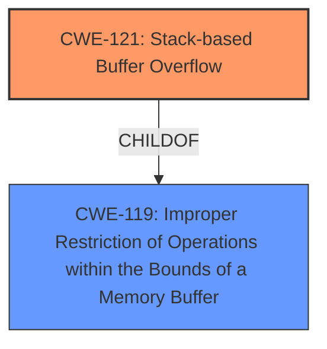

# Raw Analyzer Response for CVE-2025-25668

# Summary
| CWE ID | CWE Name | Confidence | CWE Abstraction Level | CWE Vulnerability Mapping Label | CWE-Vulnerability Mapping Notes |
|---|---|---|---|---|---|
| CWE-121 | Stack-based Buffer Overflow | 1.0 | Variant | Allowed | Primary CWE |

## Evidence and Confidence

*   **Confidence Score:** 1.0
*   **Evidence Strength:** HIGH

## Relationship Analysis
The primary relationship is that CWE-121 is a variant of buffer overflow, specifically occurring on the stack. There are no other chain or peer relationships evident in this vulnerability description. The selection of the Variant level is optimal because the description specifies the location of the buffer overflow as occurring on the stack.

## Vulnerability Chain
The vulnerability chain consists of a **stack overflow** in the `shareSpeed` parameter of the `sub_47D878` function. This allows an attacker to overwrite data on the stack, leading to potential code execution or denial of service.

## Summary of Analysis
The vulnerability description clearly states a **stack overflow** vulnerability within the Tenda AC8V4 firmware. The `shareSpeed` parameter in the `sub_47D878` function is the source of this overflow. The retriever results strongly suggest CWE-121 (Stack-based Buffer Overflow) as the primary candidate, with a score of 1.0. Given this direct evidence, CWE-121 is the most appropriate classification. The other CWEs listed in the retriever results, such as CWE-190, CWE-120, CWE-674, CWE-835, CWE-125, CWE-78, CWE-122 and CWE-805 are not as specific to the provided vulnerability description which clearly states the vulnerability is a stack overflow.

Relevant CWE Information:

# Enhanced Context (25 CWEs)
The following CWEs were identified as potentially relevant to this vulnerability:

## CWE-121: Stack-based Buffer Overflow
**Abstraction Level**: Variant
**Similarity Score**: 0.72
**Source**: dense

**Description**:
A stack-based buffer overflow condition is a condition where the buffer being overwritten is allocated on the stack (i.e., is a local variable or, rarely, a parameter to a function).

**Mapping Guidance**:
- Usage: Allowed
- Rationale: This CWE entry is at the Variant level of abstraction, which is a preferred level of abstraction for mapping to the root causes of vulnerabilities.

CWE-121 is chosen because the vulnerability description explicitly states a stack overflow, which directly matches the description of CWE-121.